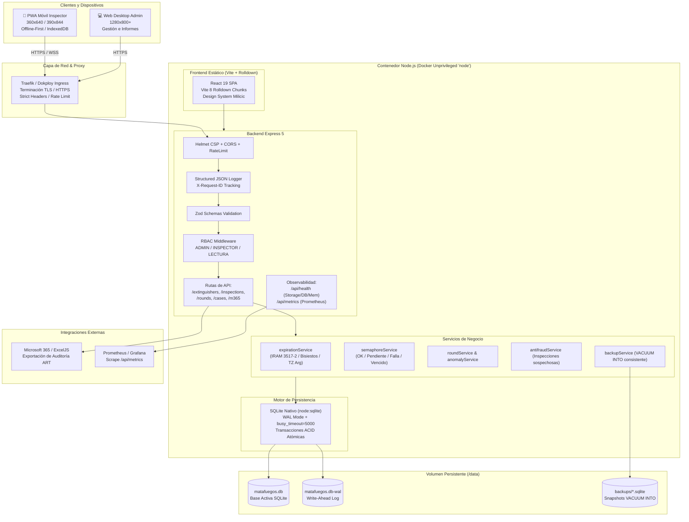

# ARQUITECTURA DEL SISTEMA | MILICIC FIRECONTROL 365

Sistema corporativo de trazabilidad, control mensual bajo norma IRAM 3517-2 e inspección de extintores contra incendio con capacidad Offline-First y despliegue sobre Docker/Dokploy.

---

## 1. Diagrama General de Arquitectura

---

## 2. Decisiones Técnicas Fundamentales

### 2.1 Persistencia: SQLite en Modo WAL (`node:sqlite`)

- **Modo WAL (Write-Ahead Logging)**: Permite múltiples lectores simultáneos sin bloquear a los escritores, eliminando los errores de contención `SQLITE_BUSY`.
- **`busy_timeout = 5000`**: Si una escritura entra en colisión temporal, el motor espera hasta 5000 ms automáticamente antes de abortar.
- **Sin servidor de base de datos adicional**: Cero latencia de red en las consultas (in-process microsegundos), eliminando la necesidad de PostgreSQL o MySQL para un parque de 130 a 500 extintores.

### 2.2 Frontend: React 19 + Vite 8 (Rolldown Chunk Splitting)

- **Arquitectura de Chunks**:
  - `vendor-react`: React, React-DOM.
  - `vendor-icons`: Lucide React.
  - `vendor-table`: TanStack Table.
  - `index`: Lógica de la aplicación y componentes.
- **Offline-First**: Implementado sobre `localStorage` e `IndexedDB` con cola de sincronización de reintento automático al recuperar conectividad.

### 2.3 Seguridad y Privacidad

- **Contenedor No-Root**: La aplicación corre bajo el usuario sin privilegios `node` (UID/GID 1000).
- **Helmet Content Security Policy**: Reglas estrictas para scripts, estilos y fuentes, habilitando explícitamente `blob:` y `data:` para la captura de fotos de la cámara y decodificación de QR.
- **Inmutabilidad de Inspecciones**: Las inspecciones registradas bajo norma IRAM 3517-2 no admiten modificación (`PUT`/`PATCH`) ni borrado (`DELETE`), devolviendo `405 Method Not Allowed`.
- **Entropy de QRs**: Tokens de 24 caracteres hexadecimales criptográficamente generados con `crypto.randomBytes(12)`.

---

## 3. Modelo de Capas del Backend

1. **Capa de Transporte y Seguridad**: Helmet, Rate Limiter (general y login), CORS restringido, Parser multipart.
2. **Capa de Observabilidad**: Request ID (`X-Request-ID`), JSON estructurado, métricas en vivo.
3. **Capa de Validación y Autenticación**: Esquemas Zod estrictos, verificación de roles RBAC.
4. **Capa de Rutas (Controllers)**: Mapeo de verbos HTTP a servicios.
5. **Capa de Lógica de Negocio (Domain Services)**: Lógica pura, aislada y 100% testeable.
6. **Capa de Datos**: `node:sqlite`, migraciones incrementales automáticas idempotentes.
