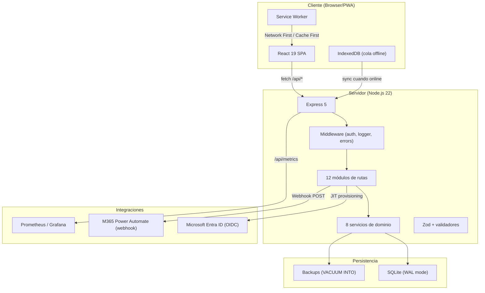
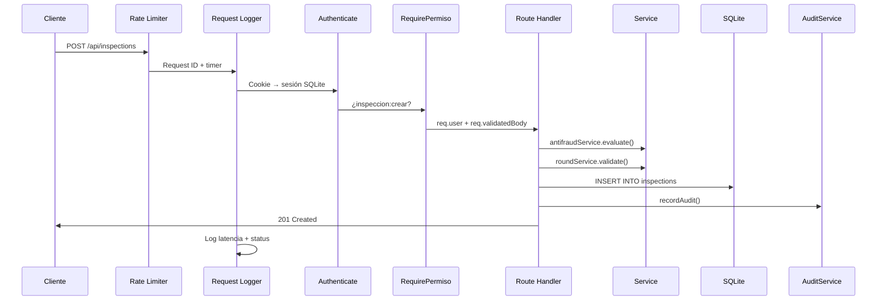
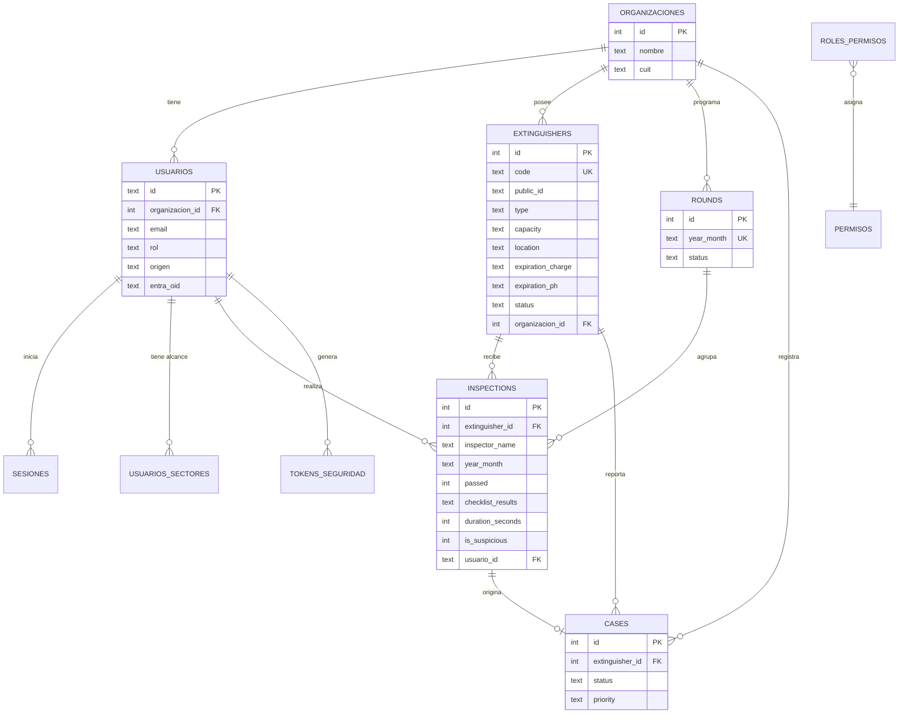
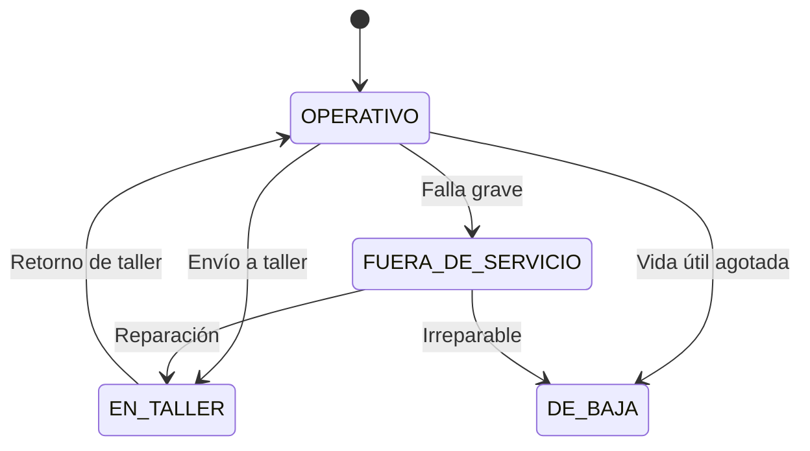
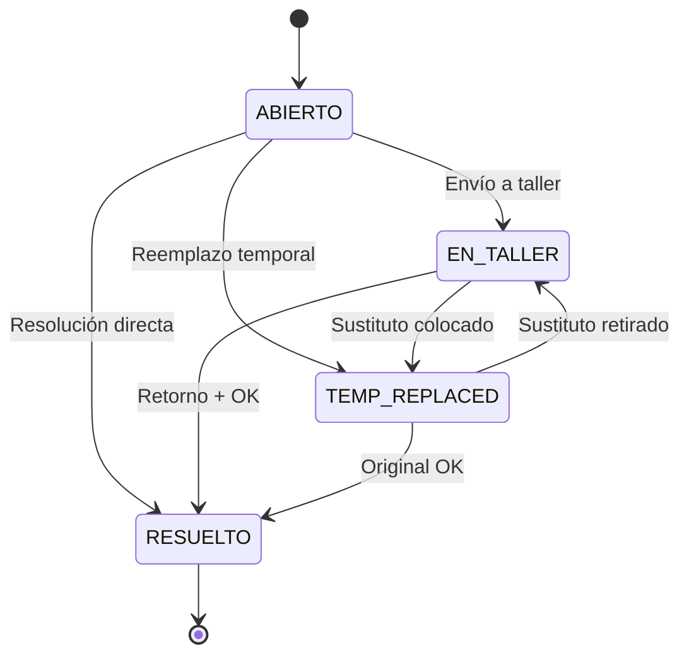
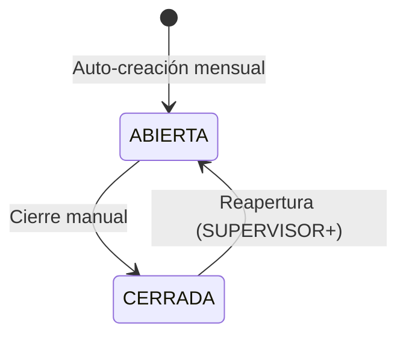
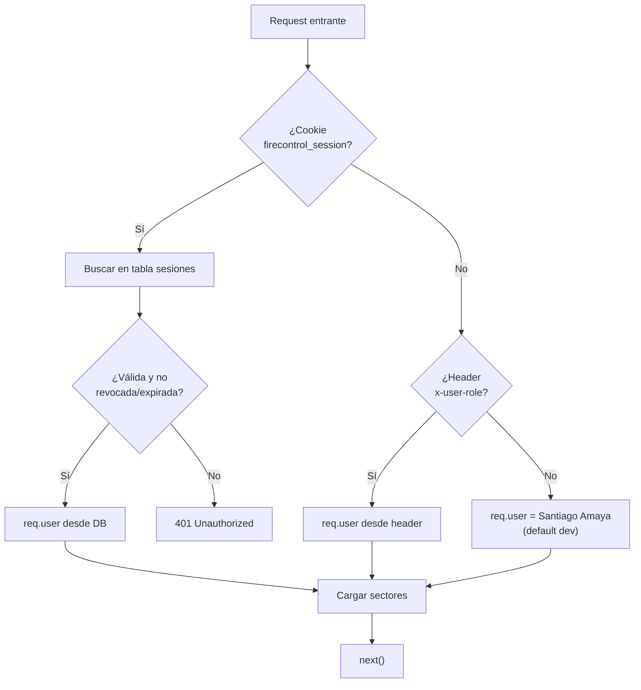
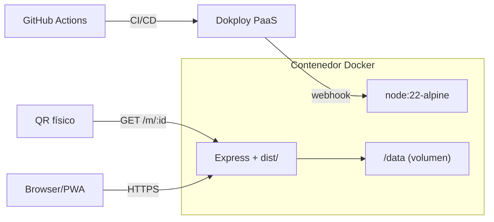

# 🏗️ Arquitectura del Sistema

> **Derivado del código real** — `server/index.js`, `server/db.js`, `src/App.jsx`, `Dockerfile`, `vite.config.js`.
> Última actualización: 2026-10-02

---

## 1. Visión General

**Milicic FireControl 365** es una aplicación web progresiva (PWA) de gestión y control mensual de extintores portátiles bajo norma IRAM 3517-2. Arquitectura monolítica de dos capas con una única base de datos embebida:



---

## 2. Decisiones Arquitectónicas Clave

### 2.1 Monolito con SQLite embebida

**Decisión**: Servidor Express único que sirve tanto la API REST como los archivos estáticos del frontend (SPA fallback).

**Justificación**:

- Despliegue simple en un solo contenedor Docker.
- SQLite embebida elimina la necesidad de un servicio de base de datos separado.
- El volumen de datos (cientos de extintores, miles de inspecciones/año) no requiere un RDBMS distribuido.

**Trade-offs**:

- No escala horizontalmente (un solo proceso Node.js, un solo archivo SQLite).
- Adecuado para el volumen actual de Milicic S.A. (≈130 extintores, ≈1 organización).

### 2.2 SQLite en modo WAL

**Configuración** (`server/db.js:14-20`):

```sql
PRAGMA journal_mode = WAL;
PRAGMA busy_timeout = 5000;
PRAGMA synchronous = NORMAL;
```

**Beneficio**: Permite lecturas concurrentes mientras se ejecuta una escritura. El `busy_timeout` de 5 segundos evita errores `SQLITE_BUSY` en operaciones de backup o importaciones masivas.

### 2.3 API `node:sqlite` (DatabaseSync)

**Decisión**: Usar la API nativa `DatabaseSync` de Node.js 22 en lugar de `better-sqlite3`.

**Justificación**:

- Elimina dependencias nativas y simplifica el build de Docker (no requiere compilación de C++).
- Operaciones síncronas simplifican el manejo de transacciones.

### 2.4 SPA con hash routing

**Decisión**: React SPA sin `react-router`, navegación gestionada por `activeTab` en estado local con hash fragments.

**Justificación**:

- Simplicidad operativa: no requiere configuración de rutas server-side más allá del SPA fallback.
- La ruta pública `/m/:publicId` (QR) se resuelve en el servidor antes del SPA fallback.

### 2.5 Sesiones opacas en SQLite

**Decisión**: Sesiones basadas en cookies httpOnly con tokens opacos almacenados en la tabla `sesiones`.

**Justificación** (vs JWT):

- Revocación inmediata de sesiones (cambio de contraseña, desactivación de usuario).
- Sin necesidad de manejo de refresh tokens.
- Sliding expiration actualizada en cada request.

---

## 3. Capas y Flujo de Datos

### 3.1 Pipeline de un request API



### 3.2 Capas del backend

| Capa                  | Responsabilidad                                                                               | Archivos                             |
| --------------------- | --------------------------------------------------------------------------------------------- | ------------------------------------ |
| **HTTP / Middleware** | Rate limiting, CORS, Helmet, cookies, request ID, autenticación, autorización, error handling | `index.js`, `middleware/*.js`        |
| **Rutas**             | Validación de input, orquestación, respuesta HTTP                                             | `routes/*.js`                        |
| **Servicios**         | Lógica de dominio pura, sin conocimiento de HTTP                                              | `services/*.js`                      |
| **Validación**        | Schemas Zod, validadores de formato de negocio                                                | `validators/*.js`                    |
| **Persistencia**      | DDL, migraciones, seed, queries                                                               | `db.js`, `migrations/*.js`           |
| **Config**            | Variables de entorno, permisos RBAC                                                           | `config.js`, `config/permissions.js` |

### 3.3 Frontend

| Capa              | Responsabilidad                                      | Archivos                               |
| ----------------- | ---------------------------------------------------- | -------------------------------------- |
| **Estado global** | `useState` en `App.jsx` (sin Redux/Context dedicado) | `App.jsx`                              |
| **Componentes**   | UI, formularios, modales, tablas                     | `components/*.jsx`                     |
| **Utilidades**    | Cola offline IndexedDB, compresión de fotos          | `utils/offlineQueue.js`                |
| **PWA**           | Service worker, manifest                             | `public/sw.js`, `manifest.webmanifest` |

---

## 4. Modelo de Datos

### 4.1 Diagrama Entidad-Relación



### 4.2 Estados de entidades

#### Extintores (`extinguishers.status`)



#### Casos (`cases.status`)



#### Rondas (`rounds.status`)



---

## 5. Autenticación y Autorización

### 5.1 Pipeline de autenticación



### 5.2 Modelo de permisos

La autorización se aplica en dos niveles:

1. **`requireRole([roles])`**: Verifica que el rol del usuario esté en la lista. SUPERADMIN bypasses.
2. **`requirePermiso(permissionCode)`**: Verifica contra la matriz `ROLE_PERMISSIONS`.
3. **`requireSectorScope`**: Verifica que el extintor esté en el sector asignado al usuario.

### 5.3 Autenticación dual

| Método                 | Flujo                                                                             |
| ---------------------- | --------------------------------------------------------------------------------- |
| **Local**              | Email + password (Argon2id) → sesión SQLite → cookie httpOnly                     |
| **Microsoft Entra ID** | Redirect OIDC → callback → JIT provisioning → sesión SQLite → cookie              |
| **PIN rápido**         | PIN numérico (4-6 dígitos, Argon2id) para cambio rápido en dispositivo compartido |

---

## 6. Despliegue

### 6.1 Arquitectura Docker



### 6.2 Multi-stage build

1. **Stage `builder`**: `npm install` + `vite build` → genera `dist/`.
2. **Stage `runner`**: Node 22 Alpine + `npm install --omit=dev` + `server/` + `dist/`. Corre como usuario `node` (no root).

### 6.3 Healthcheck

```
HEALTHCHECK --interval=30s --timeout=5s
  CMD wget -qO- http://localhost:3000/api/health || exit 1
```

Verifica: conectividad DB + integridad SQLite + espacio en disco + memoria del proceso.

---

## 7. Seguridad

| Control                 | Implementación                                               |
| ----------------------- | ------------------------------------------------------------ |
| Hashing de contraseñas  | Argon2id (64 MB, 3 iteraciones)                              |
| Sesiones                | Cookies httpOnly, secure (prod), sameSite=lax                |
| Rate limiting login     | 10 intentos / 15 min por IP                                  |
| Rate limiting API       | 300 req/min por IP                                           |
| Bloqueo de cuenta       | 5 intentos fallidos → bloqueo 15 min                         |
| Inmutabilidad           | Inspecciones: PUT/PATCH/DELETE → 405                         |
| Auditoría               | Tabla append-only `auditoria`                                |
| CSP                     | Helmet con directivas restrictivas                           |
| Input validation        | Zod schemas + validadores de negocio                         |
| Escalada de privilegios | Jerarquía numérica: solo se puede gestionar roles inferiores |
| Alcance sectorial       | Filtrado por sector/piso/edificio del usuario                |

---

## 8. Observabilidad

| Señal       | Endpoint / Mecanismo                                          |
| ----------- | ------------------------------------------------------------- |
| **Health**  | `GET /api/health` → JSON con DB, disco, memoria               |
| **Metrics** | `GET /api/metrics` → Prometheus text format                   |
| **Logs**    | JSON estructurado (prod) / texto legible (dev) con request ID |
| **Audit**   | Tabla `auditoria` con snapshot de usuario, IP, user-agent     |

### Métricas Prometheus disponibles

- `firecontrol_uptime_seconds`
- `firecontrol_memory_heap_bytes` / `rss_bytes`
- `firecontrol_http_requests_total` / `errors_total`
- `firecontrol_extinguishers_total` / `by_status`
- `firecontrol_inspections_total` / `today`
- `firecontrol_open_cases_total`
- `firecontrol_round_coverage_ratio`
- `firecontrol_sync_operations_total`
