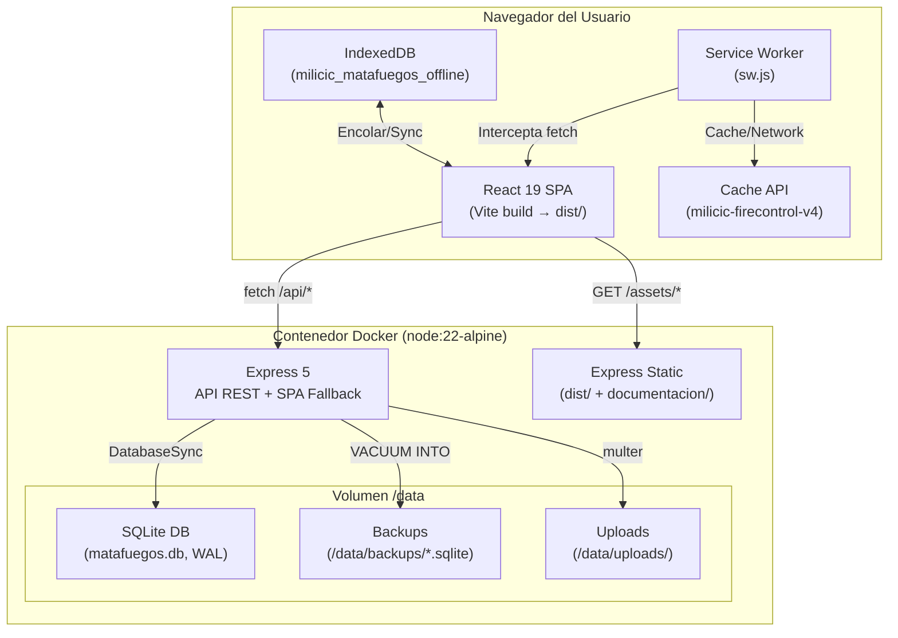

# C4 Nivel 2 — Diagrama de Contenedores

> **Para quién**: Desarrolladores que necesiten entender los componentes desplegables del sistema.
> **Qué vas a entender**: Los contenedores técnicos (procesos, almacenamiento) y cómo se comunican.

---

## Diagrama de Contenedores

> **Propósito**: Mostrar los contenedores técnicos dentro de Milicic FireControl 365.
> **Verificado contra**: `Dockerfile`, `vite.config.js`, `server/index.js`, `public/sw.js`, `src/utils/offlineQueue.js`.
> **Fecha**: 2026-10-02

### Leyenda

| Componente     | Tipo                       | Tecnología                  |
| -------------- | -------------------------- | --------------------------- |
| React SPA      | Aplicación web (cliente)   | React 19, Vite              |
| Service Worker | Worker del navegador       | Vanilla JS                  |
| IndexedDB      | Almacenamiento local       | API IndexedDB v2            |
| Express        | Servidor de aplicación     | Express 5, Node.js 22       |
| SQLite         | Base de datos embebida     | node:sqlite (DatabaseSync)  |
| Backups        | Almacenamiento de archivos | Filesystem (/data/backups/) |

---

## Comunicaciones

| Origen                   | Destino       | Protocolo                 | Contenido                       |
| ------------------------ | ------------- | ------------------------- | ------------------------------- |
| SPA → Express            | HTTP/HTTPS    | JSON (API REST)           | Todas las operaciones CRUD      |
| SPA → Express            | HTTP/HTTPS    | multipart/form-data       | Upload de fotos                 |
| Service Worker → Cache   | Cache API     | Request/Response          | Assets estáticos (cache-first)  |
| Service Worker → Network | HTTP          | HTML, JSON                | Navegación (network-first)      |
| SPA ↔ IndexedDB          | IndexedDB API | Structured clones         | Inspecciones offline pendientes |
| Express → SQLite         | node:sqlite   | SQL (prepared statements) | Toda la persistencia            |
| Express → Backups        | Filesystem    | VACUUM INTO               | Copias atómicas de la DB        |

---

## Almacenamiento

| Store     | Ubicación                 | Tipo                                             | Tamaño esperado |
| --------- | ------------------------- | ------------------------------------------------ | --------------- |
| SQLite DB | `/data/matafuegos.db`     | Archivo SQLite                                   | ~5-50 MB        |
| WAL       | `/data/matafuegos.db-wal` | Write-Ahead Log                                  | Variable        |
| Backups   | `/data/backups/`          | Archivos .sqlite                                 | 7 × tamaño DB   |
| IndexedDB | Navegador del usuario     | `pending_inspections` + `quarantine_inspections` | < 100 MB        |
| Cache API | Navegador del usuario     | `milicic-firecontrol-v4`                         | < 10 MB         |

---

## Archivos del código relacionados

- [Dockerfile](file:///c:/antigravity/matafuegos/Dockerfile) — Multi-stage build
- [docker-compose.yml](file:///c:/antigravity/matafuegos/docker-compose.yml) — Servicio y volumen
- [server/index.js](file:///c:/antigravity/matafuegos/server/index.js) — Express config y SPA fallback
- [vite.config.js](file:///c:/antigravity/matafuegos/vite.config.js) — Build frontend y proxy
- [public/sw.js](file:///c:/antigravity/matafuegos/public/sw.js) — Service Worker
- [src/utils/offlineQueue.js](file:///c:/antigravity/matafuegos/src/utils/offlineQueue.js) — IndexedDB
