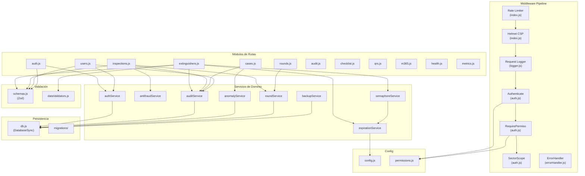

# C4 Nivel 3 — Componentes del Backend (API)

> **Para quién**: Desarrolladores backend que necesiten entender la estructura interna del servidor.
> **Qué vas a entender**: Los módulos del backend, sus dependencias internas y el pipeline de procesamiento.

---

## Diagrama de Componentes — Backend

> **Propósito**: Módulos internos del servidor Express y sus dependencias.
> **Verificado contra**: `server/index.js`, `server/routes/*.js`, `server/services/*.js`, `server/middleware/*.js`.
> **Fecha**: 2026-10-02

---

## Tabla de Módulos

### Rutas (12 archivos)

| Módulo        | Archivo                   | Dependencias de servicio                                | Endpoints principales                 |
| ------------- | ------------------------- | ------------------------------------------------------- | ------------------------------------- |
| Auth          | `routes/auth.js`          | `authService`                                           | login, logout, pin-switch, entra OIDC |
| Extinguishers | `routes/extinguishers.js` | `semaphoreService`, `expirationService`, `auditService` | CRUD, import/export Excel             |
| Inspections   | `routes/inspections.js`   | `antifraudService`, `roundService`, `auditService`      | POST (crear), GET (listar, stats)     |
| Rounds        | `routes/rounds.js`        | `roundService`                                          | GET, close, reopen                    |
| Cases         | `routes/cases.js`         | `anomalyService`, `auditService`                        | CRUD con transiciones                 |
| Users         | `routes/users.js`         | `authService`, `auditService`                           | CRUD con jerarquía                    |
| Audit         | `routes/audit.js`         | —                                                       | GET (consulta)                        |
| Checklist     | `routes/checklist.js`     | —                                                       | GET, PUT                              |
| QRs           | `routes/qrs.js`           | —                                                       | Generación de imágenes QR             |
| M365          | `routes/m365.js`          | —                                                       | Sync SharePoint, webhook              |
| Health        | `routes/health.js`        | —                                                       | Healthcheck                           |
| Metrics       | `routes/metrics.js`       | `logger` (getMetrics)                                   | Prometheus metrics                    |

### Servicios (8 archivos)

| Servicio            | Archivo                         | Responsabilidad                      | Dependencias              |
| ------------------- | ------------------------------- | ------------------------------------ | ------------------------- |
| `authService`       | `services/authService.js`       | Hash, sesiones, bloqueo, JIT Entra   | `db`, `argon2`            |
| `antifraudService`  | `services/antifraudService.js`  | Evaluación de fraude en inspecciones | Ninguna (funciones puras) |
| `auditService`      | `services/auditService.js`      | Registro append-only                 | `db`                      |
| `anomalyService`    | `services/anomalyService.js`    | Máquina de estados de casos          | Ninguna (funciones puras) |
| `expirationService` | `services/expirationService.js` | Cálculos IRAM 3517-2                 | `config` (TZ)             |
| `roundService`      | `services/roundService.js`      | Cobertura, reinspección              | `db`                      |
| `semaphoreService`  | `services/semaphoreService.js`  | Resolución de semáforo               | `expirationService`       |
| `backupService`     | `services/backupService.js`     | VACUUM INTO, verify, restore         | `db`, `fs`                |

### Middleware (3 archivos)

| Middleware        | Función                                                               | Pipeline                     |
| ----------------- | --------------------------------------------------------------------- | ---------------------------- |
| `auth.js`         | `authenticate`, `requireRole`, `requirePermiso`, `requireSectorScope` | Antes de cada ruta protegida |
| `logger.js`       | `requestLogger`, `getMetrics`                                         | Antes de las rutas           |
| `errorHandler.js` | `errorHandler`, `notFoundHandler`                                     | Después de las rutas         |

---

## Archivos del código relacionados

- [server/index.js](file:///c:/antigravity/matafuegos/server/index.js) — Montaje de middleware y rutas
- [server/routes/](file:///c:/antigravity/matafuegos/server/routes/) — Módulos de rutas
- [server/services/](file:///c:/antigravity/matafuegos/server/services/) — Servicios de dominio
- [server/middleware/](file:///c:/antigravity/matafuegos/server/middleware/) — Middleware
- [server/validators/](file:///c:/antigravity/matafuegos/server/validators/) — Validación
