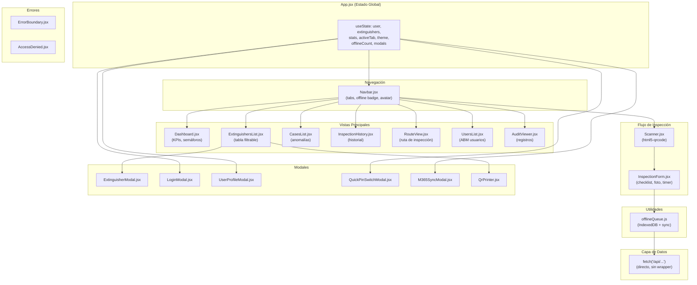

# C4 Nivel 3 — Componentes del Frontend (Web)

> **Para quién**: Desarrolladores frontend que necesiten entender la estructura del cliente React.
> **Qué vas a entender**: Componentes, estado, capa de datos, cola offline y design system.

---

## Diagrama de Componentes — Frontend

> **Propósito**: Estructura interna de la SPA React.
> **Verificado contra**: `src/App.jsx`, `src/components/*.jsx`, `src/utils/offlineQueue.js`, `src/index.css`.
> **Fecha**: 2026-10-02



---

## Gestión de Estado

**No se usa Redux, Zustand ni Context dedicado.** Todo el estado está en `App.jsx` con `useState`:

| Estado                   | Tipo        | Descripción                                     |
| ------------------------ | ----------- | ----------------------------------------------- |
| `user`                   | Object      | Usuario actual (persiste en localStorage)       |
| `extinguishers`          | Array       | Lista de extintores cargada del API             |
| `stats`                  | Object      | Estadísticas de inspección                      |
| `activeTab`              | String      | Tab activa (hash routing)                       |
| `theme`                  | String      | `'light'` o `'dark'` (persiste en localStorage) |
| `isOnline`               | Boolean     | Estado de conexión (navigator.onLine)           |
| `pendingOfflineCount`    | Number      | Inspecciones pendientes en IndexedDB            |
| `inspectingExtinguisher` | Object/null | Extintor en proceso de inspección               |
| `modalState`             | Object      | Estado del modal de extintor (create/edit/view) |

## Capa de Datos

Las llamadas al API se hacen con `fetch()` directo en cada componente. No hay capa de abstracción ni hooks custom de fetching:

```javascript
// Patrón típico en cada componente
const res = await fetch('/api/extinguishers');
const data = await res.json();
if (data.success) setExtinguishers(data.data);
```

## Cola Offline (IndexedDB)

| Store                    | Clave                | Contenido                        |
| ------------------------ | -------------------- | -------------------------------- |
| `pending_inspections`    | `id` (autoincrement) | Inspecciones por sincronizar     |
| `quarantine_inspections` | `id` (autoincrement) | Inspecciones rechazadas por auth |

**Funciones exportadas** de `offlineQueue.js`:

- `enqueueOfflineInspection(data)` — Guardar inspección offline
- `getOfflineInspections()` — Obtener pendientes
- `syncOfflineInspections(onItemSynced)` — Sync con revalidación
- `quarantineInspections(items, reason)` — Mover a cuarentena
- `compressImageFile(file, maxWidth, quality)` — Comprimir foto en Canvas

## Design System (CSS)

Definido en `src/index.css` con CSS custom properties:

| Variable           | Light     | Dark      | Uso              |
| ------------------ | --------- | --------- | ---------------- |
| `--milicic-orange` | `#ea580c` | `#ea580c` | Color primario   |
| `--milicic-dark`   | `#0f172a` | `#0f172a` | Color secundario |
| `--bg-primary`     | `#ffffff` | `#0f172a` | Fondo            |
| `--text-primary`   | `#0f172a` | `#f1f5f9` | Texto            |

Tema controlado por atributo `data-theme` en `<html>`.

---

## Archivos del código relacionados

- [src/App.jsx](file:///c:/antigravity/matafuegos/src/App.jsx) — Estado global y routing
- [src/main.jsx](file:///c:/antigravity/matafuegos/src/main.jsx) — Entry point React
- [src/index.css](file:///c:/antigravity/matafuegos/src/index.css) — Design system
- [src/components/](file:///c:/antigravity/matafuegos/src/components/) — Componentes
- [src/utils/offlineQueue.js](file:///c:/antigravity/matafuegos/src/utils/offlineQueue.js) — Cola offline
