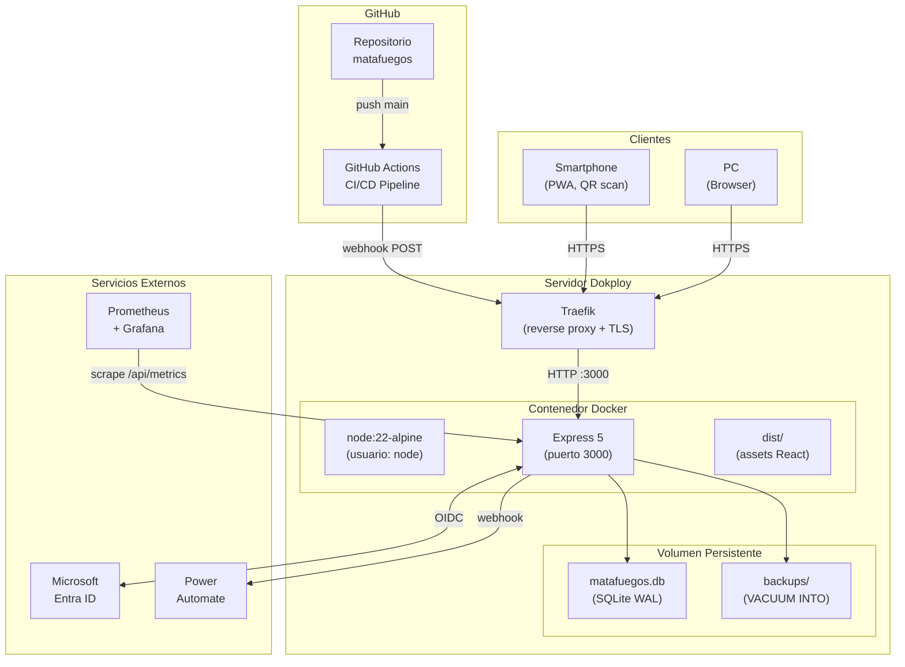

# Diagrama de Despliegue

> **Para quién**: DevOps, administradores y desarrolladores que configuren o diagnostiquen el entorno de producción.
> **Qué vas a entender**: Cómo se despliega el sistema, la infraestructura, volúmenes, red y monitoreo.

---

## Diagrama de Despliegue

> **Propósito**: Vista de infraestructura y red del sistema en producción.
> **Verificado contra**: `Dockerfile`, `docker-compose.yml`, `.github/workflows/ci.yml`.
> **Fecha**: 2026-10-02



---

## Componentes de Infraestructura

| Componente        | Detalle                                                                   |
| ----------------- | ------------------------------------------------------------------------- |
| **Servidor**      | VPS/Servidor dedicado con Dokploy instalado                               |
| **Reverse Proxy** | Traefik (gestionado por Dokploy): TLS automático (Let's Encrypt), routing |
| **Contenedor**    | `node:22-alpine`, multi-stage build, corre como usuario `node` (no root)  |
| **Volumen**       | Docker named volume `milicic_matafuegos_data` → `/data`                   |
| **DB**            | `/data/matafuegos.db` (SQLite, journal_mode=WAL)                          |
| **Backups**       | `/data/backups/*.sqlite` (VACUUM INTO, retención: 7 archivos / 30 días)   |
| **Puerto**        | 3000 (interno), expuesto a Traefik                                        |
| **Healthcheck**   | `wget -qO- http://localhost:3000/api/health` cada 30s                     |

## Pipeline CI/CD

```
push/PR → npm audit → Prettier → ESLint → Vitest → Vite build → Playwright → Axe → Docker build → Webhook Dokploy
```

| Job               | Timeout | Trigger                  |
| ----------------- | ------- | ------------------------ |
| quality-and-tests | 15 min  | Push/PR a main           |
| docker-build      | 10 min  | Post quality-and-tests   |
| deploy-dokploy    | 5 min   | Solo push a main (no PR) |

## Variables de entorno en producción

Ver documento completo: [06-operacion/VARIABLES-DE-ENTORNO.md](../06-operacion/VARIABLES-DE-ENTORNO.md)

---

## Archivos del código relacionados

- [Dockerfile](file:///c:/antigravity/matafuegos/Dockerfile) — Multi-stage build
- [docker-compose.yml](file:///c:/antigravity/matafuegos/docker-compose.yml) — Servicio y volumen
- [.github/workflows/ci.yml](file:///c:/antigravity/matafuegos/.github/workflows/ci.yml) — Pipeline
- [server/routes/health.js](file:///c:/antigravity/matafuegos/server/routes/health.js) — Healthcheck
