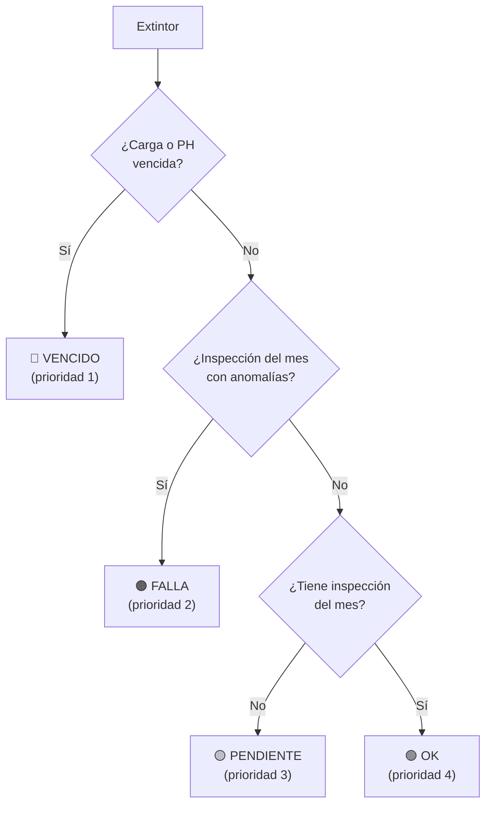

# 🧩 Modelo de Dominio

> **Derivado del código real** — `server/db.js`, `server/services/*.js`, `server/validators/*.js`, `server/config/permissions.js`.
> Última actualización: 2026-10-02

---

## 1. Entidades Principales

### 1.1 Extintor (`extinguishers`)

Unidad mínima de control. Cada extintor portátil tiene un código interno (`MF-XXX`) y un identificador público para QR (`public_id`, 24 hex).

| Campo                | Tipo        | Origen            | Descripción                                                 |
| -------------------- | ----------- | ----------------- | ----------------------------------------------------------- |
| `id`                 | INTEGER PK  | Auto              | ID interno.                                                 |
| `code`               | TEXT UNIQUE | Usuario           | Código visual (MF-001 a MF-9999). Regex: `/^MF-\d{3,4}$/i`. |
| `public_id`          | TEXT        | Auto              | 12 bytes random hex para URL QR: `/m/<public_id>`.          |
| `type`               | TEXT        | Usuario           | `Polvo ABC`, `CO2`, `Acetato K`, `Agua`, `Haloclean`.       |
| `capacity`           | TEXT        | Usuario           | Ej: `5 kg`, `10 kg`, `6 L`.                                 |
| `location`           | TEXT        | Usuario           | Ubicación física descriptiva.                               |
| `area`               | TEXT        | Usuario           | Sector o área funcional.                                    |
| `floor`              | TEXT        | Usuario           | Piso/nivel.                                                 |
| `building`           | TEXT        | Usuario           | Edificio (default: `Edificio Central`).                     |
| `expiration_charge`  | TEXT        | Calculado/Usuario | Fecha vencimiento de carga anual (YYYY-MM-DD).              |
| `expiration_ph`      | TEXT        | Calculado/Usuario | Fecha vencimiento de prueba hidráulica (YYYY-MM-DD).        |
| `status`             | TEXT        | Sistema/Usuario   | `OPERATIVO`, `EN_TALLER`, `FUERA_DE_SERVICIO`, `DE_BAJA`.   |
| `manufacturer`       | TEXT        | Usuario           | Fabricante.                                                 |
| `fab_year`           | INTEGER     | Usuario           | Año de fabricación.                                         |
| `lifespan_limit`     | TEXT        | Calculado         | Fecha de vida útil máxima (YYYY-MM-DD).                     |
| `last_charge_date`   | TEXT        | Usuario           | Última fecha de recarga.                                    |
| `collar_year_color`  | TEXT        | Usuario           | Color del marbete anual.                                    |
| `last_ph_date`       | TEXT        | Usuario           | Última prueba hidráulica.                                   |
| `supplier`           | TEXT        | Usuario           | Taller certificado.                                         |
| `certificate_number` | TEXT        | Usuario           | Número de certificado/remito.                               |
| `reference_photo`    | TEXT        | Usuario           | Foto de referencia (base64).                                |
| `location_ref`       | TEXT        | Usuario           | Referencia de ubicación (ej: "sobre columna balizada").     |
| `notes`              | TEXT        | Usuario           | Observaciones libres.                                       |
| `organizacion_id`    | INTEGER     | Sistema           | FK a organizaciones (default 1).                            |

#### Reglas de negocio IRAM 3517-2

- **Carga anual**: vence 1 año después de `last_charge_date`.
- **Prueba hidráulica**: vence 5 años después de `last_ph_date`.
- **Vida útil**: 20 años para Polvo/Agua/Acetato, 30 años para CO2.
- Implementadas en `server/services/expirationService.js`.

### 1.2 Inspección (`inspections`)

Registro **inmutable** de un control mensual reglamentario. No admite PUT, PATCH ni DELETE.

| Campo                           | Tipo        | Descripción                                                                               |
| ------------------------------- | ----------- | ----------------------------------------------------------------------------------------- |
| `id`                            | INTEGER PK  | Auto.                                                                                     |
| `extinguisher_id`               | INTEGER FK  | Extintor inspeccionado.                                                                   |
| `extinguisher_code`             | TEXT        | Snapshot del código al momento de la inspección.                                          |
| `inspector_name`                | TEXT        | Nombre del inspector (legacy).                                                            |
| `inspector_name_snapshot`       | TEXT        | Snapshot inmutable del nombre.                                                            |
| `usuario_id`                    | TEXT FK     | FK a usuarios (trazabilidad).                                                             |
| `inspection_date`               | TEXT        | Fecha de la inspección (YYYY-MM-DD).                                                      |
| `year_month`                    | TEXT        | Período de la ronda (YYYY-MM).                                                            |
| `round_id`                      | INTEGER FK  | FK a la ronda mensual.                                                                    |
| `passed`                        | INTEGER     | 1 = aprobó, 0 = con anomalías.                                                            |
| `check_location` a `check_card` | INTEGER     | 6 checks booleanos predeterminados.                                                       |
| `checklist_results`             | TEXT (JSON) | Resultados del checklist dinámico.                                                        |
| `observations`                  | TEXT        | Observaciones del inspector.                                                              |
| `photo_url`                     | TEXT        | Foto evidencia (base64).                                                                  |
| `duration_seconds`              | INTEGER     | Tiempo que tomó la inspección.                                                            |
| `is_suspicious`                 | INTEGER     | Marcada como sospechosa por antifraude.                                                   |
| `fraud_flags`                   | TEXT        | Flags: `TIEMPO_INSPECCION_MENOR_5S`, `DURACION_CERO`, `INTERVALO_CONSECUTIVO_SOSPECHOSO`. |
| `is_reinspection`               | INTEGER     | Si es reinspección del mismo mes.                                                         |
| `reinspection_reason`           | TEXT        | Motivo de la reinspección.                                                                |
| `latitude`, `longitude`         | REAL        | Coordenadas GPS (si disponible).                                                          |
| `geo_accuracy`                  | REAL        | Precisión GPS en metros.                                                                  |
| `synced_m365`                   | INTEGER     | Si fue enviada al webhook de M365.                                                        |

### 1.3 Ronda Mensual (`rounds`)

Período de inspección mensual. Se crea automáticamente al inicio de cada mes.

| Campo             | Tipo        | Descripción            |
| ----------------- | ----------- | ---------------------- |
| `id`              | INTEGER PK  | Auto.                  |
| `name`            | TEXT        | "Ronda Octubre 2026".  |
| `year_month`      | TEXT UNIQUE | "2026-10".             |
| `status`          | TEXT        | `ABIERTA` o `CERRADA`. |
| `opened_at`       | TEXT        | Fecha de apertura.     |
| `closed_at`       | TEXT        | Fecha de cierre.       |
| `notes`           | TEXT        | Notas de cierre.       |
| `organizacion_id` | INTEGER FK  | Organización.          |

#### Regla de inspección única por ronda

Un extintor solo puede ser inspeccionado **una vez** por ronda. Si se necesita una segunda inspección, debe declararse como **reinspección** con motivo justificado (mínimo 5 caracteres).

### 1.4 Caso / Anomalía (`cases`)

Registro de anomalía detectada durante una inspección. Tiene una **máquina de estados** con validación de transiciones.

| Campo                   | Tipo       | Descripción                                                   |
| ----------------------- | ---------- | ------------------------------------------------------------- |
| `id`                    | INTEGER PK | Auto.                                                         |
| `extinguisher_id`       | INTEGER FK | Extintor afectado.                                            |
| `extinguisher_code`     | TEXT       | Código snapshot.                                              |
| `inspection_id`         | INTEGER FK | Inspección que originó el caso (nullable).                    |
| `title`                 | TEXT       | Título descriptivo.                                           |
| `description`           | TEXT       | Descripción detallada.                                        |
| `status`                | TEXT       | `ABIERTO`, `EN_TALLER`, `TEMP_REPLACED`, `RESUELTO`.          |
| `priority`              | TEXT       | `BAJA`, `MEDIA`, `ALTA`, `CRITICA`.                           |
| `assigned_to`           | TEXT       | Responsable asignado.                                         |
| `temp_replacement_code` | TEXT       | Código del extintor sustituto.                                |
| `resolution_notes`      | TEXT       | Notas de resolución (obligatorio para RESUELTO, min 5 chars). |

### 1.5 Usuario (`usuarios`)

| Campo                | Tipo           | Descripción                                    |
| -------------------- | -------------- | ---------------------------------------------- |
| `id`                 | TEXT PK (UUID) | Identificador único.                           |
| `organizacion_id`    | INTEGER FK     | Organización (default 1).                      |
| `nombre`, `apellido` | TEXT           | Nombre completo.                               |
| `email`              | TEXT           | Email (UNIQUE por organización).               |
| `origen`             | TEXT           | `local` o `entra`.                             |
| `entra_oid`          | TEXT           | Object ID de Microsoft Entra.                  |
| `rol`                | TEXT           | Uno de los 5 roles.                            |
| `password_hash`      | TEXT           | Hash Argon2id de la contraseña.                |
| `pin_hash`           | TEXT           | Hash Argon2id del PIN rápido.                  |
| `activo`             | INTEGER        | 1 = activo, 0 = desactivado.                   |
| `intentos_fallidos`  | INTEGER        | Contador de login fallidos.                    |
| `bloqueado_hasta`    | TEXT           | Timestamp de desbloqueo (5 intentos → 15 min). |
| `ultimo_acceso`      | TEXT           | Último login exitoso.                          |

### 1.6 Checklist Configurable (`checklist_items`)

6 items predeterminados basados en IRAM 3517-2:

| Código           | Label                                     |
| ---------------- | ----------------------------------------- |
| `check_location` | Ubicación y Acceso Despejado              |
| `check_pressure` | Presión / Manómetro en Verde (o Peso CO2) |
| `check_seal`     | Precinto y Pasador de Seguridad           |
| `check_physical` | Cilindro, Manguera y Tobera               |
| `check_signage`  | Señalización y Chapa Baliza               |
| `check_card`     | Tarjeta de Control y Marbete Anual        |

---

## 2. Semáforo de Estado

El servicio `semaphoreService.js` resuelve el estado visual de cada extintor con una jerarquía estricta de prioridad:

| Estado      | Prioridad | Badge CSS | `isOperative` |
| ----------- | --------- | --------- | ------------- |
| `VENCIDO`   | 1         | `expired` | `false`       |
| `FALLA`     | 2         | `fault`   | `false`       |
| `PENDIENTE` | 3         | `pending` | `true`        |
| `OK`        | 4         | `ok`      | `true`        |

---

## 3. Niveles de Alerta por Vencimiento

El servicio `expirationService.js` evalúa la proximidad de un vencimiento:

| Nivel           | Condición      | `isExpired` | `isUpcoming` |
| --------------- | -------------- | ----------- | ------------ |
| `VENCIDO`       | días < 0       | `true`      | `false`      |
| `VENCE_HOY`     | días = 0       | `true`      | `false`      |
| `URGENTE_15`    | 0 < días ≤ 15  | `false`     | `true`       |
| `ALERTA_30`     | 15 < días ≤ 30 | `false`     | `true`       |
| `PREVENTIVO_60` | 30 < días ≤ 60 | `false`     | `true`       |
| `VIGENTE`       | días > 60      | `false`     | `false`      |

---

## 4. Validación de Datos

### 4.1 Schemas Zod (`validators/schemas.js`)

| Schema                 | Uso                                                                             |
| ---------------------- | ------------------------------------------------------------------------------- |
| `ExtinguisherSchema`   | Alta/edición de extintor. Código `MF-\d{3,}`, tipo enum, fechas YYYY-MM-DD.     |
| `InspectionSchema`     | Registro de inspección. `extinguisher_id` obligatorio, checklist como `Record`. |
| `CaseUpdateSchema`     | Actualización de estado de caso. Status enum.                                   |
| `UserCreateSchema`     | Alta de usuario. Email, rol enum, password opcional, PIN regex.                 |
| `UserUpdateSchema`     | Edición parcial de usuario.                                                     |
| `LoginSchema`          | Login local. Email + password.                                                  |
| `PinSwitchSchema`      | Cambio por PIN. Email o usuario_id + PIN 4-6 dígitos.                           |
| `SetPinSchema`         | Configuración de PIN.                                                           |
| `ChangePasswordSchema` | Cambio de contraseña. Current + new (min 8).                                    |

### 4.2 Validadores de negocio (`validators/dataValidators.js`)

- **`isValidExtinguisherCode(code)`**: Regex `/^MF-\d{3,4}$/i`.
- **`isValidDateString(dateStr)`**: YYYY-MM-DD con validación de calendario.
- **`validateExtinguisherInput(data)`**: Valida todos los campos requeridos.
- **`validateExcelImportRows(rows)`**: Normaliza y valida filas de importación Excel (duplicados internos, formatos).

---

## 5. Glosario de Dominio

| Término                    | Definición                                                                                         |
| -------------------------- | -------------------------------------------------------------------------------------------------- |
| **Matafuego**              | Extintor portátil de incendios. Sinónimo de "extintor" en el contexto argentino.                   |
| **Código MF-XXX**          | Identificador visual/físico del extintor, impreso en la chapa baliza.                              |
| **public_id**              | ID criptográficamente aleatorio (24 hex chars) usado en URLs QR. No guessable.                     |
| **Ronda**                  | Período mensual de inspección obligatoria. Cada extintor OPERATIVO debe ser inspeccionado una vez. |
| **Reinspección**           | Segunda inspección del mismo extintor en la misma ronda, con justificación documentada.            |
| **Carga anual**            | Recarga obligatoria del agente extintor. Vence 1 año después de la última carga.                   |
| **Prueba hidráulica (PH)** | Test de resistencia del cilindro. Vence 5 años después de la última PH.                            |
| **Vida útil**              | Máximo 20 años para polvo/agua/acetato, 30 para CO2, desde la fabricación.                         |
| **Semáforo**               | Indicador visual del estado combinado: VENCIDO > FALLA > PENDIENTE > OK.                           |
| **Caso**                   | Anomalía detectada que requiere seguimiento hasta resolución.                                      |
| **Marbete**                | Precinto plástico en el cuello del extintor con color correspondiente al año de la última carga.   |
| **Chapa baliza**           | Señalización reglamentaria sobre la pared indicando la ubicación del extintor.                     |
| **IRAM 3517-2**            | Norma argentina de mantenimiento de extintores portátiles.                                         |
| **JIT Provisioning**       | Creación automática de cuenta de usuario en el primer login con Microsoft Entra ID.                |
| **Alcance sectorial**      | Restricción de visibilidad de un usuario a determinados sectores/pisos/edificios.                  |
