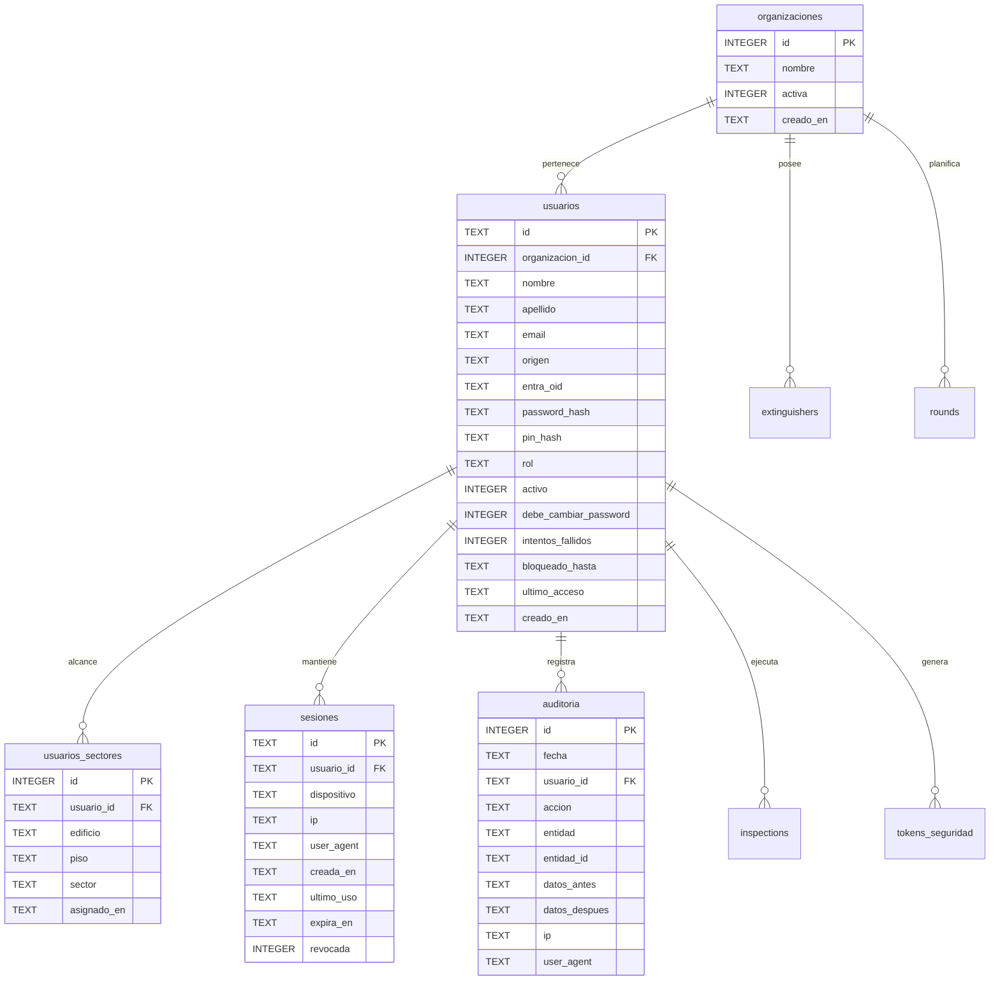
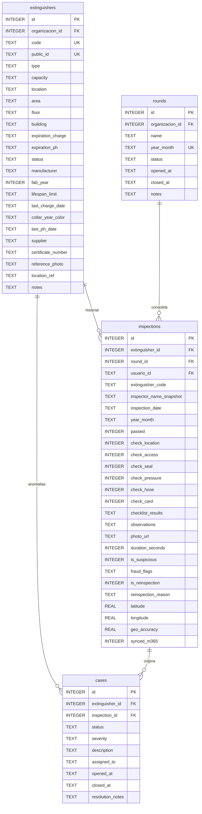

# 🗄️ Diagrama Entidad-Relación y Diccionario de Datos

> **Para quién es**: Desarrolladores backend, DBAs y auditores de infraestructura que necesitan conocer la estructura física de tablas, claves foráneas, restricciones e índices en SQLite.  
> **Qué vas a entender al terminarlo**: El esquema completo de base de datos de Milicic FireControl 365, las relaciones por módulos funcionales y el diccionario de datos de todas las columnas.

---

## 1. Diagrama Entidad-Relación (Módulo Core & Seguridad)



---

## 2. Diagrama Entidad-Relación (Módulo Operativo de Extintores)



---

## 3. Diccionario de Datos

### 3.1 Tabla `organizaciones`

- `id` (INTEGER, PK): Identificador único auto-incremental de la empresa u organización.
- `nombre` (TEXT, NOT NULL): Razón social o denominación interna (ej. "Milicic S.A.").
- `activa` (INTEGER, DEFAULT 1): Bandera de estado operativo (1 = activa, 0 = suspendida).
- `creado_en` (TEXT): Timestamp ISO 8601 de creación.

### 3.2 Tabla `usuarios`

- `id` (TEXT, PK): Identificador UUID v4 único del usuario.
- `organizacion_id` (INTEGER, FK): Referencia a `organizaciones(id)`.
- `nombre`, `apellido` (TEXT, NOT NULL): Nombres del usuario.
- `email` (TEXT, UNIQUE): Correo corporativo normalizado a minúsculas.
- `origen` (TEXT): Origen de autenticación: `'local'` o `'entra'`.
- `entra_oid` (TEXT): Object ID de Microsoft Entra ID (si aplica).
- `password_hash` (TEXT): Hash Argon2id con salt criptográfico.
- `pin_hash` (TEXT): Hash Argon2id para PIN de 4–6 dígitos (dispositivos compartidos).
- `rol` (TEXT, NOT NULL): `'SUPERADMIN'`, `'ADMIN'`, `'SUPERVISOR'`, `'INSPECTOR'`, `'LECTURA'`.
- `activo` (INTEGER, DEFAULT 1): 1 si el usuario tiene acceso permitido; 0 si está desactivado.
- `intentos_fallidos` (INTEGER, DEFAULT 0): Contador para bloqueo por fuerza bruta.
- `bloqueado_hasta` (TEXT): Timestamp hasta el cual el login queda suspendido tras 5 fallos.

### 3.3 Tabla `extinguishers`

- `id` (INTEGER, PK): Identificador secuencial interno.
- `code` (TEXT, UNIQUE): Código visual del activo (`MF-001` a `MF-9999`).
- `public_id` (TEXT, UNIQUE): Token hex aleatorio de 24 caracteres embebido en el código QR (`/m/<public_id>`).
- `type` (TEXT): Tipo de agente extintor (`Polvo ABC`, `CO2`, `Agua`, `Acetato K`).
- `expiration_charge` (TEXT): Fecha calculada de recarga (YYYY-MM-DD).
- `expiration_ph` (TEXT): Fecha calculada de vencimiento de prueba hidráulica (YYYY-MM-DD).
- `status` (TEXT): `'OPERATIVO'`, `'EN_TALLER'`, `'FUERA_DE_SERVICIO'`, `'DE_BAJA'`.

### 3.4 Tabla `inspections`

- `id` (INTEGER, PK): Identificador único del registro de control mensual.
- `inspector_name_snapshot` (TEXT): Nombre inmutable del inspector firmado al momento del control.
- `passed` (INTEGER): 1 si todos los puntos obligatorios fueron aprobados, 0 si hay anomalías.
- `duration_seconds` (INTEGER): Tiempo medido entre inicio y confirmación de la inspección.
- `is_suspicious` (INTEGER): Marcador antifraude (1 si fue menor a 5 segundos o intervalo anómalo).

---

## 4. Índices y Triggers de Inmutabilidad

```sql
-- Índices para optimización de consultas de alta frecuencia
CREATE INDEX IF NOT EXISTS idx_extinguishers_org ON extinguishers(organizacion_id);
CREATE INDEX IF NOT EXISTS idx_extinguishers_code ON extinguishers(code);
CREATE INDEX IF NOT EXISTS idx_extinguishers_public_id ON extinguishers(public_id);
CREATE INDEX IF NOT EXISTS idx_inspections_org ON inspections(organizacion_id);
CREATE INDEX IF NOT EXISTS idx_inspections_ext_date ON inspections(extinguisher_id, inspection_date);
CREATE INDEX IF NOT EXISTS idx_inspections_round ON inspections(round_id);
CREATE INDEX IF NOT EXISTS idx_sesiones_usuario ON sesiones(usuario_id);
CREATE INDEX IF NOT EXISTS idx_auditoria_usuario ON auditoria(usuario_id);
CREATE INDEX IF NOT EXISTS idx_auditoria_fecha ON auditoria(fecha);
```

---

## Archivos del código relacionados

- [`server/db.js`](file:///c:/antigravity/matafuegos/server/db.js) — Definición DDL del esquema y PRAGMAs.
- [`server/migrations/001_multi_org_and_users.js`](file:///c:/antigravity/matafuegos/server/migrations/001_multi_org_and_users.js) — Migración versionada y reversible de organizaciones y usuarios.
