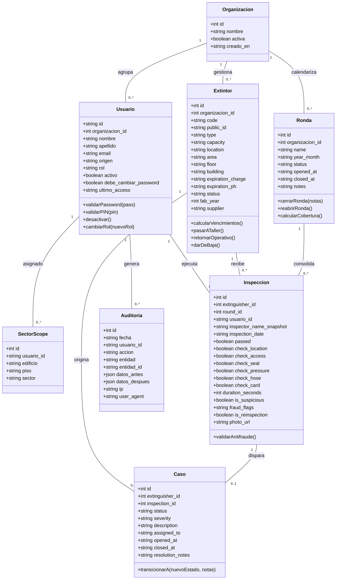

# 🧩 Diagrama de Clases del Dominio

> **Para quién es**: Desarrolladores backend, arquitectos de software e ingenieros que necesitan comprender la estructura orientada a objetos y las entidades de negocio de Milicic FireControl 365.  
> **Qué vas a entender al terminarlo**: Cuáles son las entidades centrales del dominio, cómo se relacionan entre sí, sus multiplicidades (cardinalidades) y los métodos o reglas de negocio que encapsulan.

---

## 1. Diagrama de Clases (UML)

---

## 2. Descripción de Entidades y Reglas

### 2.1 Organización (`Organizacion`)

Raíz multi-inquilino (_multi-tenant_). En la versión actual de Milicic S.A. existe la organización por defecto (`id = 1`), pero todas las entidades de negocio (`Extintor`, `Ronda`, `Usuario`) contienen `organizacion_id`.

### 2.2 Extintor (`Extintor`)

Representa el activo crítico de seguridad. Encapsula las reglas técnicas de la norma **IRAM 3517-2**:

- Vida útil máxima: 20 años para Polvo ABC / Agua / Acetato, 30 años para CO2.
- Recarga obligatoria: frecuencia de 12 meses.
- Prueba Hidráulica (PH): frecuencia de 5 años.

### 2.3 Inspección (`Inspeccion`)

Registro inmutable y legalmente vinculante del control mensual.

- **Inmutabilidad**: Prohibición estricta de `PUT`, `PATCH` y `DELETE` en la API.
- **Antifraude**: Inspecciones con duración menor a 5 segundos son etiquetadas automáticamente como `TIEMPO_INSPECCION_MENOR_5S` para revisión del Supervisor.
- **Snapshot de identidad**: Almacena `inspector_name_snapshot` para preservar el nombre exacto del operario en el momento de la firma electrónica, independientemente de futuros cambios en la cuenta de usuario.

### 2.4 Caso (`Caso`)

Gestión del ciclo de vida de anomalías detectadas en campo:

- Estados posibles: `ABIERTO` $\rightarrow$ `EN_TALLER` $\rightarrow$ `RESUELTO` (o `DESCARTADO`).
- Toda anomalía no aprobada en inspección genera automáticamente un `Caso` abierto con severidad alta o media según el ítem fallado.

---

## Archivos del código relacionados

- [`server/db.js`](file:///c:/antigravity/matafuegos/server/db.js) — Esquema de tablas y relaciones SQLite.
- [`server/services/expirationService.js`](file:///c:/antigravity/matafuegos/server/services/expirationService.js) — Cálculo de vencimientos IRAM.
- [`server/services/antifraudService.js`](file:///c:/antigravity/matafuegos/server/services/antifraudService.js) — Motor de reglas antifraude en inspecciones.
- [`server/services/anomalyService.js`](file:///c:/antigravity/matafuegos/server/services/anomalyService.js) — Detección y reglas de anomalías.
- [`server/routes/cases.js`](file:///c:/antigravity/matafuegos/server/routes/cases.js) — Ciclo de vida y transiciones de casos.
