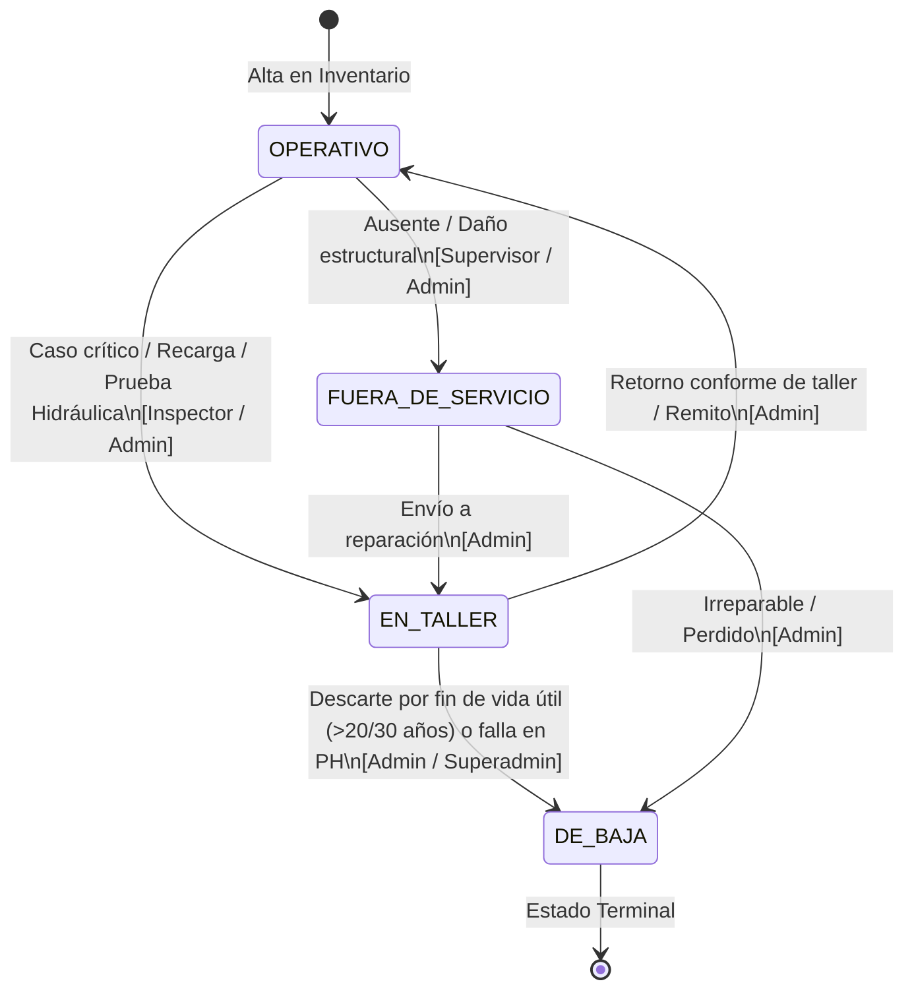
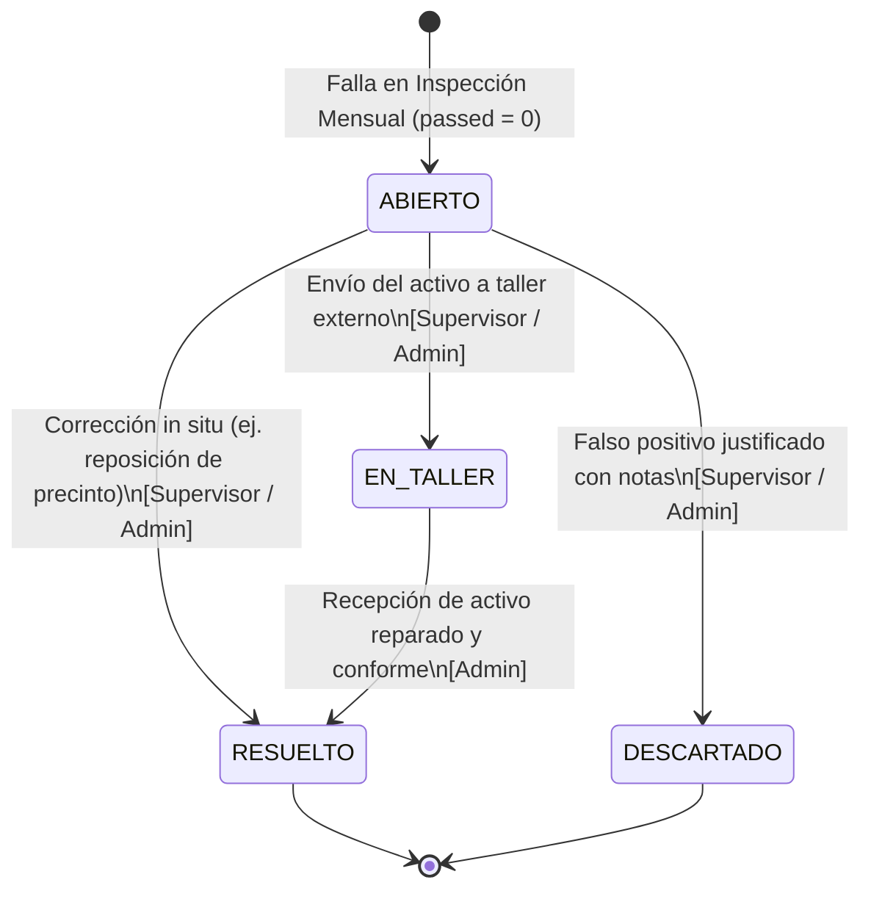
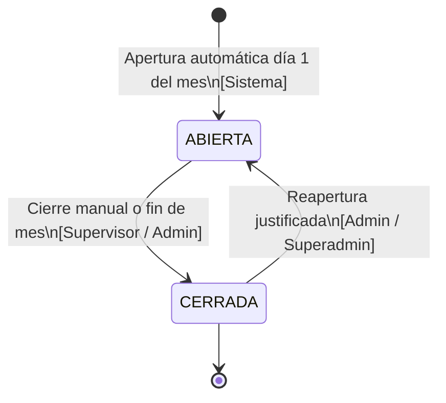
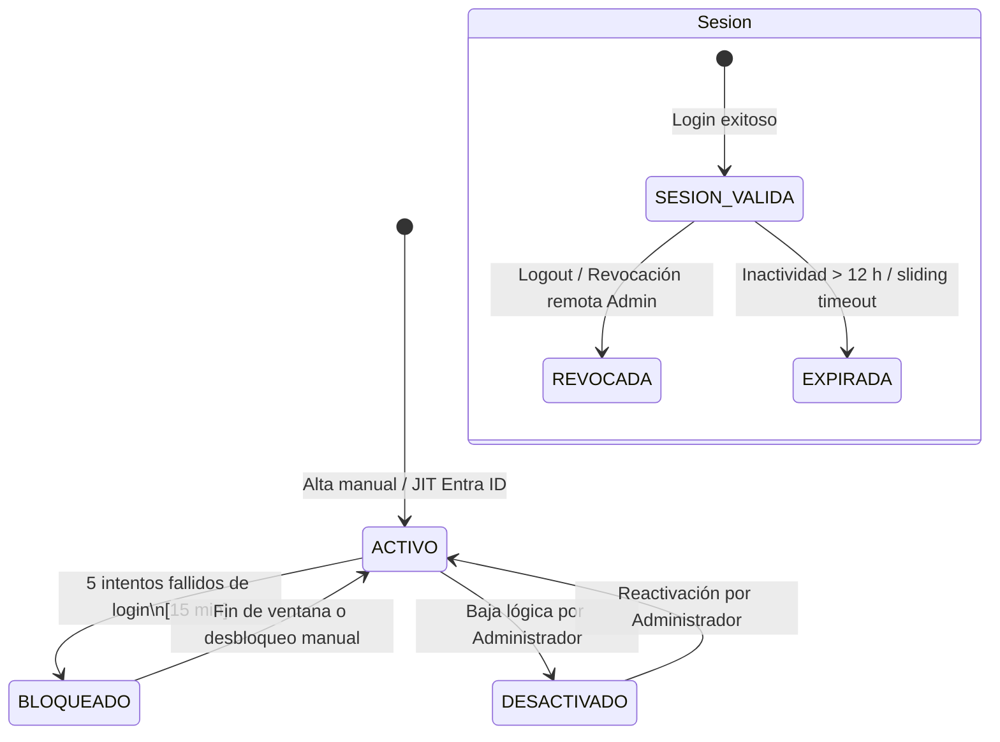

# 🔄 Máquinas de Estados del Dominio

> **Para quién es**: Desarrolladores, testers y analistas funcionales que necesitan conocer las transiciones de ciclo de vida de los activos, rondas, anomalías y sesiones.  
> **Qué vas a entender al terminarlo**: Todos los estados válidos de las entidades de Milicic FireControl 365, qué eventos provocan cada transición y qué roles tienen permiso para ejecutarlas.

---

## 1. Máquina de Estados del Activo / Extintor

Controla la operatividad del extintor según la norma IRAM 3517-2.

### Tabla de Transiciones del Activo

| Estado Inicial | Evento / Disparador                 | Estado Final        | Rol Requerido         | Endpoint API                 |
| -------------- | ----------------------------------- | ------------------- | --------------------- | ---------------------------- |
| `OPERATIVO`    | Falla en inspección / vencimiento   | `EN_TALLER`         | `INSPECTOR`, `ADMIN`  | `PUT /api/extinguishers/:id` |
| `OPERATIVO`    | Desaparición o daño crítico         | `FUERA_DE_SERVICIO` | `SUPERVISOR`, `ADMIN` | `PUT /api/extinguishers/:id` |
| `EN_TALLER`    | Servicio completado con certificado | `OPERATIVO`         | `ADMIN`, `SUPERADMIN` | `PUT /api/extinguishers/:id` |
| `EN_TALLER`    | Superó 20 años o no pasó PH         | `DE_BAJA`           | `ADMIN`, `SUPERADMIN` | `PUT /api/extinguishers/:id` |

---

## 2. Máquina de Estados de Casos / Anomalías

Gestiona las fallas reportadas durante las inspecciones mensuales.

### Reglas de Validación de Casos

- Implementadas en `server/services/casesService.js`.
- No es permitida la transición directa de `RESUELTO` hacia `ABIERTO` (retorna `400 Bad Request`).
- El pase a `RESUELTO` exige obligatoriamente `resolution_notes`.

---

## 3. Máquina de Estados de la Ronda Mensual

Controla la ventana temporal reglamentaria de controles mensuales.

---

## 4. Ciclo de Vida del Usuario y Sesión

---

## Archivos del código relacionados

- [`server/routes/cases.js`](file:///c:/antigravity/matafuegos/server/routes/cases.js) — Transiciones y validaciones de estado de casos.
- [`server/services/anomalyService.js`](file:///c:/antigravity/matafuegos/server/services/anomalyService.js) — Detección y reglas de anomalías.
- [`server/services/roundService.js`](file:///c:/antigravity/matafuegos/server/services/roundService.js) — Apertura y cierre de rondas.
- [`server/services/authService.js`](file:///c:/antigravity/matafuegos/server/services/authService.js) — Bloqueo de cuenta y revocación de sesiones.
- [`tests/integration/cases_transitions.test.js`](file:///c:/antigravity/matafuegos/tests/integration/cases_transitions.test.js) — Tests de las transiciones permitidas y prohibidas.
