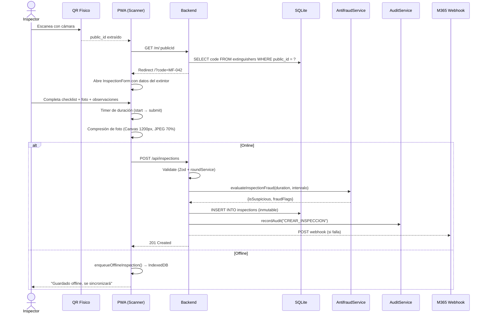
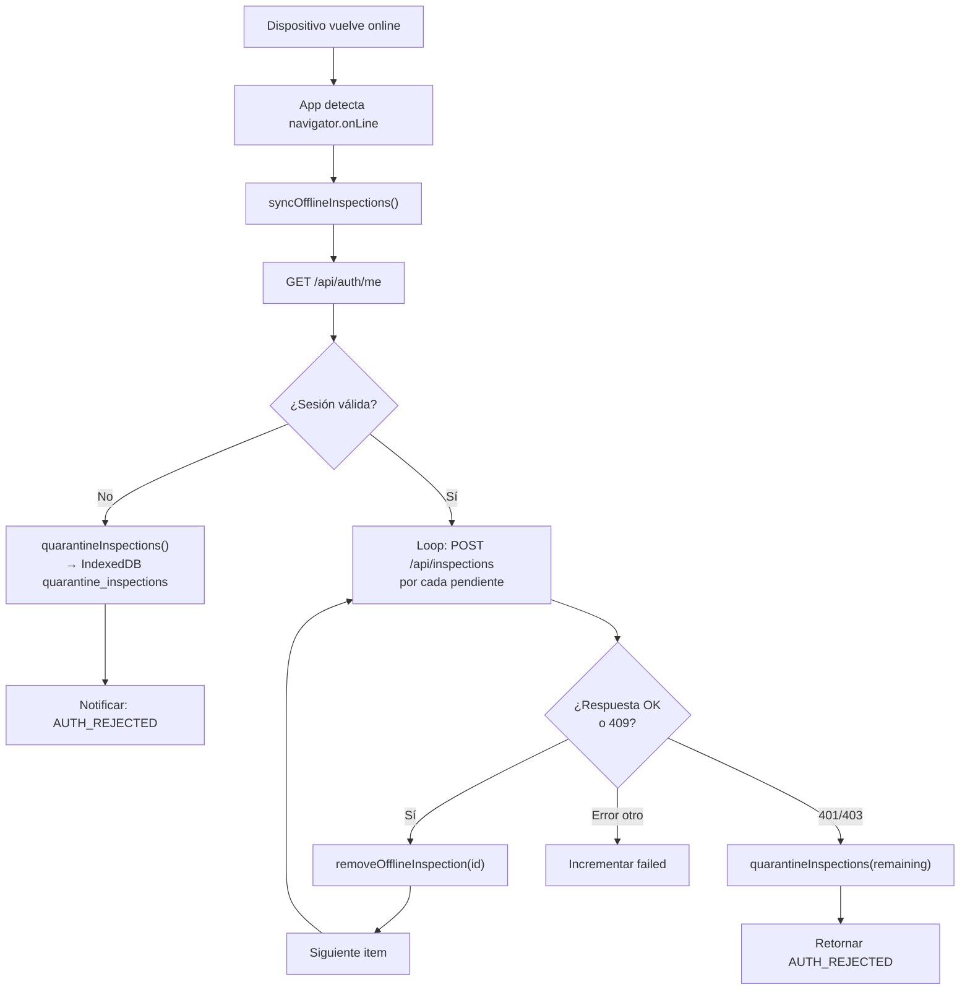
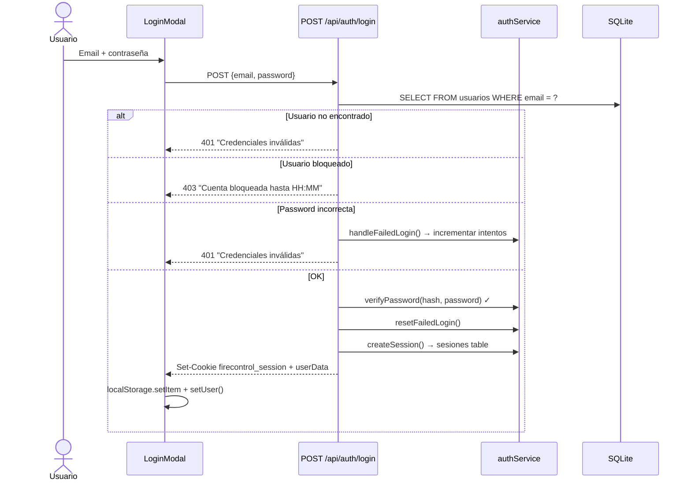
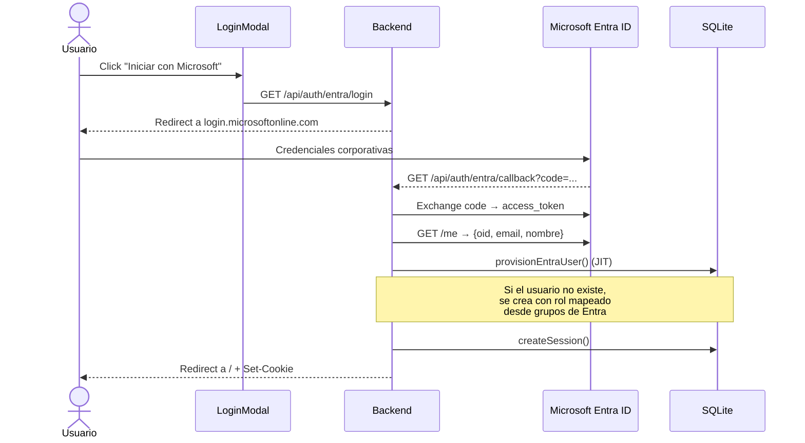
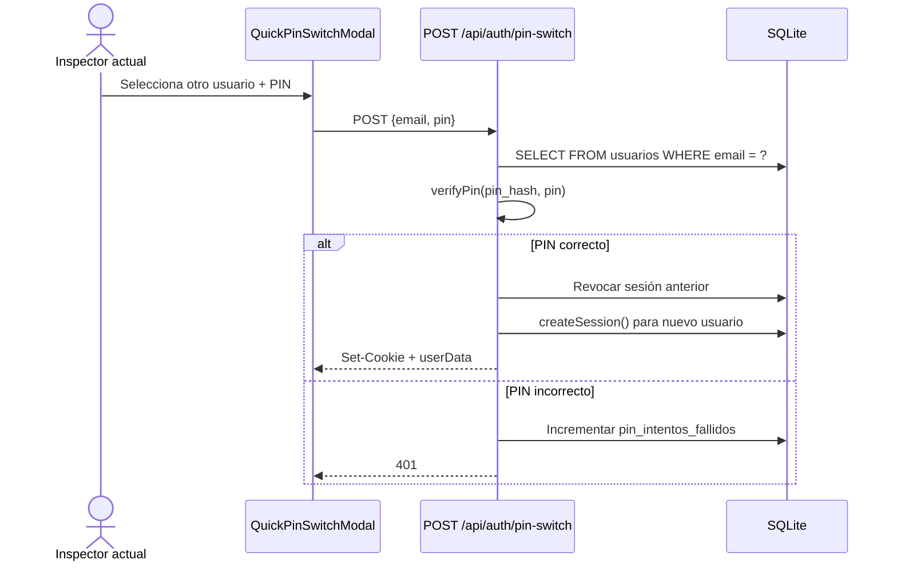
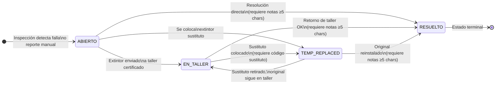
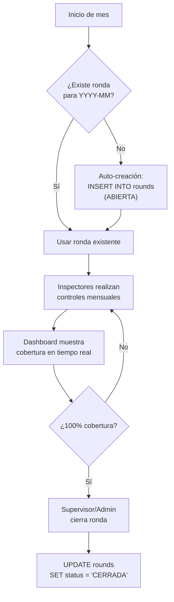
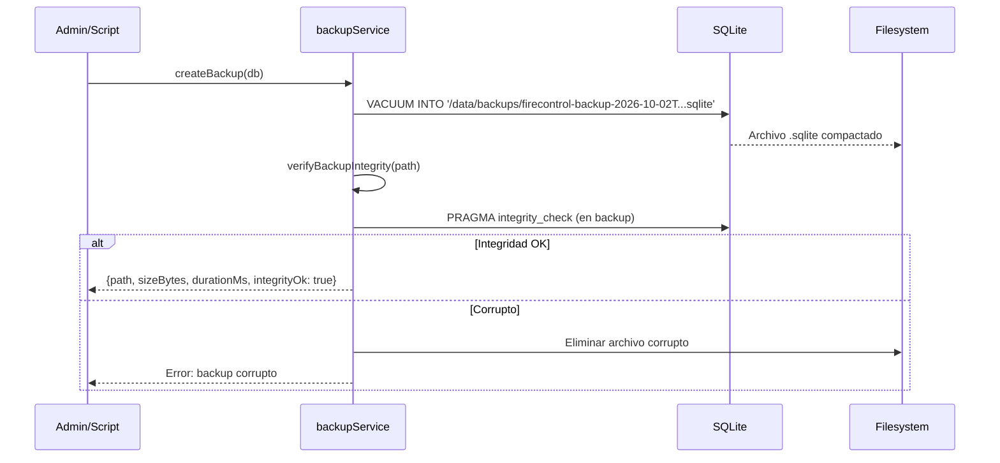
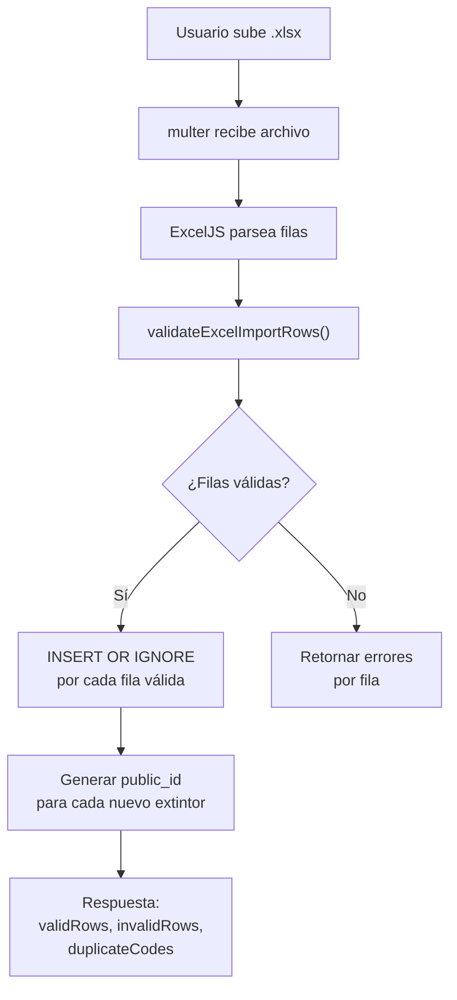
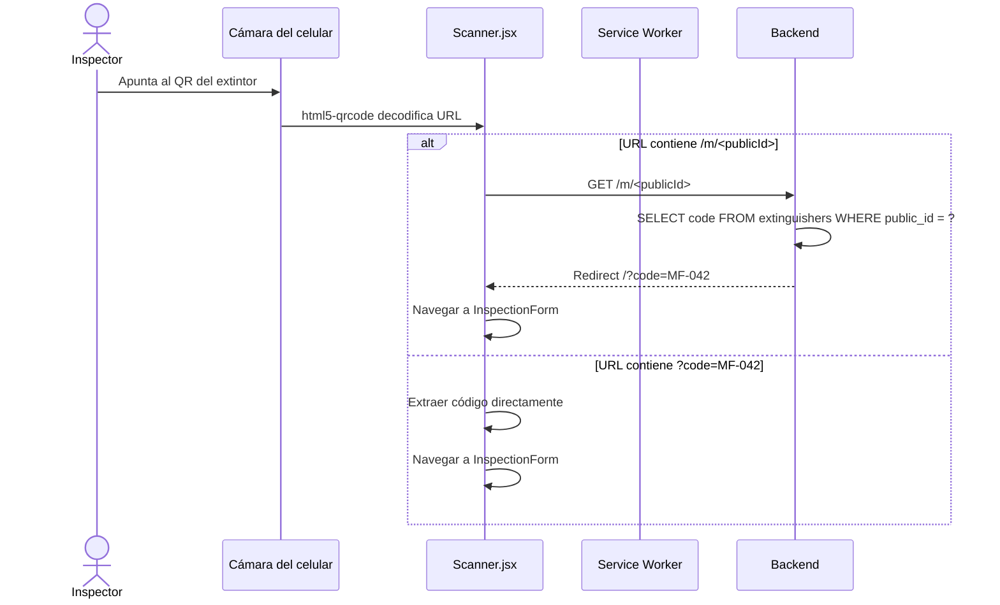

# 🔄 Flujos Operativos

> **Derivado del código real** — `server/routes/*.js`, `server/services/*.js`, `src/components/*.jsx`, `src/utils/offlineQueue.js`.
> Última actualización: 2026-10-02

---

## 1. Flujo de Inspección Mensual

El flujo principal del sistema. Un inspector recorre los extintores de su sector, escanea el QR y completa el checklist.



### 1.1 Validaciones en el registro de inspección

1. **Ronda abierta**: debe existir una ronda con `status = 'ABIERTA'` para el `year_month` actual.
2. **Inspección única**: el extintor no debe tener otra inspección en el mismo `year_month`, salvo que sea reinspección con motivo justificado (≥ 5 caracteres).
3. **Antifraude**: el servicio `antifraudService` evalúa:
   - `TIEMPO_INSPECCION_MENOR_5S`: duración < 5 segundos.
   - `DURACION_CERO`: duración reportada como 0.
   - `INTERVALO_CONSECUTIVO_SOSPECHOSO`: < 8 segundos desde la inspección anterior del mismo inspector.
4. **Alcance sectorial**: si el usuario tiene sectores asignados, el extintor debe estar en su alcance.

---

## 2. Flujo de Sincronización Offline



### 2.1 Cuarentena

Si durante la sincronización la sesión es rechazada (usuario desactivado, sesión revocada), todas las inspecciones **pendientes restantes** se mueven al store `quarantine_inspections` de IndexedDB con:

- `quarantined_at`: timestamp.
- `quarantine_reason`: mensaje del servidor.

Estas inspecciones quedan disponibles para revisión manual por un supervisor.

---

## 3. Flujo de Autenticación

### 3.1 Login Local



### 3.2 Login Microsoft Entra ID (OIDC)



### 3.3 Cambio Rápido por PIN

Para dispositivos compartidos (tablet de inspección), los usuarios pueden cambiar rápidamente sin cerrar la app:



---

## 4. Flujo de Gestión de Anomalías (Casos)



### 4.1 Validaciones de transición (`anomalyService.js`)

| Transición        | Validación adicional                                                 |
| ----------------- | -------------------------------------------------------------------- |
| → `RESUELTO`      | `resolution_notes` obligatorio, mínimo 5 caracteres.                 |
| → `TEMP_REPLACED` | `temp_replacement_code` obligatorio (código del extintor sustituto). |
| Desde `RESUELTO`  | **Prohibido**: estado terminal, no permite transición posterior.     |

---

## 5. Flujo de Ronda Mensual



### 5.1 Cobertura de ronda (`roundService.js`)

```
cobertura = extintores_distintos_inspeccionados / total_extintores_operativos × 100
```

El servicio `groupPendingBySector()` agrupa los extintores **pendientes** por piso y sector para facilitar la planificación de rutas.

---

## 6. Flujo de Backup y Restore

### 6.1 Backup (`backupService.js`)



### 6.2 Retención automática

```javascript
cleanOldBackups({
  keepCount: 7, // Máximo 7 backups recientes
  maxAgeDays: 30 // Máximo 30 días de antigüedad
});
```

### 6.3 Restore

1. Verificar integridad del archivo fuente (`PRAGMA integrity_check`).
2. Eliminar archivos WAL/SHM del destino.
3. Copiar archivo atómicamente (`fs.copyFileSync`).
4. Si `EBUSY`/`EPERM`: instrucciones para detener el contenedor primero.

---

## 7. Flujo de Importación/Exportación Excel

### 7.1 Importación masiva



### 7.2 Exportación

El sistema exporta a Excel (.xlsx) las siguientes entidades:

- Inventario completo de extintores con estado de semáforo.
- Historial de inspecciones por ronda.
- Reporte de anomalías/casos.

---

## 8. Flujo de Integración M365

### 8.1 Webhook de Power Automate

Cuando una inspección resulta con fallas (`passed = false`), el sistema envía un POST al webhook configurado en `settings.m365_webhook_url` con el payload de la inspección para activar un flujo de Power Automate (ej: notificación en canal de Teams).

### 8.2 Sincronización con SharePoint

El módulo `routes/m365.js` (29KB) gestiona:

- Exportación de datos a listas de SharePoint.
- Subida de reportes a bibliotecas de documentos.
- Lectura de configuración desde SharePoint.

---

## 9. Flujo de Escaneo QR



> **Nota crítica**: Los QR ya impresos contienen URLs del formato `https://<BASE_URL>/m/<publicId>`. El `publicId` es inmutable (24 hex chars generado una sola vez).
