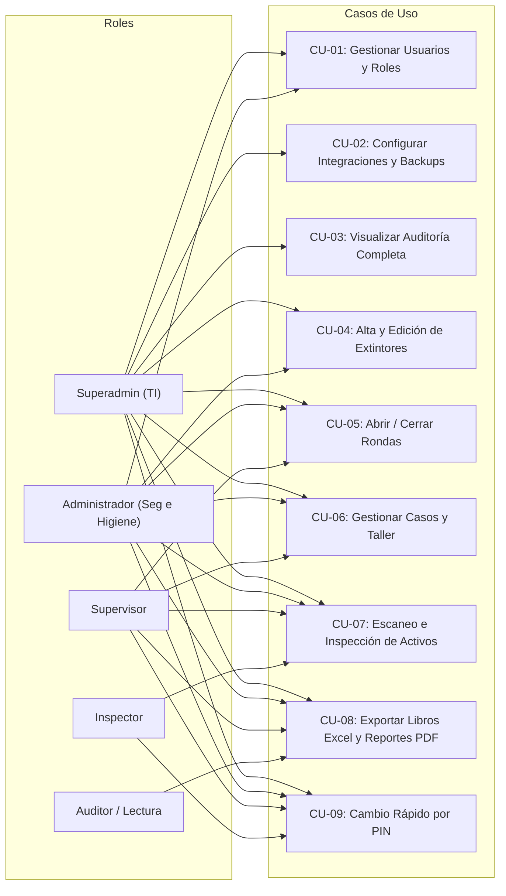

# 👥 Casos de Uso por Rol y Matriz de Permisos

> **Para quién es**: Analistas de requerimientos, desarrolladores de seguridad y auditores que necesitan conocer exactamente qué operaciones puede y no puede realizar cada perfil de usuario en el sistema.  
> **Qué vas a entender al terminarlo**: El mapeo completo de casos de uso del sistema según los 5 roles definidos, las restricciones impuestas en el backend y la matriz granular de permisos.

---

## 1. Casos de Uso por Perfil

---

## 2. Matriz Granular de Permisos (RBAC)

Extraída directamente de la configuración centralizada en [`server/config/permissions.js`](file:///c:/antigravity/matafuegos/server/config/permissions.js):

| Permiso Técnico      | Descripción de Operación                   | `SUPERADMIN` | `ADMIN` | `SUPERVISOR` | `INSPECTOR` | `LECTURA` |
| -------------------- | ------------------------------------------ | :----------: | :-----: | :----------: | :---------: | :-------: |
| `extintor:crear`     | Dar de alta un nuevo extintor              |      ✅      |   ✅    |      ❌      |     ❌      |    ❌     |
| `extintor:editar`    | Modificar datos técnicos o ubicación       |      ✅      |   ✅    |      ❌      |     ❌      |    ❌     |
| `extintor:eliminar`  | Eliminar activo del parque                 |      ✅      |   ✅    |      ❌      |     ❌      |    ❌     |
| `inspeccion:crear`   | Registrar control mensual o reinspección   |      ✅      |   ✅    |      ✅      |     ✅      |    ❌     |
| `ronda:abrir_cerrar` | Abrir período o ejecutar cierre de ronda   |      ✅      |   ✅    |      ✅      |     ❌      |    ❌     |
| `caso:gestionar`     | Transicionar estados de casos y taller     |      ✅      |   ✅    |      ✅      |     ❌      |    ❌     |
| `usuario:gestionar`  | Crear, editar y desactivar usuarios        |      ✅      |   ✅    |      ❌      |     ❌      |    ❌     |
| `auditoria:ver`      | Consultar la bitácora inmutable de eventos |      ✅      |   ✅    |      ❌      |     ❌      |    ❌     |
| `reporte:exportar`   | Descargar libros Excel y reportes PDF      |      ✅      |   ✅    |      ✅      |     ❌      |    ✅     |
| `sistema:configurar` | Configurar webhooks M365 y backups         |      ✅      |   ❌    |      ❌      |     ❌      |    ❌     |

---

## 3. Reglas Críticas de Seguridad

1. **No Escalada**: Un usuario con rol `ADMIN` solo puede invitar o crear usuarios con roles `SUPERVISOR`, `INSPECTOR` o `LECTURA`. Nunca `SUPERADMIN` ni `ADMIN`.
2. **Inmutabilidad del Último Superadmin**: Si queda un solo usuario con rol `SUPERADMIN` activo en la organización, el backend rechaza de plano (`400 Bad Request`) su desactivación o degradación.
3. **Verificación Estricta en Servidor**: El acceso no depende de si el botón está visible u oculto en React; cada endpoint valida obligatoriamente `requirePermiso(...)`.

---

## Archivos del código relacionados

- [`server/config/permissions.js`](file:///c:/antigravity/matafuegos/server/config/permissions.js) — Definición formal de la matriz.
- [`server/middleware/auth.js`](file:///c:/antigravity/matafuegos/server/middleware/auth.js) — Implementación de `requirePermiso` y `requireRole`.
- [`tests/unit/rbac_matrix.test.js`](file:///c:/antigravity/matafuegos/tests/unit/rbac_matrix.test.js) — Pruebas unitarias de la matriz.
- [`tests/integration/auth_rbac.test.js`](file:///c:/antigravity/matafuegos/tests/integration/auth_rbac.test.js) — Pruebas de integración HTTP.
