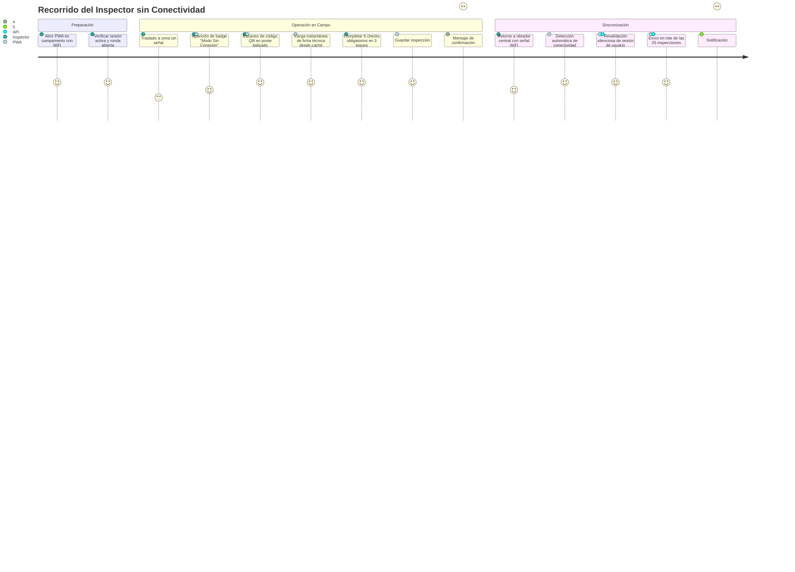
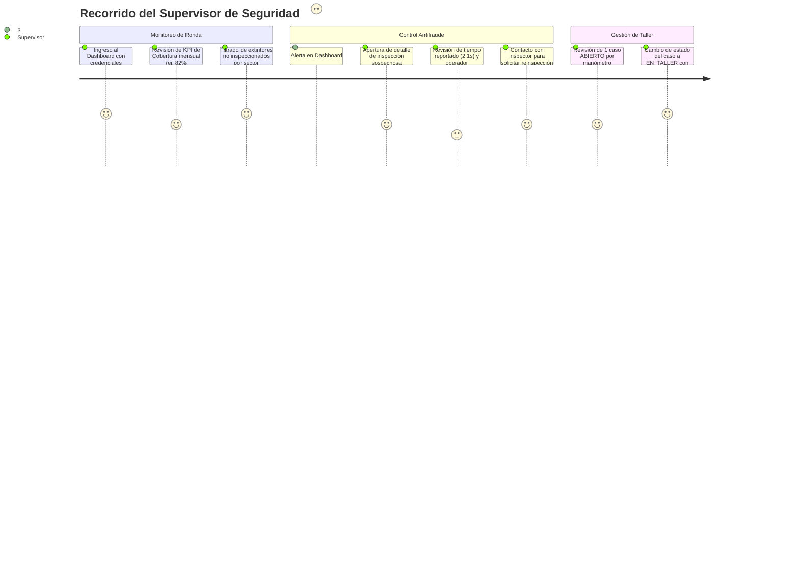
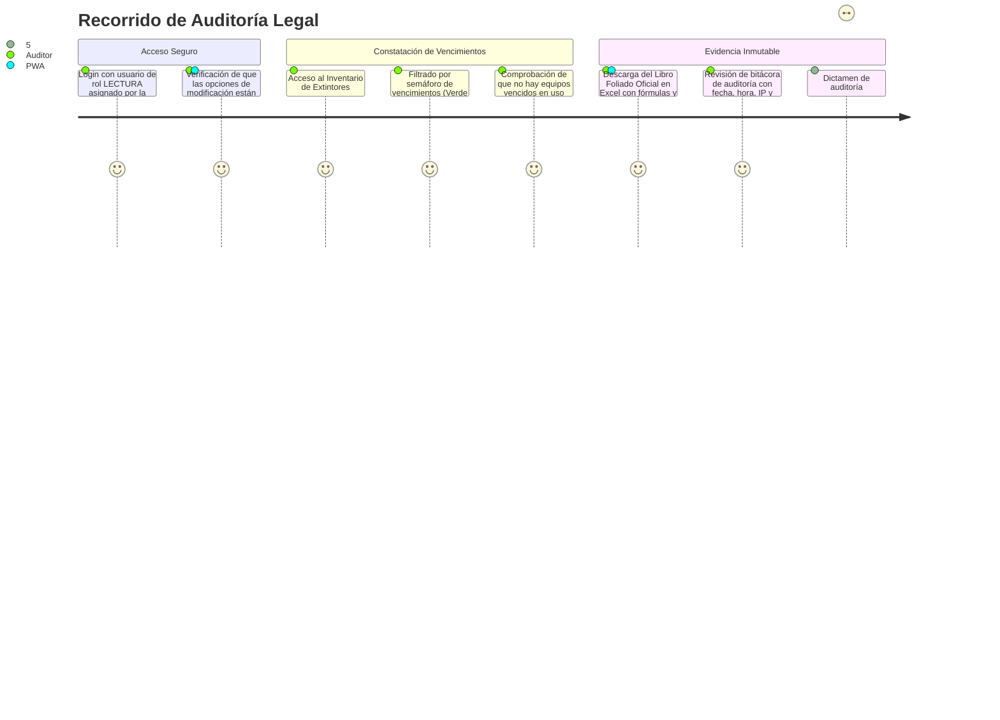

# 🧭 Recorridos de Usuario Clave (User Journeys)

> **Para quién es**: Diseñadores UX/UI, desarrolladores frontend, inspectores y supervisores que necesitan comprender la experiencia de usuario real en condiciones operativas exigentes.  
> **Qué vas a entender al terminarlo**: Cómo interactúan los diferentes perfiles con la aplicación en situaciones reales (campo sin conectividad, auditoría de emergencia, monitoreo de cobertura).

---

## Journey 1: Inspector en Campo Minero / Industrial sin Conectividad

- **Actor**: Inspector de Seguridad e Higiene.
- **Contexto**: Zona de obradores y talleres en obra minera cordillerana sin cobertura 4G ni WiFi.
- **Objetivo**: Completar el control mensual de 25 extintores en menos de 45 minutos.

---

## Journey 2: Supervisor Monitoreando Rondas y Casos Sospechosos

- **Actor**: Supervisor de SySO (Seguridad y Salud Ocupacional).
- **Contexto**: Oficina de obra, día 22 del mes calendario.
- **Objetivo**: Verificar el avance de la ronda mensual, analizar inspecciones sospechosas marcadas por antifraude y derivar equipos defectuosos a taller.

---

## Journey 3: Auditor Externo Requerimiento de Evidencia Legal

- **Actor**: Auditor de ART / Aseguradora / IRAM.
- **Contexto**: Inspección anual sorpresiva de cumplimiento normativo IRAM 3517-2.
- **Objetivo**: Comprobar que todos los extintores han sido controlados mensualmente, verificar la inmutabilidad de los registros y constatar que no existan extintores vencidos.

---

## Archivos del código relacionados

- [`src/utils/offlineQueue.js`](file:///c:/antigravity/matafuegos/src/utils/offlineQueue.js) — Cola offline IndexedDB.
- [`src/components/Dashboard.jsx`](file:///c:/antigravity/matafuegos/src/components/Dashboard.jsx) — Panel de KPIs y alertas antifraude.
- [`src/components/ExtinguishersList.jsx`](file:///c:/antigravity/matafuegos/src/components/ExtinguishersList.jsx) — Exportación oficial para auditores y gestión de inventario.
- [`server/services/antifraudService.js`](file:///c:/antigravity/matafuegos/server/services/antifraudService.js) — Detección de controles rápidos.
