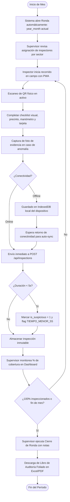
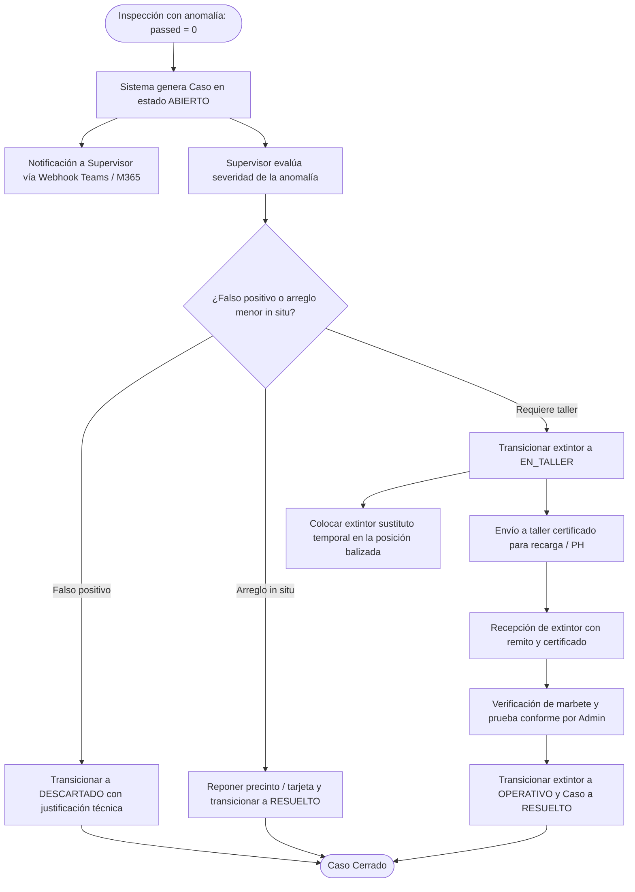
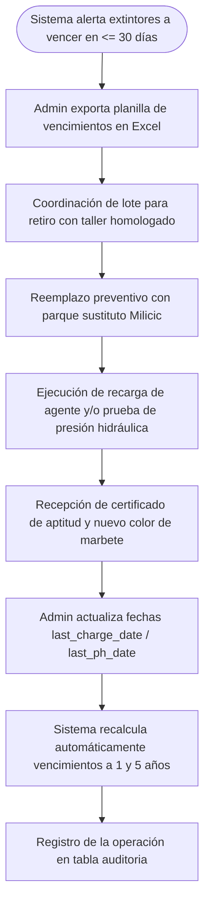

# 📊 Diagramas de Actividad de Procesos Operativos

> **Para quién es**: Supervisores de Seguridad e Higiene, coordinadores de mantenimiento y auditores que necesitan comprender los macro-procesos de negocio de la empresa.  
> **Qué vas a entender al terminarlo**: La secuencia de actividades, bifurcaciones de decisión, roles intervinientes y artefactos producidos a lo largo de las rondas de control, resolución de anomalías y campañas anuales.

---

## 1. Proceso de Ronda Mensual de Extintores

---

## 2. Gestión de Casos y Flujo de Mantenimiento / Taller

---

## 3. Campaña Anual de Recarga y Prueba Hidráulica (IRAM 3517-2)

---

## Archivos del código relacionados

- [`server/routes/rounds.js`](file:///c:/antigravity/matafuegos/server/routes/rounds.js) — Ciclo de vida de rondas mensuales.
- [`server/routes/cases.js`](file:///c:/antigravity/matafuegos/server/routes/cases.js) — Transición y control de anomalías.
- [`server/services/expirationService.js`](file:///c:/antigravity/matafuegos/server/services/expirationService.js) — Detección de vencimientos IRAM.
- [`src/components/ExtinguishersList.jsx`](file:///c:/antigravity/matafuegos/src/components/ExtinguishersList.jsx) — Generación de planillas oficiales y control de inventario.
