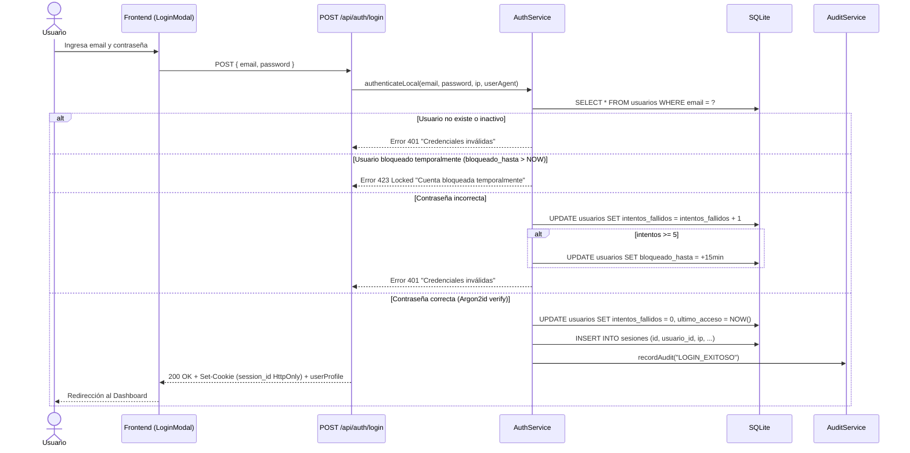
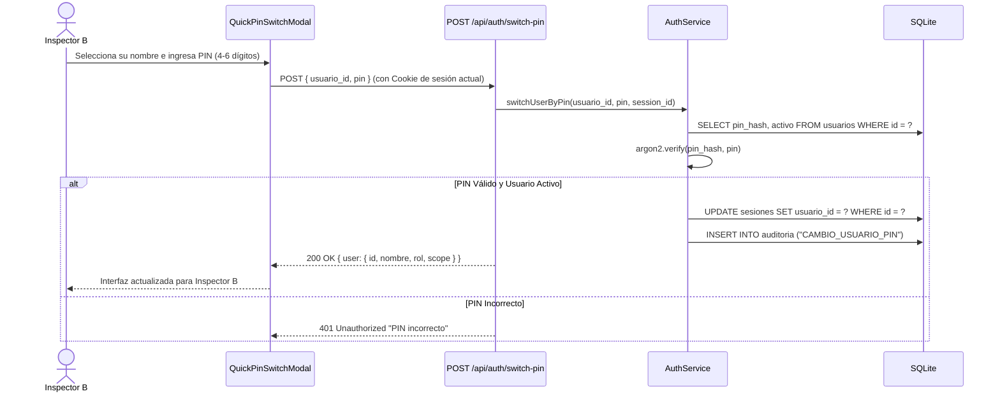
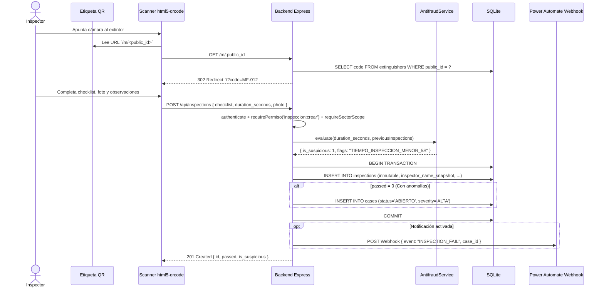
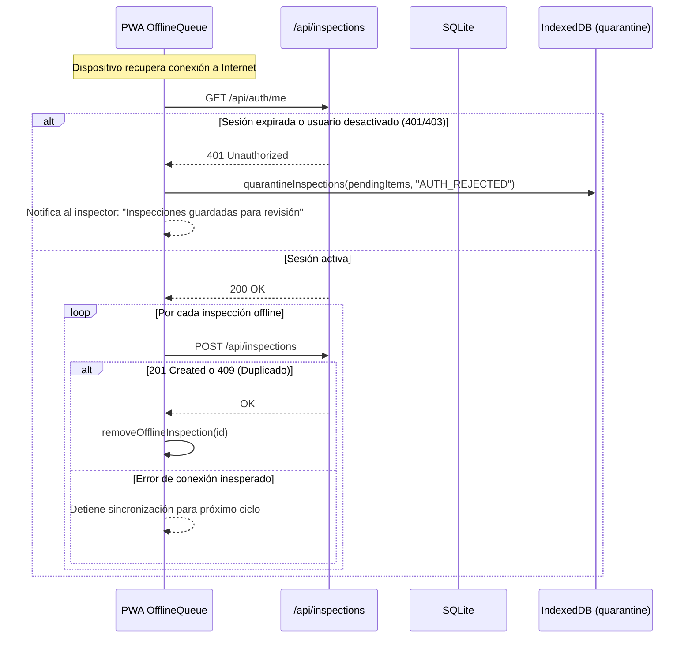

# ⏱️ Diagramas de Secuencia de Flujos Críticos

> **Para quién es**: Desarrolladores backend y frontend que necesitan entender el intercambio paso a paso de mensajes HTTP, sockets, consultas SQL y llamadas a servicios entre los componentes de Milicic FireControl 365.  
> **Qué vas a entender al terminarlo**: El ciclo de vida cronológico de los flujos más sensibles: autenticación, escaneo e inspección, sincronización offline, cambio rápido de usuario por PIN y backups de seguridad.

---

## 1. Login Local y Bloqueo por Fuerza Bruta

---

## 2. Cambio Rápido de Usuario por PIN (Shared Device)

Permite alternar entre inspectores en una misma tablet industrial sin cerrar sesión completa.

---

## 3. Escaneo QR, Inspección y Evaluación Antifraude

---

## 4. Sincronización Offline y Cuarentena de Sesión

---

## Archivos del código relacionados

- [`server/routes/auth.js`](file:///c:/antigravity/matafuegos/server/routes/auth.js) — Endpoints de login y cambio de PIN.
- [`server/routes/inspections.js`](file:///c:/antigravity/matafuegos/server/routes/inspections.js) — Endpoint inmutable de inspecciones.
- [`server/services/antifraudService.js`](file:///c:/antigravity/matafuegos/server/services/antifraudService.js) — Detección de sospechas de fraude.
- [`src/utils/offlineQueue.js`](file:///c:/antigravity/matafuegos/src/utils/offlineQueue.js) — Gestión de cola IndexedDB y cuarentena.
