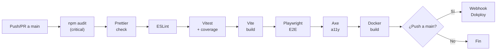

# 🔒 API, Seguridad y Operación

> **Derivado del código real** — `server/routes/*.js`, `server/middleware/*.js`, `server/services/*.js`, `.github/workflows/ci.yml`, `Dockerfile`.
> Última actualización: 2026-10-02

---

## 1. Referencia de API REST

### 1.1 Convenciones

- **Base**: `/api/`
- **Formato**: JSON (`Content-Type: application/json`)
- **Auth**: Cookie `firecontrol_session` (httpOnly). Alternativa: header `x-user-role` (dev/gateway).
- **Errores**: `{ success: false, error: "mensaje en español", code: "ERROR_CODE" }`
- **Éxito**: `{ success: true, data: ... }`
- **Rate Limit**: 300 req/min por IP (`/api`). 10 intentos/15min (`/api/auth/login`).

### 1.2 Endpoints Públicos (sin autenticación)

| Método | Ruta               | Descripción                                               |
| ------ | ------------------ | --------------------------------------------------------- |
| `GET`  | `/m/:publicId`     | Redirección QR → `/?code=MF-XXX#check`. 404 si no existe. |
| `GET`  | `/api/health`      | Healthcheck: DB, disco, memoria. Retorna 200 o 503.       |
| `GET`  | `/api/metrics`     | Métricas Prometheus (text/plain).                         |
| `GET`  | `/documentacion/*` | Portal de documentación estático.                         |

### 1.3 Extintores (`/api/extinguishers`)

| Método   | Ruta            | Permiso               | Descripción                                                                          |
| -------- | --------------- | --------------------- | ------------------------------------------------------------------------------------ |
| `GET`    | `/`             | `inventario:ver`      | Listar con filtros (`search`, `type`, `floor`, `status`, `month`). Incluye semáforo. |
| `GET`    | `/:id`          | `inventario:ver`      | Detalle de un extintor.                                                              |
| `POST`   | `/`             | `inventario:crear`    | Alta de extintor. Genera `public_id` automáticamente.                                |
| `PUT`    | `/:id`          | `inventario:editar`   | Edición de extintor. Registra auditoría con diff.                                    |
| `DELETE` | `/:id`          | `inventario:eliminar` | Eliminación lógica o física (según implementación).                                  |
| `GET`    | `/export/excel` | `reporte:exportar`    | Exportación Excel con estado actual.                                                 |
| `POST`   | `/import/excel` | `reporte:importar`    | Importación masiva desde Excel.                                                      |

### 1.4 Inspecciones (`/api/inspections`)

> ⚠️ **Inmutabilidad**: PUT, PATCH y DELETE retornan `405 Method Not Allowed`.

| Método | Ruta     | Permiso            | Descripción                                                                  |
| ------ | -------- | ------------------ | ---------------------------------------------------------------------------- |
| `GET`  | `/`      | `inspeccion:ver`   | Listar con filtros (`month`, `code`, `round_id`, `inspector`, `suspicious`). |
| `GET`  | `/stats` | `inspeccion:ver`   | Estadísticas: cobertura de ronda, total, pendientes.                         |
| `POST` | `/`      | `inspeccion:crear` | Registrar inspección. Aplica antifraude, validación de ronda.                |

### 1.5 Rondas (`/api/rounds`)

| Método | Ruta          | Permiso              | Descripción                  |
| ------ | ------------- | -------------------- | ---------------------------- |
| `GET`  | `/`           | `ronda:ver`          | Listar rondas.               |
| `GET`  | `/current`    | `ronda:ver`          | Ronda activa del mes actual. |
| `PUT`  | `/:id/close`  | `ronda:abrir_cerrar` | Cerrar ronda.                |
| `PUT`  | `/:id/reopen` | `ronda:reabrir`      | Reabrir ronda (SUPERVISOR+). |

### 1.6 Casos / Anomalías (`/api/cases`)

| Método | Ruta   | Permiso       | Descripción                                   |
| ------ | ------ | ------------- | --------------------------------------------- |
| `GET`  | `/`    | `caso:ver`    | Listar casos con filtros.                     |
| `POST` | `/`    | `caso:crear`  | Crear caso.                                   |
| `PUT`  | `/:id` | `caso:editar` | Actualizar estado (validación de transición). |

### 1.7 Autenticación (`/api/auth`)

| Método   | Ruta               | Auth             | Descripción                                   |
| -------- | ------------------ | ---------------- | --------------------------------------------- |
| `GET`    | `/me`              | Mixto            | Estado actual de autenticación.               |
| `POST`   | `/login`           | No               | Login local (email + password). Rate limited. |
| `POST`   | `/logout`          | Sí               | Cerrar sesión y revocar.                      |
| `POST`   | `/pin-switch`      | No               | Cambio rápido por PIN.                        |
| `POST`   | `/set-pin`         | Sí               | Configurar PIN personal.                      |
| `POST`   | `/change-password` | Sí               | Cambiar contraseña.                           |
| `GET`    | `/entra/login`     | No               | Redirect a Microsoft Entra ID.                |
| `GET`    | `/entra/callback`  | No               | Callback OIDC de Entra.                       |
| `GET`    | `/sessions`        | `sesion:ver`     | Listar sesiones activas.                      |
| `DELETE` | `/sessions/:id`    | `sesion:revocar` | Revocar sesión individual.                    |
| `DELETE` | `/sessions`        | `sesion:revocar` | Revocar todas las sesiones del usuario.       |

### 1.8 Usuarios (`/api/users`)

| Método | Ruta              | Permiso                  | Descripción                            |
| ------ | ----------------- | ------------------------ | -------------------------------------- |
| `GET`  | `/`               | `usuario:ver`            | Listar usuarios.                       |
| `GET`  | `/:id`            | `usuario:ver`            | Detalle de usuario.                    |
| `POST` | `/`               | `usuario:crear`          | Alta de usuario. Jerarquía de roles.   |
| `PUT`  | `/:id`            | `usuario:editar`         | Editar usuario.                        |
| `PUT`  | `/:id/deactivate` | `usuario:desactivar`     | Desactivar usuario + revocar sesiones. |
| `PUT`  | `/:id/sectores`   | `usuario:editar_alcance` | Actualizar alcance sectorial.          |

### 1.9 Auditoría (`/api/audit`)

| Método | Ruta      | Permiso              | Descripción                                                              |
| ------ | --------- | -------------------- | ------------------------------------------------------------------------ |
| `GET`  | `/`       | `auditoria:ver`      | Consultar registros. Filtros: `entidad`, `usuario_id`, `desde`, `hasta`. |
| `GET`  | `/export` | `auditoria:exportar` | Exportar auditoría.                                                      |

### 1.10 Checklist (`/api/checklist`)

| Método | Ruta   | Permiso               | Descripción                         |
| ------ | ------ | --------------------- | ----------------------------------- |
| `GET`  | `/`    | `inventario:ver`      | Listar items activos del checklist. |
| `PUT`  | `/:id` | `checklist:gestionar` | Modificar item.                     |

### 1.11 QR (`/api/qrs`)

| Método | Ruta         | Permiso       | Descripción                             |
| ------ | ------------ | ------------- | --------------------------------------- |
| `GET`  | `/:id/image` | `qr:imprimir` | Generar imagen QR PNG para un extintor. |
| `POST` | `/batch`     | `qr:imprimir` | Generar múltiples QR en lote.           |

### 1.12 M365 (`/api/m365`)

| Método    | Ruta      | Permiso            | Descripción                                                         |
| --------- | --------- | ------------------ | ------------------------------------------------------------------- |
| Múltiples | Múltiples | `config:gestionar` | Sincronización bidireccional con SharePoint, Teams, Power Automate. |

---

## 2. Seguridad

### 2.1 Autenticación

| Mecanismo               | Detalle                                                                                      |
| ----------------------- | -------------------------------------------------------------------------------------------- |
| **Hashing**             | Argon2id (`memoryCost: 64MB, timeCost: 3, parallelism: 1`).                                  |
| **PIN**                 | Argon2id (`memoryCost: 32MB, timeCost: 2`).                                                  |
| **Sesiones**            | Token opaco de 32 bytes (64 hex chars). Cookie `httpOnly`, `secure` (prod), `sameSite: lax`. |
| **Bloqueo**             | 5 intentos fallidos → bloqueo 15 minutos.                                                    |
| **PIN bloqueo**         | Contador independiente `pin_intentos_fallidos`, `pin_bloqueado_hasta`.                       |
| **Contraseñas comunes** | Lista negra de 13 contraseñas prohibidas.                                                    |
| **Mínimo**              | 10 caracteres (contraseña), 4-6 dígitos numéricos (PIN).                                     |

### 2.2 Autorización (RBAC)

```
Request → authenticate → requireRole / requirePermiso → requireSectorScope → handler
```

- **Jerarquía estricta**: un actor solo puede gestionar roles con nivel numérico inferior.
- **SUPERADMIN** bypasses `requireRole`.
- **Alcance sectorial**: `checkUserSectorScope()` cruza los sectores del usuario con `area`, `floor`, `building` del extintor.

### 2.3 Cabeceras de Seguridad

- **Helmet** con CSP restrictiva.
- `X-Request-ID` en todas las respuestas.
- `Cache-Control: no-cache, no-store, must-revalidate` para `index.html`.
- `Cache-Control: public, max-age=31536000, immutable` para assets hasheados.

### 2.4 Rate Limiting

| Endpoint          | Límite       | Ventana    | IP tracking                                |
| ----------------- | ------------ | ---------- | ------------------------------------------ |
| `/api/auth/login` | 10 intentos  | 15 minutos | `x-forwarded-for` / `socket.remoteAddress` |
| `/api/*`          | 300 requests | 1 minuto   | Idem                                       |

Implementación: `Map` en memoria (no persistente, se resetea al reiniciar).

### 2.5 Validación de Input

- **Zod schemas** en middleware `validateBody()` para requests de mutación.
- **Data validators** independientes para lógica de negocio (códigos MF-XXX, fechas).
- **Excel import**: validación fila por fila con detección de duplicados.

### 2.6 Inmutabilidad Regulatoria

Las inspecciones son **inmutables** por normativa IRAM 3517-2. El middleware en `routes/inspections.js` rechaza explícitamente PUT, PATCH y DELETE con HTTP 405.

### 2.7 Auditoría

Toda operación de mutación genera un registro en la tabla `auditoria`:

- `usuario_id` + `usuario_nombre_snapshot` (desnormalizado para preservar identidad si el usuario se modifica).
- `datos_antes` + `datos_despues` (JSON diff).
- `ip` + `user_agent`.
- **Retrocompatibilidad**: también escribe en `audit_logs` (legacy).

---

## 3. Operación

### 3.1 Despliegue con Docker

```bash
# Build
docker build -t milicic-firecontrol .

# Run
docker run -d \
  --name milicic-matafuegos \
  -p 3000:3000 \
  -v matafuegos-data:/data \
  -e NODE_ENV=production \
  -e TZ=America/Argentina/Buenos_Aires \
  milicic-firecontrol
```

### 3.2 Docker Compose

```bash
docker compose up -d
```

Volumen persistente: `milicic_matafuegos_data` → `/data` dentro del contenedor.

### 3.3 Despliegue Dokploy

1. El CI de GitHub Actions ejecuta el pipeline completo.
2. Si pasa, ejecuta `curl -f -X POST "$DOKPLOY_WEBHOOK_URL"`.
3. Dokploy detecta el webhook y hace pull + rebuild + restart.

### 3.4 Healthcheck

```
GET /api/health
```

Respuesta 200 (healthy) o 503 (unhealthy):

```json
{
  "status": "healthy",
  "system": "Milicic FireControl 365",
  "environment": "production",
  "uptime": 86400,
  "checks": {
    "database": { "status": "healthy", "integrity": "ok" },
    "storage": { "status": "healthy", "freeMb": 5120, "freePercent": 42.3 },
    "memory": { "status": "healthy", "rssMb": 85, "heapUsedMb": 45 }
  }
}
```

Docker HEALTHCHECK ejecuta esta ruta cada 30 segundos.

### 3.5 Métricas Prometheus

```
GET /api/metrics
Content-Type: text/plain; version=0.0.4
```

Métricas disponibles:

- `firecontrol_uptime_seconds`
- `firecontrol_memory_heap_bytes` / `rss_bytes`
- `firecontrol_http_requests_total` / `errors_total`
- `firecontrol_extinguishers_total` / `by_status{status="..."}`
- `firecontrol_inspections_total` / `today`
- `firecontrol_open_cases_total`
- `firecontrol_round_coverage_ratio{year_month="..."}`
- `firecontrol_sync_operations_total`

### 3.6 Backup y Restore

#### Backup manual

```bash
# Desde la máquina host
npm run backup

# Desde dentro del contenedor
node scripts/backup-db.js
```

Genera: `/data/backups/firecontrol-backup-YYYY-MM-DDTHH-MM-SS.sqlite`

#### Restore

```bash
# Detener el servicio primero
docker stop milicic-matafuegos

# Ejecutar restore
npm run restore -- /data/backups/firecontrol-backup-2026-10-01T...sqlite

# Reiniciar
docker start milicic-matafuegos
```

#### Retención

- **keepCount**: 7 backups (default).
- **maxAgeDays**: 30 días (default).

### 3.7 Logs

| Entorno        | Formato                                   | Ejemplo                                                                                                      |
| -------------- | ----------------------------------------- | ------------------------------------------------------------------------------------------------------------ |
| **Producción** | JSON estructurado (una línea por request) | `{"timestamp":"...", "level":"INFO", "message":"GET /api/extinguishers", "statusCode":200, "durationMs":12}` |
| **Desarrollo** | Texto legible                             | `[2026-10-02T15:30:00.000Z] [INFO] [a1b2c3d4] GET /api/extinguishers 200 (12ms)`                             |

Niveles: `debug` < `info` < `warn` < `error`. Configurable con `LOG_LEVEL`.

### 3.8 Creación de usuario administrador

```bash
node scripts/crear-admin.js
```

Script interactivo que crea un usuario `SUPERADMIN` con:

- Nombre, apellido, email.
- Contraseña hasheada con Argon2id.
- PIN opcional.

### 3.9 CI/CD Pipeline


