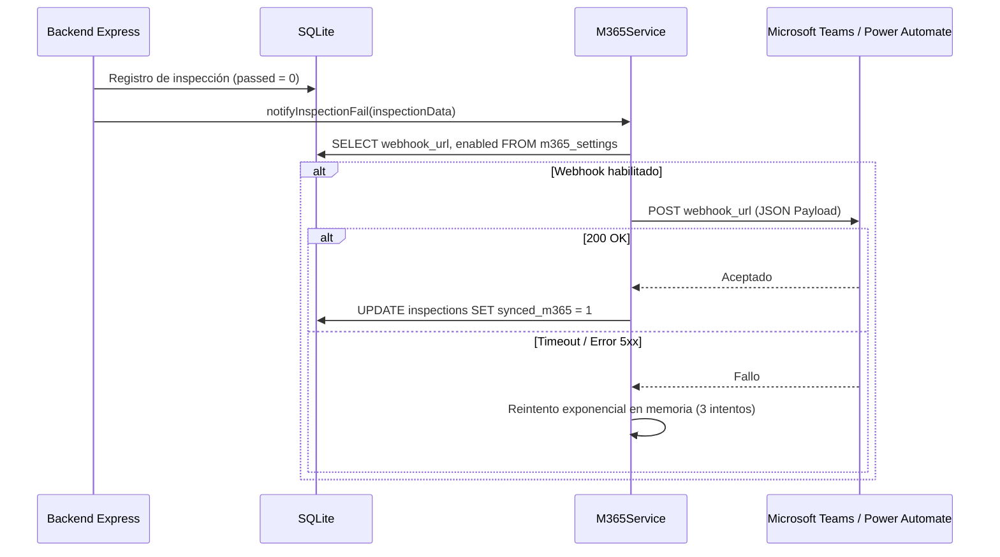

# ⚡ Eventos y Webhooks de Integración

> **Para quién es**: Desarrolladores de integraciones, ingenieros DevOps y administradores de Microsoft 365 / Power Automate.  
> **Qué vas a entender al terminarlo**: Cómo emite Milicic FireControl 365 notificaciones en tiempo real a canales externos (Microsoft Teams, Power Automate, correo), la estructura de los payloads JSON y la política de resiliencia ante caídas del webhook.

---

## 1. Arquitectura de Notificación

Cuando ocurre un evento crítico en la aplicación (por ejemplo, una anomalía grave en un extintor), la ruta [`server/routes/m365.js`](file:///c:/antigravity/matafuegos/server/routes/m365.js) dispara una petición HTTP POST asíncrona hacia el webhook configurado en Microsoft 365 / Power Automate.



---

## 2. Catálogo de Payloads de Eventos

### 2.1 Evento: Falla en Inspección Mensual (`INSPECTION_FAIL`)

Se emite inmediatamente cuando un extintor no supera uno o más de los 6 controles reglamentarios.

```json
{
  "event": "INSPECTION_FAIL",
  "timestamp": "2026-10-02T14:30:00.000Z",
  "organization": {
    "id": 1,
    "name": "Milicic S.A."
  },
  "extinguisher": {
    "code": "MF-012",
    "type": "Polvo ABC",
    "capacity": "5 kg",
    "location": "Obrador Central - Taller Mecánico",
    "building": "Edificio Central",
    "floor": "Planta Baja"
  },
  "inspection": {
    "id": 842,
    "inspector": "Santiago Amaya",
    "date": "2026-10-02",
    "failures": [
      "check_pressure (Manómetro fuera de zona verde)",
      "check_seal (Precinto roto o adulterado)"
    ],
    "observations": "Se observa golpe en la válvula y pérdida de presión.",
    "photo_evidence": "data:image/jpeg;base64,/9j/4AAQSkZJRg..."
  },
  "case": {
    "id": 115,
    "status": "ABIERTO",
    "severity": "ALTA"
  }
}
```

### 2.2 Evento: Alerta Preventiva de Vencimiento (`EXPIRATION_ALERT`)

Emitido por la tarea programada ante extintores a 30 días o menos de su vencimiento de carga o prueba hidráulica.

```json
{
  "event": "EXPIRATION_ALERT",
  "timestamp": "2026-10-01T08:00:00.000Z",
  "summary": {
    "total_alertas": 3,
    "vencidos": 0,
    "por_vencer_30_dias": 3
  },
  "extinguishers": [
    {
      "code": "MF-005",
      "type": "CO2",
      "expiration_charge": "2026-10-28",
      "days_until_expiration": 27,
      "location": "Sala de Servidores TI"
    }
  ]
}
```

---

## 3. Configuración y Resiliencia

- **Almacenamiento**: La URL del webhook se guarda cifrada o parametrizada en la tabla `m365_settings` o mediante la variable de entorno `M365_WEBHOOK_URL`.
- **Modo Asíncrono**: La notificación externa no bloquea la respuesta HTTP al inspector (`non-blocking background task`).
- **Política de Reintentos**: 3 intentos con backoff exponencial (1s, 2s, 4s). En caso de fallo definitivo, se registra el incidente en el log estructurado de la aplicación con severidad `WARN`.

---

## Archivos del código relacionados

- [`server/routes/m365.js`](file:///c:/antigravity/matafuegos/server/routes/m365.js) — Endpoints de configuración, prueba y emisión de webhooks M365.
- [`server/routes/inspections.js`](file:///c:/antigravity/matafuegos/server/routes/inspections.js) — Disparo del evento ante inspección no conforme.
