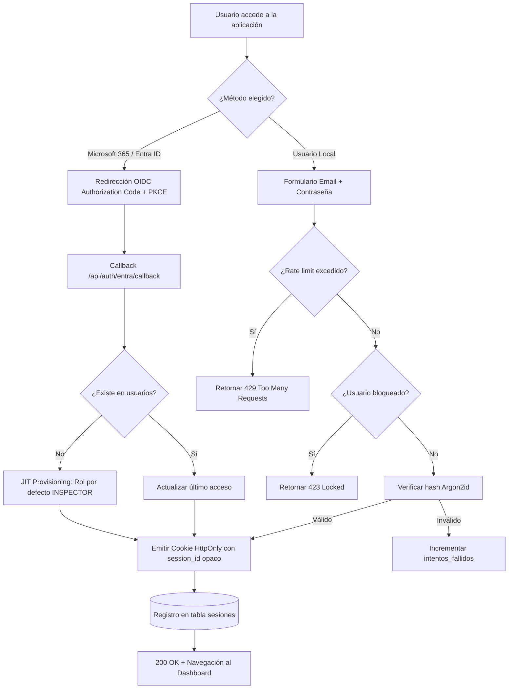

# 🔑 Autenticación, Autorización (RBAC) y Control de Alcance

> **Para quién es**: Desarrolladores backend, arquitectos de software e ingenieros de seguridad que implementan o auditan los mecanismos de acceso.  
> **Qué vas a entender al terminarlo**: El funcionamiento del flujo dual de autenticación (Microsoft Entra ID + Local Argon2id), el ciclo de vida de sesiones opacas, la autorización basada en roles y sectores, y la protección contra ataques IDOR.

---

## 1. Arquitectura de Autenticación Dual

---

## 2. Gestión de Sesiones Opacas

A diferencia de JWT auto-contenidos, el sistema utiliza **IDs de sesión opacos (UUID v4)** persistidos en la tabla `sesiones` de SQLite:

- **Revocación Inmediata**: Si un administrador desactiva a un usuario o revoca una sesión desde la UI, el acceso queda interrumpido en la siguiente petición HTTP.
- **Seguridad en Cookies**: Emitidas con los atributos `HttpOnly`, `SameSite=Lax` y `Secure` (en entornos productivos HTTPS).
- **Protección XSS**: Al ser `HttpOnly`, el token de sesión no puede ser leído ni extraído mediante scripts maliciosos ejecutados en el navegador.

---

## 3. Autorización RBAC y Scope Sectorial

La autorización se evalúa en el servidor mediante middlewares encadenados:

1. **`authenticate`**: Valida la cookie `firecontrol_session`, comprueba que la sesión no esté revocada y que el usuario siga `activo = 1`.
2. **`requirePermiso('codigo:permiso')`**: Comprueba si el rol asignado posee el permiso según la matriz centralizada en `server/config/permissions.js`.
3. **`requireSectorScope`**: Si el usuario tiene registros en `usuarios_sectores`, se intercepta la petición para validar que el extintor objetivo pertenezca a sus sectores/edificios autorizados. Si no tiene registros, su alcance abarca toda la organización.

---

## 4. Protección contra IDOR (Insecure Direct Object References)

- **Aislamiento Multi-Organización**: Todas las queries SQL incorporan automáticamente el filtro `WHERE organizacion_id = ?` derivado del usuario autenticado. Un usuario de la Organización A jamás puede acceder ni modificar activos de la Organización B, incluso conociendo sus IDs secuenciales.
- **Aislamiento por Sector**: Los inspectores con alcance asignado no pueden consultar ni registrar inspecciones sobre extintores ubicados fuera de su área operativa. Intentos de manipulación retornan `403 Forbidden`.

---

## Archivos del código relacionados

- [`server/services/authService.js`](file:///c:/antigravity/matafuegos/server/services/authService.js) — Lógica de login, hash Argon2id, lockout y sesiones.
- [`server/middleware/auth.js`](file:///c:/antigravity/matafuegos/server/middleware/auth.js) — Middlewares `authenticate`, `requirePermiso` y `requireSectorScope`.
- [`server/config/permissions.js`](file:///c:/antigravity/matafuegos/server/config/permissions.js) — Matriz de permisos RBAC.
- [`tests/integration/idor_and_scope.test.js`](file:///c:/antigravity/matafuegos/tests/integration/idor_and_scope.test.js) — Pruebas automatizadas de aislamiento e IDOR.
