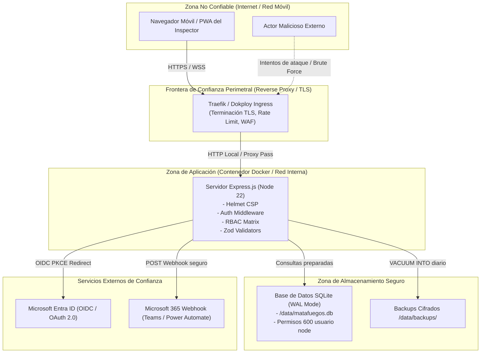

# 🛡️ Modelo de Amenazas (STRIDE) y Límites de Confianza

> **Para quién es**: Ingenieros de seguridad de la información, arquitectos de software y auditores de ciberseguridad.  
> **Qué vas a entender al terminarlo**: El diagrama de flujo de datos (DFD) con sus fronteras de confianza, las amenazas identificadas bajo la metodología STRIDE, las contramedidas implementadas en el código y el riesgo residual aceptado.

---

## 1. Diagrama de Flujo de Datos (DFD) y Límites de Confianza

---

## 2. Análisis STRIDE de Amenazas y Mitigaciones

| Categoría STRIDE                                 | Amenaza Identificada                                                                                     | Componente Afectado                       | Mitigación Implementada                                                                                                                         | Riesgo Residual |
| ------------------------------------------------ | -------------------------------------------------------------------------------------------------------- | ----------------------------------------- | ----------------------------------------------------------------------------------------------------------------------------------------------- | :-------------: |
| **S**poofing (Suplantación)                      | Un atacante se hace pasar por un inspector o administrador para alterar controles.                       | `/api/auth/login`, `/api/auth/switch-pin` | Argon2id con salt criptográfico, cookies HttpOnly SameSite=Lax, autenticación OIDC delegada a Microsoft Entra ID.                               |    Muy Bajo     |
| **T**ampering (Alteración)                       | Modificación retroactiva de un control fallado para ocultar un extintor vencido.                         | `/api/inspections`                        | Inmutabilidad de endpoints (PUT/PATCH/DELETE prohibidos con 405 Method Not Allowed), tabla `auditoria` inmutable.                               |      Bajo       |
| **R**epudiation (Repudio)                        | Un inspector niega haber realizado o aprobado una inspección sospechosa.                                 | `/api/inspections`, `auditoria`           | `inspector_name_snapshot` inmutable, registro de IP, user-agent, `usuario_id` vinculado y duración de la inspección.                            |    Muy Bajo     |
| **I**nformation Disclosure (Fuga de Información) | Extracción no autorizada de credenciales, tokens o listas de usuarios.                                   | `/api/users`, endpoints de error          | Sanitización de respuestas (no se exponen contraseñas ni PINs en ningún JSON), mensajes de error genéricos para evitar enumeración de usuarios. |    Muy Bajo     |
| **D**enial of Service (Denegación de Servicio)   | Saturación de peticiones de login para bloquear la API o agotar SQLite.                                  | Express, SQLite                           | Rate limiting en memoria (10 intentos/15m en login, 300 req/min global), `PRAGMA busy_timeout = 5000` en SQLite.                                |      Medio      |
| **E**levation of Privilege (Escalada)            | Un Inspector o Auditor manipula llamadas para auto-asignarse rol SUPERADMIN (IDOR/Privilege Escalation). | `/api/users/:id`, RBAC                    | Middleware de servidor `requirePermiso(...)`, validación de jerarquía numérica de roles (nadie puede asignar rol superior o igual al propio).   |    Muy Bajo     |

---

## Archivos del código relacionados

- [`server/middleware/auth.js`](file:///c:/antigravity/matafuegos/server/middleware/auth.js) — Verificación de permisos y protección contra escalada.
- [`server/routes/auth.js`](file:///c:/antigravity/matafuegos/server/routes/auth.js) — Rate limiting y bloqueo por fuerza bruta.
- [`server/routes/inspections.js`](file:///c:/antigravity/matafuegos/server/routes/inspections.js) — Inmutabilidad de registros normativos.
- [`tests/integration/idor_and_scope.test.js`](file:///c:/antigravity/matafuegos/tests/integration/idor_and_scope.test.js) — Pruebas automatizadas de prevención IDOR.
