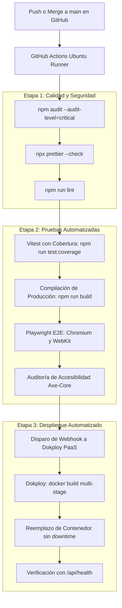

# 🚀 Pipeline de CI/CD y Despliegue en Dokploy

> **Para quién es**: Ingenieros de DevOps, administradores de Dokploy y desarrolladores que necesitan conocer cómo se automatiza la validación y el despliegue del software.  
> **Qué vas a entender al terminarlo**: La secuencia de ejecución del flujo de trabajo en GitHub Actions, las compuertas de calidad requeridas y cómo se dispara el webhook de despliegue automatizado hacia Dokploy PaaS.

---

## 1. Arquitectura del Pipeline de Entrega Continua

---

## 2. Configuración en GitHub Actions

El archivo de configuración principal se encuentra en [`.github/workflows/ci.yml`](file:///c:/antigravity/matafuegos/.github/workflows/ci.yml):

- **Desencadenadores**:
  - `push` a la rama `main`.
  - `pull_request` contra la rama `main`.
- **Secretos Requeridos en GitHub**:
  - `DOKPLOY_WEBHOOK_URL`: URL secreta generada en el panel de Dokploy que gatilla el re-despliegue del contenedor de producción.

---

## 3. Despliegue en Dokploy PaaS

Dokploy gestiona el ciclo de vida del contenedor Docker en el servidor de producción:

1. Recibe el webhook autenticado desde GitHub Actions.
2. Clona el commit verificado de `main`.
3. Ejecuta el `Dockerfile` multi-stage:
   - **Stage 1 (builder)**: Compila los activos estáticos de React con Vite.
   - **Stage 2 (runner)**: Crea una imagen ligera con Node.js 22 Alpine, instala únicamente dependencias de producción y corre como usuario `node`.
4. Monta el volumen persistente `matafuegos-data` en `/data`.
5. Valida el estado mediante el `HEALTHCHECK` configurado sobre `/api/health`.

---

## Archivos del código relacionados

- [`.github/workflows/ci.yml`](file:///c:/antigravity/matafuegos/.github/workflows/ci.yml) — Workflow de GitHub Actions.
- [`Dockerfile`](file:///c:/antigravity/matafuegos/Dockerfile) — Receta de compilación y empaquetado del contenedor.
- [`docker-compose.yml`](file:///c:/antigravity/matafuegos/docker-compose.yml) — Especificación de volúmenes y variables para Dokploy.
