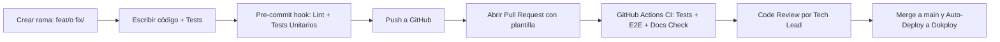

# 🤝 Guía del Contribuidor y Definición de Terminado (DoD)

> **Para quién es**: Cualquier ingeniero o desarrollador que prepare un cambio, corrección o nueva funcionalidad en el repositorio.  
> **Qué vas a entender al terminarlo**: El ciclo de vida de una contribución, los requisitos previos al envío de un Pull Request y los criterios de aceptación rigurosos de la "Definición de Terminado".

---

## 1. Flujo de Trabajo para Nuevas Funcionalidades



---

## 2. Definición de "Terminado" (Definition of Done - DoD)

Un cambio solo se considera terminado cuando cumple con **todos** los siguientes puntos:

1. **Código Funcional**: La funcionalidad resuelve el requerimiento sin romper los flujos existentes.
2. **Autorización Backend**: La operación está restringida en el servidor mediante `requirePermiso` o `requireRole`, no únicamente en la UI.
3. **Inmutabilidad y Auditoría**: Si muta datos sensibles, registra la operación en la tabla `auditoria`. Si toca inspecciones, respeta su inmutabilidad estricta.
4. **Pruebas Automatizadas**:
   - Pruebas unitarias para la lógica pura.
   - Pruebas de integración API para los nuevos endpoints o cambios de permisos.
   - En flujos críticos de usuario, prueba E2E en Playwright.
5. **Calidad de Código**: `npm run lint` pasa sin advertencias ni errores.
6. **Diseño Visual**: Se respetaron los tokens institucionales de Milicic (#EA580C y #0F172A) y no hay desborde horizontal en 360 px.
7. **Documentación Actualizada**: Se actualizaron los documentos correspondientes en `docs/` y el archivo `CHANGELOG-DOCS.md`.

---

## 3. Plantilla de Pull Request

```markdown
### 📝 Resumen del Cambio

- Breve descripción del problema resuelto o la funcionalidad incorporada.

### 🔒 Impacto en Seguridad y Permisos

- [ ] ¿Requiere un nuevo permiso en `server/config/permissions.js`?
- [ ] ¿Afecta el aislamiento multi-organización o por sector?
- [ ] ¿Preserva la inmutabilidad de inspecciones históricas?

### 🧪 Verificación Realizada

- [ ] `npm test -- --run` pasó al 100%.
- [ ] `npm run test:e2e` pasó al 100%.
- [ ] `npm run lint` pasó sin errores.

### 📚 Documentación

- [ ] Actualicé la documentación y los diagramas afectados en `docs/`.
```

---

## Archivos del código relacionados

- [`package.json`](file:///c:/antigravity/matafuegos/package.json) — Hooks de `precommit`.
- [`eslint.config.js`](file:///c:/antigravity/matafuegos/eslint.config.js) — Reglas de linter.
