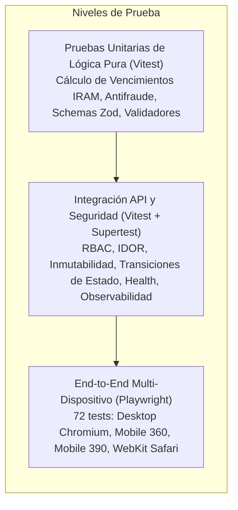

# 🧪 Estrategia de Pruebas Automatizadas y Calidad

> **Para quién es**: Desarrolladores, ingenieros de QA / Test Automation y evaluadores de accesibilidad.  
> **Qué vas a entender al terminarlo**: La arquitectura de la pirámide de pruebas, cómo ejecutar cada nivel (unitario, integración, E2E multi-dispositivo, rendimiento y accesibilidad Axe-Core) y cómo simular condiciones complejas como la pérdida de conexión o la cámara del celular.

---

## 1. La Pirámide de Pruebas de Milicic FireControl



---

## 2. Ejecución de Suites de Prueba

### 2.1 Pruebas Unitarias y de Integración (Vitest)

```bash
# Ejecutar todas las pruebas unitarias y de integración
npm test -- --run

# Ejecutar únicamente pruebas unitarias rápidas
npm run test:unit

# Ejecutar únicamente pruebas de integración API
npm run test:api

# Generar reporte de cobertura de código
npm run test:coverage
```

_Configuración_: `vitest.config.js` tiene configurado `fileParallelism: false` para evitar colisiones de cerrojo en SQLite durante la ejecución concurrente de tests en disco.

### 2.2 Pruebas End-to-End (Playwright)

```bash
# Compilar el bundle estático previo a los tests E2E
npm run build

# Ejecutar los 72 tests E2E en los 4 navegadores/viewports
npm run test:e2e

# Ejecutar de forma interactiva con UI
npx playwright test --ui
```

### 2.3 Auditoría de Accesibilidad (Axe-Core)

```bash
npm run test:a11y
```

Evalúa contraste de color, etiquetas ARIA, jerarquía de encabezados y elementos interactivos según pautas **WCAG 2.1 Nivel AA**. Cero violaciones críticas o serias toleradas.

### 2.4 Pruebas de Rendimiento y Carga (Autocannon)

```bash
npm run test:load
```

Somete a la API a ráfagas de 50 conexiones concurrentes sostenidas durante 10 segundos, comprobando que la latencia p99 se mantenga por debajo de los 100 ms y la tasa de error sea 0%.

---

## 3. Técnicas Especiales de Simulación

### 3.1 Simulación de Pérdida de Conectividad (Offline)

En Playwright (`tests/e2e/offline_sync.spec.js`), se simula la desconexión mediante:

```javascript
await page.context().setOffline(true);
// Los formularios deben completar y confirmar guardado en IndexedDB
await page.context().setOffline(false);
// Se dispara la sincronización automática y se confirma en el backend
```

### 3.2 Inyección Segura de Sesión en E2E

Para evitar demoras repetitivas de login en cada spec, se utiliza la función auxiliar `ensureAdminSession(page)` en [`tests/e2e/helpers.js`](file:///c:/antigravity/matafuegos/tests/e2e/helpers.js), la cual inserta la sesión directamente en SQLite e inyecta la cookie HttpOnly en el contexto del navegador.

---

## Archivos del código relacionados

- [`vitest.config.js`](file:///c:/antigravity/matafuegos/vitest.config.js) — Configuración del test runner Vitest.
- [`playwright.config.js`](file:///c:/antigravity/matafuegos/playwright.config.js) — Proyectos y viewports de Playwright.
- [`tests/e2e/helpers.js`](file:///c:/antigravity/matafuegos/tests/e2e/helpers.js) — Utilidades de sesión y navegación E2E.
- [`tests/integration/auth_rbac.test.js`](file:///c:/antigravity/matafuegos/tests/integration/auth_rbac.test.js) — Cobertura de matriz RBAC.
