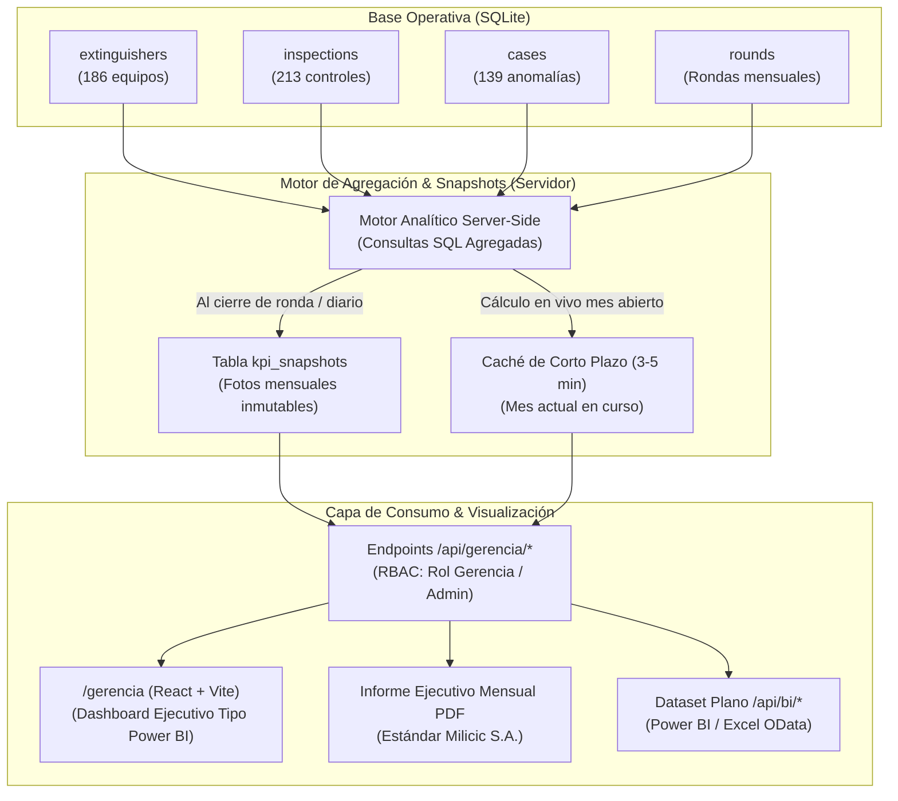

# ADR-005: Módulo Gerencial de KPIs Ejecutivos y Resumen de Estado (FireControl 365 BI)

**Estado:** PROPUESTO  
**Fecha:** 2026-10-03  
**Autor:** Arquitecto de Software & Diseñador de Producto  
**Decisores:** Gerencia General, Gerencia de Higiene y Seguridad (HSE), Gerencia de Operaciones / TI  
**Normativa y Estándares de Referencia:** IRAM 3517-2 • ISO 45001 • ISO 27001 • WCAG 2.1 AA • Milicic Corporate Standards

---

## 1. Contexto y Problema de Negocio

La plataforma **Milicic FireControl 365** ha alcanzado madurez en su operativa de campo:

- Inspección ágil mediante escaneo QR y listas de verificación reglamentarias (IRAM 3517-2).
- Trazabilidad y georreferenciación de controles mensuales con motor antifraude (< 5 segundos).
- Gestión de roles (RBAC) con soporte para autenticación local y Microsoft Entra ID (Azure AD OIDC).
- Manejo de contingencias sin conexión (Offline Sync) y registro inmutable de auditoría.

**El Problema:**  
Actualmente, la visualización de la plataforma está centrada en la **operativa cotidiana del inspector y del supervisor** (extintores pendientes de la ronda del mes, lista de equipos por sector, botones de acción para escaneo).  
La **Alta Gerencia** (Gerencia de Seguridad e Higiene, Gerencia de Operaciones y Dirección de Milicic S.A.) no dispone de un espacio dedicado a la **toma de decisiones estratégicas**:

1. No puede responder en menos de 30 segundos si la planta está en cumplimiento normativo legal o si existen pasivos por extintores vencidos.
2. No cuenta con una proyección presupuestaria a 12 meses de recargas y pruebas hidráulicas quinquenales para planificar campañas de taller e inversiones.
3. No posee visibilidad agregada sobre la confiabilidad del servicio de proveedores externos (tiempos de devolución y cumplimiento de fechas pactadas).
4. No existe un mecanismo de "fotos congeladas" (snapshots) que permita certificar ante comités o la ART cuál era el estado exacto de la planta en meses anteriores sin riesgo de que ediciones posteriores alteren el histórico.

---

## 2. Público Objetivo y Preguntas de Negocio Clave

### 2.1 Audiencia

- **Gerencia de Seguridad, Higiene y Medio Ambiente (HSE):** Responsable legal y técnico de la protección contra incendios de la compañía.
- **Gerencia de Operaciones y Mantenimiento de Planta:** Responsable de la continuidad operativa, disponibilidad de equipos en áreas críticas y coordinación con talleres externos.
- **Dirección General:** Evaluación global de riesgos de infraestructura, auditorías corporativas y cumplimiento de presupuestos.

### 2.2 Preguntas Estratégicas que Debe Responder la Sección

La interfaz no se organizará por tablas de datos, sino por **preguntas de negocio**:

| Pregunta de Negocio                                                       | Decisión Gerencial que Habilita                                                                                             |
| :------------------------------------------------------------------------ | :-------------------------------------------------------------------------------------------------------------------------- |
| **¿Estamos cumpliendo con la ronda reglamentaria a tiempo?**              | Asignar refuerzos a inspectores, reabrir rondas demoradas o sancionar demoras operativas.                                   |
| **¿Cuál es nuestro nivel de exposición y riesgo legal por vencimientos?** | Disponer el recambio urgente de cilindros vencidos o fuera de norma para evitar clausuras y no-coberturas de seguro.        |
| **¿Dónde se concentran los focos de riesgo y fallas? (Mapa de Calor)**    | Priorizar capacitaciones de uso en sectores con alta rotura o corregir condiciones ambientales (humedad, vibración, polvo). |
| **¿Qué presupuesto debemos prever para los próximos 12 meses?**           | Aprobar partidas de compras, licitar servicios de recarga con anticipación y negociar tarifas por volumen.                  |
| **¿Resolvemos las anomalías con la agilidad requerida (MTTR)?**           | Evaluar el cuello de botella entre detección, taller y reinstalación del equipo en puesto.                                  |
| **¿Los proveedores externos de taller cumplen sus compromisos?**          | Renovar contratos con proveedores confiables o exigir penalidades por retrasos no justificados.                             |
| **¿Son íntegros y confiables los datos presentados?**                     | Validar que no existan inspecciones fraudulentas o registros sin respaldo físico antes de presentar reportes a directores.  |

---

## 3. Principio Rector de Privacidad Laboral (Regla de Oro)

> **REGLA ESTRICTA DE PRIVACIDAD GERENCIAL:**  
> La sección Gerencia mostrará datos **agregados a nivel planta, edificio, sector, tipo de activo y proveedor**.  
> **Bajo ninguna circunstancia se expondrán rankings de velocidad individual, comparativas persona a persona o métricas de productividad por inspector.**

### Justificación:

1. **Enfoque en Procesos, no en Punición:** La gestión ejecutiva de seguridad debe focalizarse en la confiabilidad de las instalaciones y no en incentivar carreras de velocidad entre inspectores que degraden la calidad técnica del control visual.
2. **Prevención de Fraude Operativo:** Mostrar rankings de "inspectores más rápidos" a nivel directivo incentiva controles superficiales o adulteración de datos de campo.
3. **Privacidad y Clima Laboral:** El análisis del desempeño individual es resorte exclusivo del Supervisor y Administrador de HSE en sus paneles operativos con fines formativos y de auditoría interna.

---

## 4. Estrategia Arquitectónica de Datos y Cálculo



### 4.1 Cálculo Exclusivo en el Servidor (Server-Side Aggregations)

- No se transfieren listas masivas de inspecciones o extintores al navegador del cliente.
- Se implementan funciones de agregación SQL con índices adecuados (`year_month`, `status`, `expiration_charge`, `passed`).
- Respuestas de la API compactas en formato JSON preagregado: tiempos de respuesta objetivo **$p95 < 200\text{ ms}$** con los 186 activos actuales y **$< 500\text{ ms}$** con 5.000 activos simulados.

### 4.2 Inmutabilidad de Meses Cerrados vía `kpi_snapshots`

- Cada vez que una ronda mensual pasa a estado `CERRADA`, el sistema calcula y almacena un snapshot definitivo e inmutable en la tabla `kpi_snapshots`.
- Los gráficos de tendencias históricas a 12 meses consultan directamente los snapshots cerrados. Si meses más tarde se edita un dato maestro, el resultado histórico oficial del mes cerrado permanece idéntico.
- **Backfill Histórico:** Se implementará una migración que calculará los snapshots de los meses ya registrados en la base, marcándolos con la bandera `es_reconstruido = 1` para total transparencia de auditoría.

### 4.3 Única Fuente de Verdad para Fórmulas

Cada KPI tendrá una **única función de cálculo centralizada** en `server/services/kpiService.js`.  
El valor visualizado en la pantalla `/gerencia`, el valor exportado a Excel, el valor impreso en el PDF ejecutivo y el valor entregado al conector de Power BI provienen rigurosamente de la misma función matemática.

---

## 5. Integración con el Modelo de Seguridad y RBAC Existente

Se incorpora el rol **`GERENCIA`** a la matriz central de permisos (`server/config/permissions.js`):

```javascript
PERMISOS.GERENCIA_VER = 'gerencia:ver';
PERMISOS.GERENCIA_EXPORTAR = 'gerencia:exportar';
PERMISOS.GERENCIA_CONFIGURAR = 'gerencia:configurar'; // Solo SUPERADMIN y ADMIN
```

- **Acceso:** `SUPERADMIN`, `ADMIN` y `GERENCIA` pueden visualizar `/gerencia`.
- **Restricción:** El rol `GERENCIA` tiene privilegios de solo lectura; no puede editar inventario, ni aprobar inspecciones, ni alterar configuraciones de usuarios.
- **Multitenancy y Alcance:** Todos los endpoints validan la `organizacion_id` y los filtros sectoriales autorizados para prevenir cualquier vulnerabilidad IDOR.

---

## 6. Diagnóstico del Estado Actual de Datos vs Requerimientos

| Requerimiento de KPI                           | Datos Actuales en BD                                                                     |  Factibilidad Actual   | Estrategia de Implementación                                                                                                                                 |
| :--------------------------------------------- | :--------------------------------------------------------------------------------------- | :--------------------: | :----------------------------------------------------------------------------------------------------------------------------------------------------------- |
| **a) Cumplimiento de Ronda**                   | `rounds`, `inspections.year_month`, `inspections.extinguisher_id`                        |    **100% Exacto**     | Inmediata (Conteo de equipos inspeccionados vs total activo).                                                                                                |
| **b) Cumplimiento Normativo / Vigencia**       | `extinguishers.expiration_charge`, `expiration_ph`, `lifespan_limit`, `status`           |    **100% Exacto**     | Inmediata (Evaluación de fechas contra fecha de corte).                                                                                                      |
| **c) Proyección de Vencimientos 12 Meses**     | Fechas de vencimiento completas en los 186 registros de `extinguishers`                  |    **100% Exacto**     | Inmediata (Agrupación mensual a 30/60/90/365 días).                                                                                                          |
| **d) Tasa de Fallas por Tipo y Sector**        | `inspections.passed`, `checklist_results`, `extinguishers.type`, `area`, `floor`         |    **100% Exacto**     | Inmediata (Agrupación de anomalías por dimensión).                                                                                                           |
| **e) Gestión de Anomalías y MTTR**             | `cases.opened_at`, `cases.closed_at`, `cases.status`                                     |    **100% Exacto**     | Inmediata (Diferencia de días entre apertura y cierre).                                                                                                      |
| **f) Disponibilidad de la Protección**         | `extinguishers.status` ('EN_TALLER', 'FUERA_DE_SERVICIO'), `cases.temp_replacement_code` |    **100% Exacto**     | Inmediata (% de puestos cubiertos por equipo titular o sustituto).                                                                                           |
| **g) Servicios de Taller & Tiempos Proveedor** | `cases.status = 'EN_TALLER'`, `extinguishers.supplier`                                   |   **Parcial (80%)**    | En Fase 1 se incorporará tabla `ordenes_servicio` para registrar formalmente: fecha envío, fecha prometida y fecha recepción.                                |
| **h) Mapa de Calor por Sector**                | `extinguishers.building`, `floor`, `area`, estados consolidados                          |    **100% Exacto**     | Inmediata (Matriz sectorial con semáforo IRAM).                                                                                                              |
| **i) Índice de Salud General (0-100)**         | Combinación ponderada de los KPIs b, a, e y f                                            |    **100% Exacto**     | Inmediata (Fórmula documentada y configurable).                                                                                                              |
| **j) Confiabilidad de Datos / Antifraude**     | `inspections.is_suspicious`, `fraud_flags`, `duration_seconds`                           |    **100% Exacto**     | Inmediata (% sospechosas sobre total inspeccionado).                                                                                                         |
| **k) Adopción Organizacional**                 | `rounds.status`, `rounds.closed_at`, `rounds.opened_at`, usuarios activos                |    **100% Exacto**     | Inmediata (Cierres a tiempo vs planificados a nivel global).                                                                                                 |
| **l) Costos de Mantenimiento**                 | No existen campos de importes monetarios en el esquema actual                            | **Pendiente (Fase 1)** | Se agregará columna opcional `costo_servicio` en `ordenes_servicio`. Mientras tanto, el módulo reportará "Módulo de Costos no configurado" sin romper la UI. |

---

## 7. Decisiones Descartadas y Alternativas Evaluadas

1. **Descartado: Calcular KPIs en el cliente (Browser):**  
   _Motivo:_ Descargar cientos o miles de registros al navegador ralentiza dispositivos móviles y expone datos sensibles de auditoría. Todo cálculo se hace en SQLite y se envía preagregado.
2. **Descartado: Recalcular métricas históricas al vuelo:**  
   _Motivo:_ Si se modifica una ficha de extintor hoy, alteraría retroactivamente las estadísticas de enero o marzo. Los comités de auditoría exigen que los meses cerrados sean inmutables (resuelto con `kpi_snapshots`).
3. **Descartado: Integrar librerías de gráficos pesadas incompatibles:**  
   _Motivo:_ El proyecto corre React 19. Librerías tradicionales con dependencias antiguas generan conflictos de instalación. Se opta por gráficos SVG reactivos nativos ultra-livianos, accesibles, estilizados con la paleta Milicic y sin sobrecarga de bundle.
4. **Descartado: Conectores propietarios o APIs pagas de BI:**  
   _Motivo:_ Se implementará un endpoint REST estándar `/api/bi/*` que entrega tablas planas (formato estrella en JSON y CSV) consumible nativamente desde Power BI Desktop (vía Conector Web/OData) o Excel sin costos adicionales ni licencias propietarias.

---

## 8. Plan de Implementación por Fases

- **Fase 0 (Actual):** Aprobación del ADR y del catálogo técnico en `docs/KPIS.md`.
- **Fase 1 (Backend & Cálculos):** Migración SQLite de `kpi_snapshots`, `kpi_configuracion` y `ordenes_servicio`; servicio centralizado `kpiService.js`, backfill histórico y endpoints `/api/gerencia/*`.
- **Fase 2 (Interfaz Ejecutiva):** Ruta `/gerencia` en React con KPIs superiores, paneles por preguntas estratégicas, filtros dinámicos, sparklines, mapa de calor, modo presentación y narrativa automática.
- **Fase 3 (Reportes & Power BI):** Generador de informe ejecutivo mensual en PDF oficial, exportación Excel/PNG y endpoint `/api/bi/*` con token seguro.
- **Fase 4 (Pruebas & Calidad):** Tests unitarios de fórmulas, consistencia entre vistas, tests de rendimiento con 5.000 activos y tests E2E con Playwright.
- **Fase 5 (Documentación & Entrega):** Actualización de diagramas de arquitectura, manuales y presentación final al usuario.
