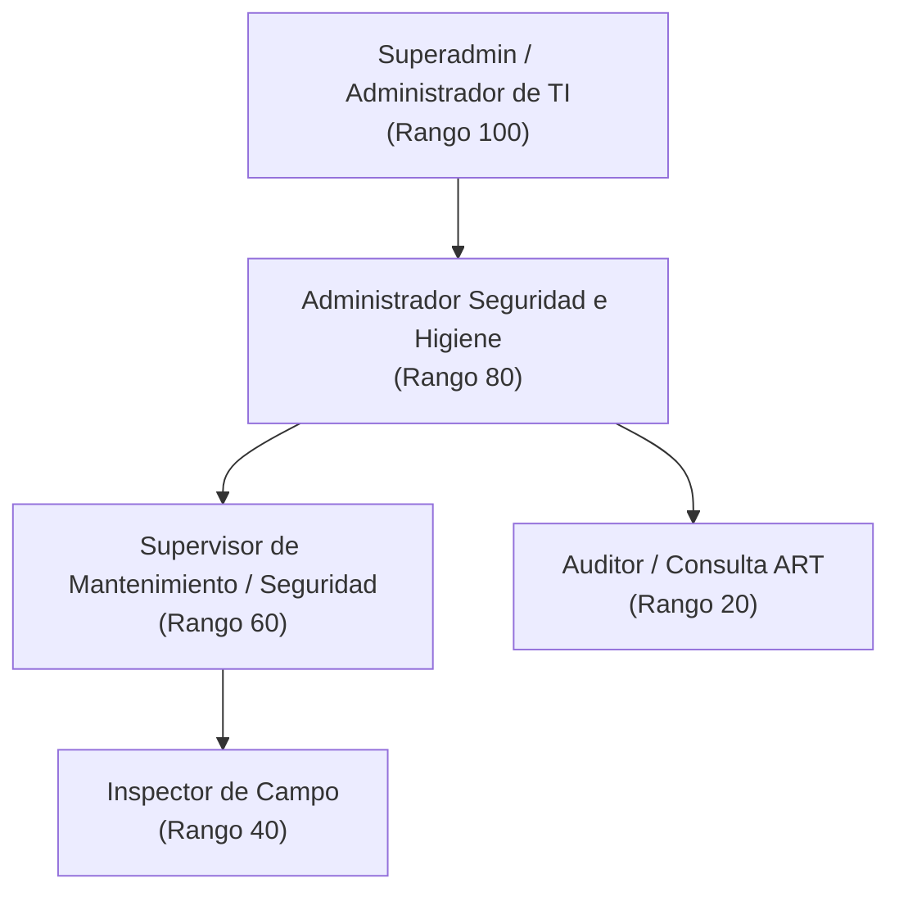

# Milicic FireControl 365 — Matriz de Roles, Permisos y Gobernanza RBAC

**Documento Corporativo de Arquitectura y Seguridad**  
**Organización:** Milicic S.A. — Higiene, Seguridad y TI  
**Normativa Aplicable:** IRAM 3517-2 • ISO 27001 • Principio de Menor Privilegio (PoLP)  
**Versión:** 1.0.0 (Producción)

---

## 1. Definición y Alcance de Roles

El sistema de control e inspección de extintores implementa un modelo de control de acceso basado en roles (**RBAC - Role-Based Access Control**) jerárquico y estricto, con 5 roles operativos:



### 1.1 Superadmin / Administrador de TI (`SUPERADMIN` - Rango 100)

- **Responsabilidad:** Gobernanza global de la plataforma, conectividad con Microsoft 365 / Entra ID, backups, auditoría completa e integraciones de infraestructura.
- **Alcance:** Global sobre todas las organizaciones, sectores y usuarios.
- **Protección Crítica:** El sistema impide la desactivación o degradación del último Superadmin activo (`verifyNotLastSuperadmin`).

### 1.2 Administrador de Higiene y Seguridad (`ADMIN` - Rango 80)

- **Responsabilidad:** Gestión integral del parque de extintores, apertura y cierre de rondas, configuración de checklists técnicos IRAM 3517-2, asignación de casos, impresión de etiquetas QR masivas y reportes oficiales.
- **Gestión de Usuarios:** Puede crear, invitar y desactivar usuarios con rango estrictamente inferior (`SUPERVISOR`, `INSPECTOR`, `AUDITOR`). No puede crear ni auto-asignarse el rol `SUPERADMIN`.

### 1.3 Supervisor de Seguridad (`SUPERVISOR` - Rango 60)

- **Responsabilidad:** Coordinación operativa del equipo de inspección en campo, reapertura justificada de rondas mensuales, asignación de rutas y casos de anomalías, revisión del tablero antifraude y control de tiempos de inspección sospechosos.
- **Alcance:** Sectores asignados o global si no posee restricción en `usuarios_sectores`.

### 1.4 Inspector de Campo (`INSPECTOR` - Rango 40)

- **Responsabilidad:** Escaneo de códigos QR en campo, ejecución de controles técnicos según checklist IRAM 3517-2, registro fotográfico de fallas, apertura de casos de anomalías y seguimiento de "Mi Ruta".
- **Alcance Operativo:** Limitado a los pisos, áreas o edificios definidos en `usuarios_sectores`. Cualquier intento de inspeccionar o consultar un matafuego fuera de su alcance es rechazado por el servidor con código HTTP `403 Forbidden` (Protección IDOR).
- **Operación Desconectada:** Sesión de larga duración (jornada completa en campo).

### 1.5 Auditor / Solo Lectura (`AUDITOR` - Rango 20)

- **Responsabilidad:** Veedores externos, auditores de aseguradoras de riesgo de trabajo (ART), bomberos y comités de auditoría interna.
- **Alcance:** Acceso exclusivo de lectura al tablero general, inventario, reportes certificados, descargas en Excel .xlsx y visualización de registros de auditoría. Sin permisos de mutación.

---

## 2. Matriz Centralizada de Permisos (RBAC Matrix)

Todos los permisos del sistema están definidos como constantes en [`server/config/permissions.js`](file:///c:/antigravity/matafuegos/server/config/permissions.js) y se validan en el servidor mediante el middleware `requirePermiso(...)`:

| Módulo / Recurso      | Código del Permiso               | SUPERADMIN | ADMIN | SUPERVISOR | INSPECTOR | AUDITOR |
| :-------------------- | :------------------------------- | :--------: | :---: | :--------: | :-------: | :-----: |
| **Usuarios**          | `usuario:ver`                    |            |       |            |    ❌     |   ❌    |
|                       | `usuario:crear`                  |            |       |     ❌     |    ❌     |   ❌    |
|                       | `usuario:invitar`                |            |       |     ❌     |    ❌     |   ❌    |
|                       | `usuario:editar`                 |            |       |     ❌     |    ❌     |   ❌    |
|                       | `usuario:desactivar`             |            |       |     ❌     |    ❌     |   ❌    |
|                       | `usuario:eliminar`               |            |       |     ❌     |    ❌     |   ❌    |
|                       | `usuario:editar_alcance`         |            |       |     ❌     |    ❌     |   ❌    |
| **Sesiones & PIN**    | `sesion:ver`                     |            |       |     ❌     |    ❌     |   ❌    |
|                       | `sesion:revocar`                 |            |       |     ❌     |    ❌     |   ❌    |
|                       | `dispositivo:autorizar`          |            |       |     ❌     |    ❌     |   ❌    |
| **Auditoría & TI**    | `auditoria:ver`                  |            |       |     ❌     |    ❌     |         |
|                       | `auditoria:exportar`             |            |       |     ❌     |    ❌     |   ❌    |
|                       | `config:gestionar`               |            |  ❌   |     ❌     |    ❌     |   ❌    |
|                       | `backup:gestionar`               |            |  ❌   |     ❌     |    ❌     |   ❌    |
| **Inventario**        | `inventario:ver`                 |            |       |            |           |         |
|                       | `inventario:crear`               |            |       |     ❌     |    ❌     |   ❌    |
|                       | `inventario:editar`              |            |       |     ❌     |    ❌     |   ❌    |
|                       | `inventario:eliminar`            |            |       |     ❌     |    ❌     |   ❌    |
|                       | `qr:imprimir`                    |            |       |            |    ❌     |   ❌    |
| **Rondas Mensuales**  | `ronda:ver`                      |            |       |            |           |         |
|                       | `ronda:abrir_cerrar`             |            |       |            |    ❌     |   ❌    |
|                       | `ronda:reabrir`                  |            |  ❌   |            |    ❌     |   ❌    |
|                       | `ronda:asignar`                  |            |       |            |    ❌     |   ❌    |
| **Inspecciones**      | `inspeccion:crear`               |            |       |            |           |   ❌    |
|                       | `inspeccion:ver`                 |            |       |            |           |         |
|                       | `inspeccion:revisar_sospechosas` |            |       |            |    ❌     |   ❌    |
| **Casos / Anomalías** | `caso:ver`                       |            |       |            |           |         |
|                       | `caso:crear`                     |            |       |            |           |   ❌    |
|                       | `caso:editar`                    |            |       |            |           |   ❌    |
|                       | `caso:asignar`                   |            |       |            |    ❌     |   ❌    |
| **Checklists**        | `checklist:gestionar`            |            |       |     ❌     |    ❌     |   ❌    |
| **Reportes & Excel**  | `reporte:exportar`               |            |       |            |           |         |
|                       | `reporte:importar`               |            |       |     ❌     |    ❌     |   ❌    |
|                       | `dashboard:ver`                  |            |       |            |           |         |

---

## 3. Reglas de Seguridad y Anti-Escalada de Privilegios

1. **Anti-Auto-Elevación:** Ningún usuario autenticado puede modificar su propio rol mediante la API ni asignarse privilegios superiores.
2. **Techo Jerárquico de Gestión:** Un usuario con rol `ADMIN` solo puede crear, editar o desactivar usuarios con rangos estrictamente menores (`SUPERVISOR`, `INSPECTOR`, `AUDITOR`). Intentar crear o modificar un `SUPERADMIN` devuelve `403 Forbidden`.
3. **Protección del Último Superadmin:** Si en la base de datos existe un único Superadmin activo, cualquier intento de desactivarlo o cambiarle el rol es bloqueado con error explicativo para evitar el bloqueo accidental de la gobernanza del sistema.
4. **Protección IDOR por Alcance Sectorial:**
   - La tabla `usuarios_sectores (usuario_id, sector, piso, edificio)` restringe los equipos visibles en inventario y rondas.
   - El middleware `checkUserSectorScope` valida en el servidor que el usuario pertenezca al sector del extintor antes de permitir ver la ficha o registrar una inspección.
5. **Aislamiento Multi-Organización:**
   - Todas las consultas y mutaciones de negocio filtran obligatoriamente por `organizacion_id`.
   - Ningún usuario puede consultar o alterar equipos o inspecciones de otra empresa inquilina.

---

## 4. Guía Administrativa: Ciclo de Vida de Usuarios

### 4.1 Alta de Nuevo Usuario

1. Iniciar sesión como `SUPERADMIN` o `ADMIN`.
2. Dirigirse al menú superior **Usuarios**.
3. Presionar el botón **Nuevo Usuario**.
4. Completar los datos obligatorios: Nombre, Apellido, Correo Institucional (`@milicic.com.ar`), Rol y Contraseña temporal inicial.
5. _(Opcional)_ Asignar los sectores habilitados (ej: "Planta Baja - Talleres"). Dejar vacío si el usuario debe tener acceso a toda la planta.
6. Guardar. El usuario quedará registrado con el flag `debe_cambiar_password = 1` y la acción quedará asentada en la auditoría inmutable.

### 4.2 Desactivación de Usuario (Baja Segura)

1. En la lista de usuarios, localizar al agente y presionar el botón de estado o menú de acciones.
2. Confirmar la desactivación.
3. **Efecto Inmediato:**
   - Todas las sesiones activas en la tabla `sesiones` son marcadas como `revocada = 1`.
   - Cualquier petición posterior con cookies previas es rechazada con `401 Unauthorized`.
   - Las inspecciones históricas y anomalías registradas previamente se conservan íntegras asociadas a su `usuario_id` y su `inspector_name_snapshot`.

### 4.3 Procedimiento de Recuperación de Emergencia (Disaster Recovery)

Si se pierde el acceso de todos los Superadministradores, ejecutar desde la consola del servidor en el directorio raíz de la aplicación:

```bash
npm run crear-admin
```

O suministrar credenciales específicas mediante variables de entorno:

```bash
ADMIN_EMAIL="admin.recuperacion@milicic.com.ar" ADMIN_PASSWORD="ClaveMuySegura2026!" npm run crear-admin
```
