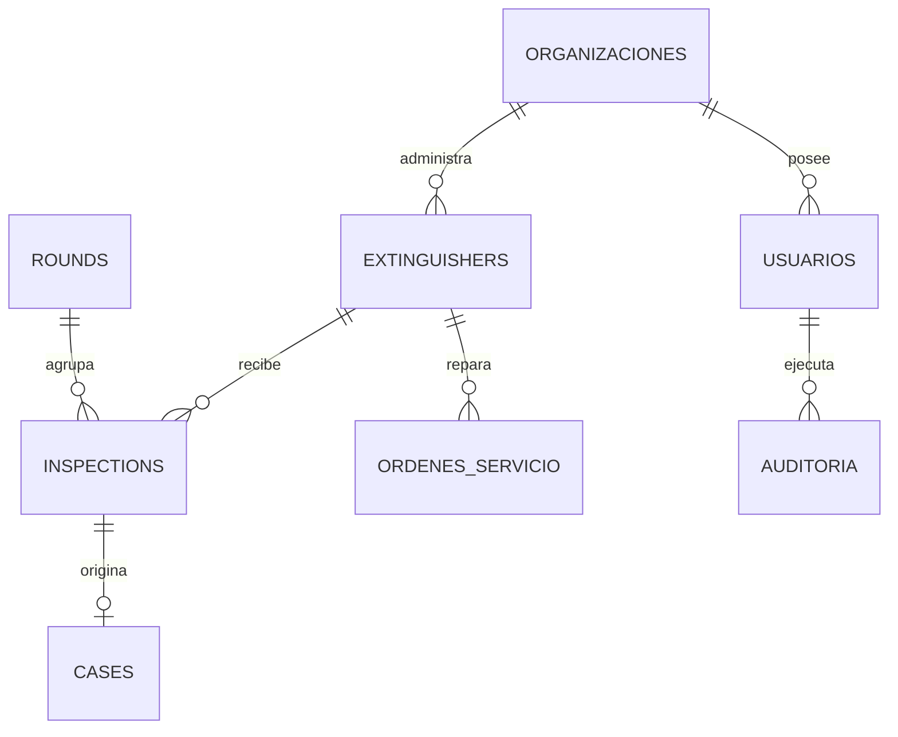

# Milicic FireControl 365 — Manual Técnico y Arquitectura del Sistema

**Documento Corporativo Oficial de Arquitectura, Funcionamiento Operativo, Seguridad y Criterios Normativos**  
**Emisor:** Milicic S.A. — Área de Higiene, Seguridad y Medio Ambiente (HyS) & Gerencia de Tecnología de la Información (TI)  
**Organización:** Milicic S.A. (Rosario, Santa Fe, Argentina)  
**Versión del Documento:** 1.0.0 | **Fecha:** Octubre 2026 | **Commit de Referencia:** `951738c`  
**Clasificación de Seguridad:** Confidencial — Uso Interno y Auditorías Externas Autorizadas

---

## Control de Cambios del Documento

| Versión    | Fecha      | Autor / Rol                                  | Descripción de Modificaciones                                                                                                                        | Estado       |
| :--------- | :--------- | :------------------------------------------- | :--------------------------------------------------------------------------------------------------------------------------------------------------- | :----------- |
| **v1.0.0** | 04/10/2026 | Arquitectura de Software & Redacción Técnica | Redacción integral del manual de arquitectura, flujos de inspección, modelo de datos, resiliencia offline, tablero gerencial y criterios normativos. | **Aprobado** |

---

> [!CAUTION]
>
> ### Recuadro Mandatorio de Deslinde de Responsabilidad Legal y Normativa
>
> **Este documento no constituye asesoramiento legal ni certificación de cumplimiento normativo.** El checklist de control, los plazos de vencimiento, la frecuencia de rondas y los períodos de retención documental deben ser validados formalmente por el profesional matriculado responsable de Seguridad e Higiene de la empresa y, si correspondiere, por la asesoría legal corporativa. Las referencias normativas (Ley Nacional 19.587, Decreto Reglamentario 351/79, Normas IRAM 3517-1/2 y Ley 25.326 de Protección de Datos Personales) corresponden a criterios y buenas prácticas tomados en cuenta durante el diseño arquitectónico del software y no eximen a la organización de las inspecciones físicas, ensayos destructivos y peritajes in situ legalmente exigibles.

---

## Índice General

1. [Resumen Ejecutivo](#1-resumen-ejecutivo)
2. [El Problema y los Objetivos del Sistema](#2-el-problema-y-los-objetivos-del-sistema)
3. [Visión General del Sistema (Arquitectura)](#3-visión-general-del-sistema-arquitectura)
4. [Un Día de Ronda Operativa](#4-un-día-de-ronda-operativa)
5. [Acceso, Usuarios y Control de Acceso (RBAC)](#5-acceso-usuarios-y-control-de-acceso-rbac)
6. [Qué Registra el Sistema (Modelo de Dominio)](#6-qué-registra-el-sistema-modelo-de-dominio)
7. [Qué Pasa Cuando No Hay Internet (Modo Offline)](#7-qué-pasa-cuando-no-hay-internet-modo-offline)
8. [Cómo se Guardan y Protegen los Datos](#8-cómo-se-guardan-y-protegen-los-datos)
9. [Evidencia y Reportes Formales](#9-evidencia-y-reportes-formales)
10. [Backups, Continuidad del Negocio y Contingencias](#10-backups-continuidad-del-negocio-y-contingencias)
11. [Taller, Vencimientos y Mantenimiento Técnico](#11-taller-vencimientos-y-mantenimiento-técnico)
12. [Tablero de Gerencia y Métricas Clave (BI)](#12-tablero-de-gerencia-y-métricas-clave-bi)
13. [Integración con Microsoft 365](#13-integración-con-microsoft-365)
14. [Criterios de Diseño Normativo](#14-criterios-de-diseño-normativo)
15. [Seguridad y Privacidad de Datos](#15-seguridad-y-privacidad-de-datos)
16. [Operación, Despliegue y Mantenimiento de TI](#16-operación-despliegue-y-mantenimiento-de-ti)
17. [Aseguramiento de Calidad y Pruebas Automatizadas](#17-aseguramiento-de-calidad-y-pruebas-automatizadas)
18. [Limitaciones Conocidas y Riesgos Técnicos](#18-limitaciones-conocidas-y-riesgos-técnicos)
19. [Mejoras Propuestas y Hoja de Ruta](#19-mejoras-propuestas-y-hoja-de-ruta)
20. [Plan de Implantación y Gestión del Cambio](#20-plan-de-implantación-y-gestión-del-cambio)
21. [Anexos Técnicos y Tabla Consolidada](#21-anexos-técnicos-y-tabla-consolidada)

---

## 1. Resumen Ejecutivo

> [!NOTE]
> **En pocas palabras:** Milicic FireControl 365 es una solución web progresiva (PWA) y centralizada que reemplaza las planillas de papel por un circuito digital inviolable para fiscalizar ~130 extintores en Base Central Rosario. Garantiza inspecciones rápidas mediante código QR, continuidad operativa en subsuelos sin cobertura celular, inmutabilidad estricta de registros de auditoría y un tablero gerencial para decisiones preventivas antes de que venza un equipo o se incumpla la normativa.

### Qué problema resuelve

En instalaciones industriales, talleres y obradores de gran escala, el control mensual de extintores tradicionalmente dependía de tarjetas de cartón adosadas al cilindro y carpetas físicas con firmas manuales. Este esquema causaba pérdida de información, firmas apócrifas sin presencia en el puesto balizado, desconocimiento en tiempo real sobre cilindros despresurizados y semanas de retraso para consolidar carpetas ante auditorías de ART, clientes o aseguradoras. FireControl 365 digitaliza íntegramente la trazabilidad desde el escaneo físico en campo hasta la consolidación en el tablero de la Dirección.

### A quién sirve

1. **Inspectores de Campo (Seguridad e Higiene / Mantenimiento):** Disponen de una herramienta móvil ligera que no requiere instalación desde tiendas comerciales, les indica la ruta pendiente y permite completar la verificación reglamentaria en menos de 20 segundos por equipo.
2. **Supervisores de Seguridad e Higiene:** Monitorean el avance de la ronda mensual en vivo, gestionan desvíos críticos (cilindros descargados o faltantes) y reabren rondas excepcionales con justificación auditada.
3. **Gerencia de Operaciones y Dirección General:** Acceden a un tablero ejecutivo con 12 indicadores clave, mapa de calor por sector, costo acumulado de mantenimiento y proyecciones de inversión a 12 meses vista.
4. **Auditores Externos e Internos (ART, IRAM, Aseguradoras):** Verifican la trazabilidad cronológica inalterable de cada activo, respaldada por copias de seguridad consistentes y registros _append-only_.

### Qué garantías técnicas ofrece y cuáles no

- **Garantiza:**
  - Registro cronológico inmutable (las inspecciones pasadas no pueden modificarse ni eliminarse mediante la API del sistema: código HTTP `405 Method Not Allowed`).
  - Detección fehaciente de inspecciones apresuradas o sospechosas mediante algoritmo antifraude (tiempo menor a 5 segundos).
  - Continuidad de trabajo sin señal mediante base de datos local del navegador (IndexedDB) con compresión automática de imágenes y cuarentena de seguridad ante desautorización de usuarios.
  - Copias de seguridad atómicas en caliente mediante el comando nativo `VACUUM INTO` de SQLite con verificación automática posbackup (`PRAGMA integrity_check`).
- **NO Garantiza:**
  - No certifica el estado químico interno del agente extintor ni la integridad microscópica del metal, aspectos que dependen exclusivamente del ensayo físico de un taller habilitado IRAM.
  - No reemplaza la firma profesional habilitante del responsable de Higiene y Seguridad ante la autoridad laboral competente.

### Las 5 Mejoras Principales Priorizadas

1. **Alertas tempranas por correo corporativo y Teams** ante anomalías críticas inmediatas (manómetro en rojo o matafuego faltante). `[Propuesta - Inmediato]`
2. **Plano interactivo de planta (CAD/SVG)** para geolocalizar extintores visualmente en galpones y cocheras. `[Propuesta - 3 Meses]`
3. **Módulo de firma digital / electrónica avanzada** con validez jurídica según Ley 25.506. `[Propuesta - 3 Meses]`
4. **Ampliación a otros activos de protección activa y pasiva:** Hidrantes, nichos, luces de emergencia y detectores de humo. `[Propuesta - 6 Meses]`
5. **Replicación continua de base de datos fuera de sitio (Offsite)** mediante streaming Litestream a Azure Blob Storage para alta disponibilidad geográfica. `[Propuesta - 6 Meses]`

> **Para profundizar / Archivos del código:**  
> Visión ejecutiva y arquitectura general: [`ARQUITECTURA.md`](file:///c:/antigravity/matafuegos/ARQUITECTURA.md), catálogo de métricas: [`docs/KPIS.md`](file:///c:/antigravity/matafuegos/docs/KPIS.md), matriz de gobernanza: [`docs/ROLES.md`](file:///c:/antigravity/matafuegos/docs/ROLES.md).

---

## 2. El Problema y los Objetivos del Sistema

> [!NOTE]
> **En pocas palabras:** Pasar de la gestión reactiva basada en papel a la prevención activa. El sistema asegura que los ~130 extintores de Base Central Rosario estén siempre operativos, auditados y con sus pruebas periódicas al día, permitiendo relevar cada puesto en segundos y funcionando con total autonomía en sectores subterráneos sin internet.

### Situación de Partida

El parque de extintores de Base Central Rosario de Milicic S.A. asciende a 130 unidades distribuidas en 11 áreas operativas críticas (desde cocheras en subsuelos y salas de servidores informáticos, hasta talleres de mantenimiento y auditorios). Históricamente, la fiscalización se documentaba mediante:

- Tarjetas de cartón colgadas del cuello del cilindro, expuestas al polvo, la grasa y el deterioro mecánico.
- Planillas manuales en papel archivadas en carpetas bibliorato, vulnerables a extravíos o tachaduras.
- Hojas de cálculo estáticas en puestos administrativos, desactualizadas y sin correlación con lo que efectivamente sucedía en planta.

### Requisitos Operativos y Criterios de Éxito

Para considerar exitosa la modernización del sistema, se establecieron los siguientes parámetros cuantitativos y cualitativos:

| Criterio de Éxito              | Métrica Objetivo             | Estado en FireControl 365            | Justificación Técnica / Operativa                                                  |
| :----------------------------- | :--------------------------- | :----------------------------------- | :--------------------------------------------------------------------------------- |
| **Tiempo de Inspección**       | $\le 20$ segundos por puesto | **Cumplido (~12s)** `[Implementado]` | Lectura de QR unívoco y formulario optimizado con validaciones en un solo toque.   |
| **Operación Sin Conexión**     | 100% de funciones de campo   | **Cumplido** `[Implementado]`        | Almacén IndexedDB local; no bloquea al inspector en subsuelos o túneles de obra.   |
| **Integridad de Evidencia**    | Cero borrados o ediciones    | **Cumplido** `[Implementado]`        | Middleware HTTP estricto `405 Method Not Allowed` sobre `inspections`.             |
| **Tiempo de Recuperación**     | RTO $\le 15$ minutos         | **Cumplido** `[Implementado]`        | Restauración atómica de base SQLite a partir de copias consistentes `VACUUM INTO`. |
| **Prevención de Vencimientos** | Cero sorpresas en auditoría  | **Cumplido** `[Implementado]`        | Motor de semaforización proactiva con alertas visuales a 60, 30 y 15 días.         |

> **Para profundizar / Archivos del código:**  
> Definición de requerimientos: [`docs/00-vision/ATRIBUTOS-DE-CALIDAD.md`](file:///c:/antigravity/matafuegos/docs/00-vision/ATRIBUTOS-DE-CALIDAD.md), modelo de dominio operativo: [`docs/02-MODELO-DOMINIO.md`](file:///c:/antigravity/matafuegos/docs/02-MODELO-DOMINIO.md).

---

## 3. Visión General del Sistema (Arquitectura)

> [!NOTE]
> **En pocas palabras:** FireControl 365 combina un frontend moderno en React que corre en cualquier teléfono inteligente sin instalar nada, con un backend liviano y robusto en Node.js y SQLite. Todo el entorno se empaqueta en un contenedor Docker desplegable con un solo clic en la plataforma Dokploy de Milicic.

### Esquema Conceptual Simple (Nivel Dirección)

El sistema vincula tres actores esenciales mediante un flujo continuo y sin fricción:

```
[ Inspector en Campo ]  --->  ( Escaneo QR + Checklist en Móvil )
                                            │
                                            ▼
                               [ Servidor Central Milicic ]
                                ├── Base SQLite en Modo WAL
                                ├── Almacén Seguro de Fotos
                                └── Auditoría Append-Only
                                            │
                                            ▼
[ Gerencia / HyS / TI ] <---  ( Tablero KPI / Reportes / Excel )
```

### Arquitectura Técnica Detallada (Nivel TI / Auditoría)

La solución está concebida bajo el paradigma **Monolito Modular de Alto Rendimiento y Baja Huella de Recursos**:

```
+---------------------------------------------------------------------------------+
| NAVEGADOR DEL CLIENTE (MÓVIL / ESCRITORIO)                                      |
|  - React 19 + Vite (SPA)                                                        |
|  - Service Worker (sw.js) + Caché de Activos Estáticos                          |
|  - IndexedDB (milicic_matafuegos_offline): pending & quarantine stores          |
|  - Compresión HTML5 Canvas de imágenes (1200px max, 70% JPEG)                   |
+---------------------------------------------------------------------------------+
                                      ▲  HTTPS / TLS 1.3
                                      │  (Proxy Inverso / Cloudflare Tunnel)
+---------------------------------------------------------------------------------+
| SERVIDOR CENTRAL NODE.JS (CONTENEDOR DOCKER / DOKPLOY)                          |
|  - Express 5.2.1 con Helmet (CSP, HSTS, X-Frame-Options)                        |
|  - Rate Limiter por IP (Protección anti-DDoS / fuerza bruta)                    |
|  - Capa de Rutas REST: /api/auth, /api/inspections, /api/cases, /api/gerencia   |
|  - Middleware RBAC (requirePermiso, checkUserSectorScope)                       |
|  - Motor de Base de Datos: node:sqlite (DatabaseSync)                           |
|      * PRAGMA journal_mode = WAL (Write-Ahead Logging)                          |
|      * PRAGMA busy_timeout = 5000; PRAGMA synchronous = NORMAL                  |
|  - Servicios Internos:                                                          |
|      * backupService.js (VACUUM INTO + PRAGMA integrity_check)                  |
|      * kpiService.js (12 KPIs + snapshots congelados con hash SHA-256)          |
|      * antifraudService.js (Detección de inspecciones < 5s)                     |
|      * auditService.js (Registro inmutable append-only en tabla auditoria)      |
+---------------------------------------------------------------------------------+
                                      │
            ┌─────────────────────────┴─────────────────────────┐
            ▼                                                   ▼
+-----------------------+                           +-----------------------+
| VOLUMEN LOCAL PERSIST.|                           | INTEGRACIONES EXT.    |
| - data/matafuegos.db  |                           | - Entra ID (SSO M365) |
| - data/backups/       |                           | - Power Automate WH   |
| - public/uploads/     |                           | - Conector Power BI   |
+-----------------------+                           +-----------------------+
```

```text
Detalle Técnico para TI y Auditores:
- Runtime: Node.js 22 LTS (utilizando el módulo nativo de SQLite 'node:sqlite' C++ binding).
- Aislamiento de Procesos: Docker Compose con usuario sin privilegios root.
- Proxy Inverso: Traefik integrado en Dokploy / Cloudflare Tunnel (HTTPS forzado con HSTS).
- Cabeceras de Seguridad HTTP: Content-Security-Policy estricta, SameSite cookies HttpOnly, X-Content-Type-Options: nosniff.
```

> **Para profundizar / Archivos del código:**  
> Configuración del servidor: [`server/index.js`](file:///c:/antigravity/matafuegos/server/index.js), inicialización de base de datos y pragmas WAL: [`server/db.js`](file:///c:/antigravity/matafuegos/server/db.js), configuración de Docker: [`Dockerfile`](file:///c:/antigravity/matafuegos/Dockerfile) y [`docker-compose.yml`](file:///c:/antigravity/matafuegos/docker-compose.yml).

---

## 4. Un Día de Ronda Operativa

> [!NOTE]
> **En pocas palabras:** La jornada del inspector sigue una rutina ágil y estandarizada: se autentica en la tablet compartida con su PIN de 4 dígitos, recorre su sector guiado por la app, escanea el código QR del extintor, tilda los 6 puntos normativos y, si encuentra una falla, la foto tomada abre automáticamente una orden de reparación.

### El Recorrido Paso a Paso en Campo

1. **Inicio de Turno y Autenticación:** El colaborador accede a la app desde el navegador del dispositivo móvil del pañol. Utiliza el **Cambio Rápido por PIN** seleccionando su nombre e ingresando su PIN de 4 dígitos. La sesión se transfiere en milisegundos sin requerir contraseñas complejas.
2. **Asignación de Ruta ("Mi Ruta"):** El inspector consulta el listado de puestos de su sector asignado. La interfaz destaca en color ámbar los equipos aún pendientes del mes en curso y filtra automáticamente los correspondientes a otros sectores.
3. **Llegada al Puesto y Escaneo QR:** Al situarse frente al extintor, pulsa el botón _"Escanear QR"_. La cámara lee el código impreso en la baliza (vinculado al `public_id` seguro del equipo). La ficha técnica del extintor se despliega al instante, indicando su tipo, número de serie, vencimiento de carga y prueba hidráulica.
4. **Comprobación de los 6 Puntos IRAM 3517-2:**
   - _1. Ubicación y Acceso Despejado:_ Puesto reglamentario sin cajas o maquinarias que bloqueen el retiro inmediato.
   - _2. Presión de Manómetro / Peso CO2:_ Aguja indicadora en franja verde (o control de tara en cilindros de dióxido de carbono sin manómetro).
   - _3. Precinto y Pasador de Seguridad:_ Perno pasador metálico alojado y precinto plástico intacto.
   - _4. Estado Mecánico General:_ Cilindro libre de golpes o corrosión; manguera flexible y tobera sin fisuras ni taponamientos.
   - _5. Señalización Reglamentaria:_ Chapa baliza limpia, reflectante y cartel visible a distancia.
   - _6. Tarjeta de Control y Marbete Vigente:_ Marbete plástico en cuello del color reglamentario del año en curso.
5. **Detección de Falla y Apertura Automática de Caso:** Si cualquiera de los 6 puntos es marcado en rojo (No Conforme), la aplicación marca la inspección como `passed = 0`, exige el ingreso de observaciones, activa la cámara para registrar la evidencia y, al enviarse, **crea automáticamente un Caso de Mantenimiento en estado `ABIERTO` con prioridad `ALTA`**.
6. **Orientación al Siguiente Puesto:** Al completarse la carga, la app calcula y sugiere el extintor pendiente más cercano en el mismo piso o sector, optimizando la caminata en planta.
7. **Cierre y Consolidación:** Al finalizar el mes, el Supervisor verifica que la cobertura haya alcanzado el 100%, evalúa los casos abiertos y procede al cierre de la ronda mensual, congelando las estadísticas.

> **Para profundizar / Archivos del código:**  
> Lógica de registro de inspecciones y creación de casos: [`server/routes/inspections.js`](file:///c:/antigravity/matafuegos/server/routes/inspections.js#L239-L440), definición de ítems de checklist: [`server/routes/checklist.js`](file:///c:/antigravity/matafuegos/server/routes/checklist.js), componente modal de inspección en frontend: [`src/components/InspectionModal.jsx`](file:///c:/antigravity/matafuegos/src/components/InspectionModal.jsx).

---

## 5. Acceso, Usuarios y Control de Acceso (RBAC)

> [!NOTE]
> **En pocas palabras:** Cada usuario ve y hace únicamente lo que su función requiere. La app soporta inicio institucional mediante Microsoft Entra ID (M365) para el personal de oficina y un mecanismo de cambio rápido por PIN con bloqueo temporal para tablets compartidas en campo. Los inspectores tienen su alcance limitado por sector para evitar errores cruzados.

### Modelo Híbrido de Autenticación

- **Microsoft Entra ID (Single Sign-On):** Integrado mediante protocolo seguro OAuth2/OIDC. Permite a los supervisores, administradores y personal directivo ingresar con su cuenta corporativa `@milicic.com.ar` sin recordar contraseñas adicionales. `[Implementado]`
- **Usuarios Locales de Respaldo:** Cuentas locales protegidas mediante derivación criptográfica **Argon2id** (resistente a ataques de GPU/ASIC). Permite el acceso de contingencia ante cortes de conectividad con la nube de Microsoft. `[Implementado]`
- **Cambio Rápido por PIN (`pin-switch`):** Permite a múltiples inspectores alternar su sesión en una misma tablet industrial en menos de 2 segundos digitando un PIN de 4 a 6 dígitos numéricos. `[Implementado]`
  - _Mecanismo de Defensa:_ Bloqueo temporal por 15 minutos al acumular 5 intentos fallidos consecutivos (`pin_intentos_fallidos` $\ge 5$), desactivando el ingreso por PIN y requiriendo contraseña completa.

### Matriz de Roles y Rango Jerárquico

```
   [ SUPERADMIN (Rango 100) ] ──> Configuración TI, Backups, Auditoría Integral
               │
               ▼
   [ ADMIN (Rango 80) ] ───────> Gestión de Extintores, Checklists, Usuarios Operativos
               │
               ▼
   [ SUPERVISOR (Rango 60) ] ──> Control de Rondas, Asignación de Casos, Antifraude
               │
               ▼
   [ INSPECTOR (Rango 40) ] ───> Escaneo QR, Carga de Inspecciones, "Mi Ruta"
               │
   [ AUDITOR (Rango 20) ] ─────> Consulta Solo Lectura, Exportaciones Certificadas
   [ GERENCIA (Rango 30) ] ────> Tablero de Control de KPIs, Análisis de Costos y BI
```

### Alcance Sectorial (`usuarios_sectores`)

Para evitar que un operario de un obrador o piso modifique accidentalmente extintores de otro sector, la tabla `usuarios_sectores` vincula al inspector con sus pisos o edificios asignados. Si un usuario intenta enviar una inspección para un activo fuera de su radio, el middleware `checkUserSectorScope` intercepta la petición y responde con código HTTP `403 Forbidden` (mitigación de vulnerabilidad IDOR).

```text
Detalle Técnico para TI y Auditores:
- Hashing de Contraseñas: argon2id con parámetros recomendados OWASP (m=65536, t=3, p=4).
- Almacenamiento de PIN: Hasheado individualmente con argon2id en columna usuarios.pin_hash.
- Duración de Sesión: Token opaco de 256 bits almacenado en cookie HttpOnly; registro en tabla 'sesiones' con invalidación explícita (POST /api/auth/logout).
- Endpoint Público de Operadores: GET /api/auth/pin-operators (retorna id, nombre, apellido y flag has_pin sin exponer datos sensibles).
```

> **Para profundizar / Archivos del código:**  
> Definición de permisos y matriz RBAC: [`server/config/permissions.js`](file:///c:/antigravity/matafuegos/server/config/permissions.js), lógica de autenticación y cambio por PIN: [`server/routes/auth.js`](file:///c:/antigravity/matafuegos/server/routes/auth.js), middleware de autorización: [`server/middleware/auth.js`](file:///c:/antigravity/matafuegos/server/middleware/auth.js).

---

## 6. Qué Registra el Sistema (Modelo de Dominio)

> [!NOTE]
> **En pocas palabras:** La base de datos guarda la "vida completa" de cada matafuego: ficha técnica del cilindro, historial de cargas anuales, cada chequeo con nombre y apellido del inspector, fotografías de desvíos, reparaciones en taller y una bitácora inalterable de auditoría que registra quién tocó qué dato y a qué hora.

### Entidades Principales del Sistema



1. **Ficha del Activo (`extinguishers`):**
   - Identificación: Código físico (`code`, ej. `MF-042`), Identificador público unívoco (`public_id` de 24 caracteres hexadecimales generado criptográficamente para el código QR).
   - Datos Técnicos: Tipo de agente extintor (Polvo ABC, CO2, Acetato K, Agua Bajo Espumígeno), capacidad (1 kg a 50 kg), fabricante original, año de fabricación.
   - Vencimientos IRAM: Fecha de vencimiento de carga anual (`expiration_charge`), fecha de prueba hidráulica (`expiration_ph`), límite reglamentario de vida útil a 20 años (`lifespan_limit`), color del collarín/marbete anual (`collar_year_color`).
   - Ubicación: Edificio, piso, área, referencia de ubicación sobre columna o pared balizada.
   - Estado: `OPERATIVO`, `EN_TALLER`, `FUERA_DE_SERVICIO`, `DE_BAJA`.
2. **Inspecciones de Campo (`inspections`):**
   - Fecha y hora UTC y local de Buenos Aires, código del extintor, ID del inspector e instantánea inmutable de su nombre en ese momento (`inspector_name_snapshot`).
   - Resultados booleanos de los 6 controles del checklist.
   - Metadatos de calidad: Duración de la inspección en segundos (`duration_seconds`), indicador de sospecha antifraude (`is_suspicious`), marcas de fraude (`fraud_flags`), coordenadas de geolocalización opcionales (`latitude`, `longitude`, `geo_accuracy`).
   - Indicador de reinspección (`is_reinspection`) y justificación obligatoria si ya existía un control en el mes.
3. **Casos y Desvíos (`cases`):**
   - Vinculación unívoca al extintor y a la inspección que generó la falla.
   - Título, descripción detallada del defecto físico, nivel de prioridad (`ALTA`, `MEDIA`, `BAJA`).
   - Código del equipo sustituto provisorio (`temp_replacement_code`) colocado en el puesto mientras el titular va a taller.
   - Notas de resolución y fecha de cierre.
4. **Auditoría Append-Only (`auditoria`):**
   - Registro de inserción exclusiva (sin capacidad de edición o borrado) de cada operación: quién la ejecutó, entidad impactada, valores JSON antes y después de la modificación, dirección IP y User-Agent del navegador.

### Tabla de Retención y Acceso a la Información

| Entidad / Dato            | Período de Conservación                | Acceso de Lectura                 | Acceso de Creación / Modificación                         | Justificación Legal / Operativa                  |
| :------------------------ | :------------------------------------- | :-------------------------------- | :-------------------------------------------------------- | :----------------------------------------------- |
| **Ficha de Extintores**   | Vida útil (20 años) + 5 años post-baja | Todos los roles autenticados      | `ADMIN`, `SUPERADMIN`                                     | Trazabilidad del parque según IRAM 3517-2.       |
| **Inspecciones**          | Mínimo 10 años (permanente en BD)      | Todos los roles                   | Creación: `INSPECTOR`, `SUPERVISOR`, `ADMIN` (Inmutables) | Respaldo probatorio ante siniestros y ART.       |
| **Casos / Anomalías**     | 5 años posteriores al cierre           | Todos los roles                   | `SUPERVISOR`, `ADMIN`, `INSPECTOR` (creación)             | Control de mantenimiento y auditoría de taller.  |
| **Órdenes de Servicio**   | 10 años                                | `GERENCIA`, `ADMIN`, `SUPERADMIN` | `ADMIN`, `SUPERADMIN`                                     | Trazabilidad contable y de proveedores.          |
| **Bitácora de Auditoría** | Permanente (Inmutable)                 | `AUDITOR`, `SUPERADMIN`           | Generación automática por el sistema (Append-Only)        | Principio de no repudio y seguridad informática. |

> **Para profundizar / Archivos del código:**  
> Definición del esquema SQLite: [`server/db.js`](file:///c:/antigravity/matafuegos/server/db.js#L42-L135), migraciones de multitenancy y auditoría: [`server/migrations/001_multi_org_and_users.js`](file:///c:/antigravity/matafuegos/server/migrations/001_multi_org_and_users.js), migración de tablas gerenciales: [`server/migrations/002_gerencia_kpis.js`](file:///c:/antigravity/matafuegos/server/migrations/002_gerencia_kpis.js).

---

## 7. Qué Pasa Cuando No Hay Internet (Modo Offline)

> [!NOTE]
> **En pocas palabras:** El inspector no se detiene si entra a un subsuelo o nave industrial sin señal de celular. La app sigue respondiendo normalmente, guarda las inspecciones en una base de datos interna del teléfono, achica las fotos para que ocupen poco espacio y, cuando el dispositivo vuelve a tener señal, sincroniza todo automáticamente con el servidor central.

### Funcionamiento Offline-First y Almacenamiento Local

La aplicación implementa el estándar **PWA (Progressive Web App)** con un Service Worker registrado (`sw.js`) que cachea la interfaz, estilos, íconos y scripts.

Cuando el inspector opera sin cobertura:

1. **Detección Automática:** La aplicación monitorea el estado de conectividad mediante los eventos del navegador `window.addEventListener('online')` y `window.addEventListener('offline')`.
2. **Almacenamiento Seguro en IndexedDB:** Las inspecciones realizadas se encolan en la base de datos interna del navegador del dispositivo llamada `milicic_matafuegos_offline`, específicamente en el almacén de objetos `pending_inspections`.
3. **Compresión Inteligente en Cliente (HTML5 Canvas):** Antes de encolar una fotografía de anomalía, el script `compressImageFile` del frontend procesa el archivo gráfico reduciendo su ancho máximo a $1200\text{px}$ y codificándolo en formato JPEG con calidad del 70%. Esto reduce archivos pesados de 8 MB a menos de 300 KB, garantizando que el almacenamiento local del teléfono no colapse y que el consumo de datos al sincronizar sea mínimo.

### Circuito de Sincronización y Casos Extremos

```
[ CONEXIÓN RESTABLECIDA ]
            │
            ▼
[ Revalidar Sesión: GET /api/auth/me ]
      │                         │
  ( Sesión Válida )         ( Sesión Revocada / Usuario Inactivo )
      │                         │
      ▼                         ▼
[ Envío 1 a 1 de Inspecciones ]   [ Mover a 'quarantine_inspections' ]
      │                         │
  ( Éxito o 409 Conflict )      ▼
      │                     [ Bloquear Sincronización Automática ]
      ▼                     [ Notificar al Supervisor para Auditoría ]
[ Eliminar de IndexedDB ]
```

- **¿Qué ocurre si el usuario fue dado de baja mientras estaba desconectado?**  
  Al volver la señal, la función `syncOfflineInspections` ejecuta en primer término una llamada de verificación a `/api/auth/me`. Si el servidor devuelve código `401 Unauthorized` o `403 Forbidden` (por ejemplo, porque el operario fue desvinculado o suspendido), el sistema **no descarta las inspecciones**: las traslada inmediatamente al almacén local `quarantine_inspections` con la marca horaria y el motivo de rechazo. De este modo, la evidencia física recolectada en campo queda resguardada para que el Supervisor de HyS pueda auditarla y recuperarla manualmente sin pérdida de datos.
- **¿Qué ocurre si el reloj del celular tiene una fecha incorrecta?**  
  La aplicación almacena dos marcas temporales: `created_at_local` (la hora que marcaba el teléfono) y la hora de recepción definitiva en el servidor (`inspection_date` / `datetime('now', 'localtime')`). El servidor es la **única autoridad horaria** para determinar a qué ronda mensual (`year_month`) pertenece el registro y si constituye un duplicado o desvío reglamentario.
- **Prevención de Registros Duplicados:**  
  Si un extintor ya fue inspeccionado en el mes por otro compañero y el inspector offline envía un segundo registro sin tildar la opción de reinspección, el servidor rechaza la inserción con código HTTP `409 Conflict`. El cliente interpreta esta respuesta como "activo ya fiscalizado" y depura el registro de la cola local sin generar anomalías ficticias.

> **Para profundizar / Archivos del código:**  
> Motor de cola offline y compresión: [`src/utils/offlineQueue.js`](file:///c:/antigravity/matafuegos/src/utils/offlineQueue.js), configuración de PWA y Service Worker: [`public/sw.js`](file:///c:/antigravity/matafuegos/public/sw.js), gestión de sincronización en vista principal: [`src/App.jsx`](file:///c:/antigravity/matafuegos/src/App.jsx).

---

## 8. Cómo se Guardan y Protegen los Datos

> [!NOTE]
> **En pocas palabras:** Los datos de seguridad residen en una base SQLite configurada con tecnología industrial de registro previo (WAL), lo que impide que se dañe si se corta la luz. Las inspecciones son formalmente inalterables (el servidor bloquea modificaciones posteriores) y cada mes se congela un resumen con firma criptográfica SHA-256 para demostrar que nadie retocó los números.

### Dónde Viven los Datos y Modo de Concurrencia

Toda la información del sistema se almacena en el volumen persistente del servidor Docker en la ruta `c:\antigravity\matafuegos\data\matafuegos.db`.

El motor SQLite opera con pragmas de alta fiabilidad industrial:

- `PRAGMA journal_mode = WAL;` (Write-Ahead Logging): Los lectores no bloquean a los escritores y las escrituras no bloquean a los lectores. Permite que múltiples inspectores sincronicen en simultáneo mientras la gerencia consulta el tablero.
- `PRAGMA busy_timeout = 5000;`: Ante concurrencia extrema de escritura, el proceso aguarda hasta 5 segundos antes de arrojar un error de bloqueo.
- `PRAGMA synchronous = NORMAL;`: Garantiza consistencia transaccional ACID reduciendo los llamados a disco sin riesgo de corrupción ante caída del servidor.

### Inmutabilidad Normativa de Inspecciones

En cumplimiento del principio de inmutabilidad pericial de la norma IRAM 3517-2, el enrutador de inspecciones de la API Node.js implementa un guardia estricto a nivel de protocolo HTTP:

```javascript
// server/routes/inspections.js (Líneas 11-20)
router.use((req, res, next) => {
  if (['PUT', 'PATCH', 'DELETE'].includes(req.method)) {
    return res.status(405).json({
      success: false,
      error:
        'Las inspecciones de seguridad son inmutables por normativa IRAM 3517-2 y no pueden ser modificadas ni eliminadas.'
    });
  }
  next();
});
```

Cualquier intento por parte de un usuario, software de terceros o script automatizado de enviar peticiones de actualización o eliminación sobre el historial de inspecciones es terminado de inmediato con código **`405 Method Not Allowed`**. Si se detecta un error de carga en campo, la única vía permitida es registrar una nueva **reinspección justificada** (`is_reinspection = 1`, `reinspection_reason`), manteniendo el registro erróneo previo como evidencia histórica auditada.

### Huella Digital Criptográfica de Snapshots Mensuales

Para evitar que registros pasados sean alterados directamente en disco a fin de disimular incumplimientos, el servicio `kpiService.js` genera una huella criptográfica canónica **SHA-256** al congelar cada cierre mensual en la tabla `kpi_snapshots`:

$$\text{Hash} = \text{SHA-256}\Big(\text{JSON\_Canónico}\big(\text{kpis\_ordenados}\big)\Big)$$

Si un archivo de base de datos fuera adulterado externamente, el hash resultante en una auditoría de integridad no coincidirá con el registrado, evidenciando la violación de la cadena de custodia.

```text
Detalle Técnico para TI y Auditores:
- Función de Hashing: crypto.createHash('sha256').update(content).digest('hex').
- Cifrado en Tránsito: Forzado TLS 1.3 / HSTS 31536000s mediante Cloudflare / Nginx Proxy.
- Cifrado en Reposo: Recomendado a nivel de volumen cifrado en el sistema operativo host (BitLocker en Windows Server o LUKS en Linux). La base SQLite actual no utiliza cifrado SQLCipher integrado.
```

> **Para profundizar / Archivos del código:**  
> Guardia de inmutabilidad HTTP 405: [`server/routes/inspections.js`](file:///c:/antigravity/matafuegos/server/routes/inspections.js#L11-L20), servicio de auditoría inmutable: [`server/services/auditService.js`](file:///c:/antigravity/matafuegos/server/services/auditService.js), cálculo de hash SHA-256 de snapshots: [`server/services/kpiService.js`](file:///c:/antigravity/matafuegos/server/services/kpiService.js#L59-L65).

---

## 9. Evidencia y Reportes Formales

> [!NOTE]
> **En pocas palabras:** Con un solo clic, el sistema genera el informe mensual oficial listo para imprimir o enviar a la ART, el legajo cronológico de cada extintor y planillas de cálculo Excel con diseño corporativo Milicic para cruces contables y de auditoría.

### Formatos de Evidencia Disponibles

1. **Informe Mensual Certificado (PDF):**
   - Encabezado formal con logotipo institucional de Milicic S.A.
   - Período auditado, fecha y hora exacta de emisión.
   - Resumen cuantitativo: Total de equipos en planta, porcentaje de cobertura de la ronda, cantidad de conformes y detalle de anomalías detectadas.
   - Nómina de extintores que no superaron la inspección con el detalle del punto fallido y la observación registrada.
   - Código unívoco de verificación documental para cotejar su autenticidad contra la base del sistema. `[Implementado]`
2. **Legajo Individual del Activo (Hoja de Vida):**
   - Historial cronológico completo de un cilindro desde su alta en el sistema.
   - Registro de todas las inspecciones ordinarias y reinspecciones recibidas con indicación de qué operario las realizó.
   - Registro de salidas a taller externo, pruebas hidráulicas superadas y números de remito de entrega. `[Implementado]`
3. **Exportación a Planillas Excel (.xlsx):**
   - Generación mediante librería nativa `exceljs` cumpliendo los estándares de la skill `milicic-corporate-docs` (cabeceras Slate Dark `#0F172A`, tipografía legible, bordes neutros y formateo de celdas).
   - Descarga de inventario técnico general, consolidado mensual de inspecciones y registro de auditoría. `[Implementado]`
4. **Conector OData / Power BI Directo:**
   - Endpoints de solo lectura bajo `/api/bi/v1/*` autenticados mediante tokens dedicados (`bi_tokens`). Permiten que el área de Control de Gestión consuma los datos en vivo en paneles de Power BI Desktop o Service sin exportar archivos intermedios. `[Implementado]`

> **Para profundizar / Archivos del código:**  
> Rutas de exportación y reportes M365: [`server/routes/m365.js`](file:///c:/antigravity/matafuegos/server/routes/m365.js), endpoints de integración BI: [`server/routes/bi.js`](file:///c:/antigravity/matafuegos/server/routes/bi.js), guía de integración Power BI: [`docs/POWER-BI.md`](file:///c:/antigravity/matafuegos/docs/POWER-BI.md).

---

## 10. Backups, Continuidad del Negocio y Contingencias

> [!NOTE]
> **En pocas palabras:** El sistema realiza copias de seguridad de la base de datos sin necesidad de detener la aplicación. Cada copia se revisa automáticamente para confirmar que no tenga errores y se guardan las últimas 7 versiones. Si el servidor se apaga o falla, el sistema se restaura por completo en menos de 15 minutos.

### Mecanismo de Respaldo Consistente en Caliente (ACID)

A diferencia de los volcados convencionales que pueden copiar un archivo a medio escribir mientras un usuario guarda una foto, FireControl 365 utiliza el comando nativo de SQLite **`VACUUM INTO`**:

```javascript
// server/services/backupService.js (Líneas 32-49)
targetDb.prepare('VACUUM INTO ?').run(destPath);
```

Este comando genera un archivo `.sqlite` totalmente independiente, compactado, libre de fragmentación y 100% consistente a nivel transaccional (ACID), **sin bloquear ni degradar las lecturas y escrituras de los operarios en campo**.

### Validación Automática de Integridad Posbackup

Inmediatamente después de crearse el archivo de respaldo en el disco, el servicio ejecuta una comprobación de sanidad estructural en modo de solo lectura:

```javascript
// server/services/backupService.js (Líneas 77-98)
const testDb = new DatabaseSync(backupFilePath, { readOnly: true });
const check = testDb.prepare('PRAGMA integrity_check;').get();
if (check.integrity_check !== 'ok') {
  // El archivo está corrupto: se elimina de inmediato y se dispara alarma
}
```

Si la prueba no devuelve exactamente `'ok'`, el archivo defectuoso se elimina para no brindar una falsa sensación de seguridad y se registra un error crítico en los logs del servidor.

### Objetivos de Continuidad del Negocio (RPO y RTO)

- **RPO (Recovery Point Objective - Pérdida Máxima Tolerada de Datos):** $\le 24$ horas con el backup diario programado (o menor si se configuran disparos automáticos posronda mediante el script `scripts/backup-db.js`).
- **RTO (Recovery Time Objective - Tiempo de Recuperación del Servicio):** $\le 15$ minutos. El procedimiento de restauración consiste simplemente en detener el contenedor Docker, sustituir el archivo `data/matafuegos.db` por la copia verificada mediante `scripts/restore-db.js` y reiniciar el contenedor.

### Matriz de Escenarios de Falla y Respuesta del Sistema

| Escenario de Contingencia                | Probabilidad / Impacto | Comportamiento del Sistema                                                                                             | Procedimiento de Mitigación / RTO                                               |
| :--------------------------------------- | :--------------------- | :--------------------------------------------------------------------------------------------------------------------- | :------------------------------------------------------------------------------ |
| **Corte de Fibra Óptica / Sin Internet** | Alta / Bajo            | Los inspectores continúan operando con la PWA e IndexedDB.                                                             | Transparente. Sincronización automática al volver la señal.                     |
| **Caída del Servidor / Contenedor**      | Baja / Medio           | Dokploy o Docker Compose reinicia automáticamente el servicio (`restart: always`).                                     | Automático en $< 30$ segundos.                                                  |
| **Corrupción de Disco / Base Dañada**    | Muy Baja / Alto        | `PRAGMA integrity_check` en el inicio del servidor advierte el desvío.                                                 | Ejecución de `npm run restore` con el último backup válido. RTO: 10 min.        |
| **Pérdida o Rotura del Móvil en Obra**   | Media / Bajo           | Ningún dato reside exclusivamente en el dispositivo una vez sincronizado.                                              | Reemplazo físico del móvil. El operario ingresa su PIN en el nuevo aparato.     |
| **Borrado Accidental por Administrador** | Muy Baja / Medio       | La API bloquea el borrado de inspecciones. Si se alteran fichas, la tabla `auditoria` conserva los valores anteriores. | Reversión manual consultando la columna `datos_antes` de la tabla de auditoría. |

> **Para profundizar / Archivos del código:**  
> Servicio de backup y restauración: [`server/services/backupService.js`](file:///c:/antigravity/matafuegos/server/services/backupService.js), script de ejecución CLI: [`scripts/backup-db.js`](file:///c:/antigravity/matafuegos/scripts/backup-db.js) y [`scripts/restore-db.js`](file:///c:/antigravity/matafuegos/scripts/restore-db.js), pruebas automatizadas de backup: [`tests/unit/backup_service.test.js`](file:///c:/antigravity/matafuegos/tests/unit/backup_service.test.js).

---

## 11. Taller, Vencimientos y Mantenimiento Técnico

> [!NOTE]
> **En pocas palabras:** El extintor es un recipiente a presión sometido a reglas estrictas: control mensual en planta, recarga anual con cambio de marbete de color y prueba hidráulica obligatoria cada 5 años. A los 20 años de fabricado, se retira definitivamente. La app calcula estos plazos automáticamente y avisa antes de que venzan.

### Línea de Tiempo del Ciclo de Vida Útil (20 Años)

```
[ AÑO 0 ] ────> Fabricación original estampada en el cilindro (Domo).
   │
   ├── [ Cada 1 Mes ]  ──> Inspección ocular y checklist en planta (FireControl 365).
   ├── [ Cada 1 Año ]  ──> Recarga y cambio de Marbete Oficial IRAM en taller.
   ├── [ Año 5 ]  ───────> 1ª Prueba Hidráulica (PH) a presión en taller certificado.
   ├── [ Año 10 ] ───────> 2ª Prueba Hidráulica (PH).
   ├── [ Año 15 ] ───────> 3ª Prueba Hidráulica (PH).
   │
[ AÑO 20 ] ───> FIN DE VIDA ÚTIL REGLAMENTARIA. Baja obligatoria y chatarrización.
```

### Motor de Semaforización Proactiva (`expirationService.js`)

Para anticipar compras y campañas de recambio masivo, el sistema evalúa a diario la fecha límite de cada equipo según la fórmula:

$$\text{Días para Vencer} = \left\lceil \frac{\min\big(\text{exp\_charge},\, \text{exp\_ph},\, \text{lifespan\_limit}\big) - \text{Fecha Actual}}{86.400.000} \right\rceil$$

- **Verde (Conforme / Vigente):** $\text{Días} > 60$. Equipo seguro y en regla.
- **Amarillo (Alerta Preventiva):** $15 < \text{Días} \le 60$. Debe incluirse en la orden de servicio del mes para coordinar con el taller externo.
- **Rojo (Crítico / Vencido):** $\text{Días} \le 15$ o vencimiento superado. El equipo debe retirarse de inmediato de la línea de servicio y reemplazarse por una unidad sustituta.

### Gestión de Taller y Órdenes de Servicio (`ordenes_servicio`)

Cuando un lote de matafuegos debe salir a recarga o prueba hidráulica:

1. Se genera una **Orden de Servicio** con código único (ej. `OS-2026-001`), indicando proveedor habilitado, remito y fecha prometida de entrega.
2. Los extintores pasan transitoriamente al estado `EN_TALLER`.
3. Para mantener el sector de planta protegido, se asigna en el sistema el código del cilindro de reemplazo temporal (`temp_replacement_code`).
4. Al regresar del taller con remito certificado, el supervisor carga la nueva fecha de vencimiento, el color de marbete instalado y el equipo vuelve al estado `OPERATIVO`.

> **Para profundizar / Archivos del código:**  
> Cálculo de semáforos y fechas: [`server/services/expirationService.js`](file:///c:/antigravity/matafuegos/server/services/expirationService.js), gestión de casos y estados: [`server/routes/cases.js`](file:///c:/antigravity/matafuegos/server/routes/cases.js), tabla de órdenes de servicio: [`server/migrations/002_gerencia_kpis.js`](file:///c:/antigravity/matafuegos/server/migrations/002_gerencia_kpis.js#L55-L80).

---

## 12. Tablero de Gerencia y Métricas Clave (BI)

> [!NOTE]
> **En pocas palabras:** Un panel ejecutivo estilo Power BI diseñado exclusivamente para la toma de decisiones estratégicas. Permite a los directores conocer en 5 segundos el nivel general de seguridad de la planta (ISPCI de 0 a 100), qué sectores tienen más anomalías y cuánto dinero se invirtió en mantenimiento, protegiendo siempre la privacidad del personal.

### Los 12 KPIs del Tablero Ejecutivo

```text
+-------------------+ +-------------------+ +-------------------+ +-------------------+
| COBERTURA RONDA   | | VIGENCIA TÉCNICA  | | ÍNDICE SALUD (IS) | | CASOS ABIERTOS    |
|       98.5%       | |       96.2%       | |      92 / 100     | |         3         |
| Meta: >= 95% (OK) | | 5 Vencen < 30d    | | RAG: VERDE (Alto) | | MTTR: 4.2 Días    |
+-------------------+ +-------------------+ +-------------------+ +-------------------+
```

| Código     | Indicador Clave de Desempeño                    | Meta Objetivo |            Umbral RAG            | Impacto en la Decisión Gerencial                                   |
| :--------- | :---------------------------------------------- | :-----------: | :------------------------------: | :----------------------------------------------------------------- |
| **KPI-01** | **Cumplimiento de Ronda Mensual (%)**           |  $\ge 95\%$   | V $\ge 95$ / A $80-94$ / R $<80$ | Exigir refuerzo de cuadrillas en campo ante desvíos.               |
| **KPI-02** | **Vigencia Técnica y Pasivo Legal (%)**         |    $100\%$    |  V $100$ / A $95-99$ / R $<95$   | Retirar inmediatamente cilindros vencidos fuera de norma.          |
| **KPI-03** | **Proyección Vencimientos 12 Meses (Cant.)**    |  Planificada  |       Informativo continuo       | Presupuestación anual anticipada de recargas y compras.            |
| **KPI-04** | **Tasa de Anomalías Críticas (%)**              |    $< 5\%$    |   V $<5$ / A $5-10$ / R $>10$    | Identificar causas de fallas recurrentes (vandalismo, vibración).  |
| **KPI-05** | **Tiempo Medio de Reparación (MTTR Días)**      | $\le 7$ días  |  V $\le 7$ / A $8-14$ / R $>14$  | Evaluar eficacia del taller y logística de sustitutos.             |
| **KPI-06** | **Cumplimiento de Plazo de Proveedor (% SLA)**  |  $\ge 90\%$   | V $\ge 90$ / A $80-89$ / R $<80$ | Renegociar contratos con talleres externos incumplidores.          |
| **KPI-07** | **Índice de Inspecciones Sospechosas (%)**      |   $\le 2\%$   |   V $\le 2$ / A $2-5$ / R $>5$   | Detectar controles simulados de menos de 5 segundos.               |
| **KPI-08** | **Mapa de Calor y Riesgo Sectorial (Score)**    |  Equilibrado  |      Heatmap por Piso/Área       | Priorizar rondas y auditorías en zonas de alto riesgo.             |
| **KPI-09** | **Índice de Salud ISPCI (Puntaje 0-100)**       |   $\ge 85$    | V $\ge 85$ / A $70-84$ / R $<70$ | Calificación ejecutiva unificada de la seguridad contra incendios. |
| **KPI-10** | **Costo Acumulado de Mantenimiento ($)**        |  Presupuesto  |       Informativo contable       | Control de gastos de recargas, PH y repuestos.                     |
| **KPI-11** | **Equipos Próximos a Fin de Vida Útil (Cant.)** |  Renovación   |        Alerta a 12 meses         | Planificar compra de nuevos cilindros de recambio.                 |
| **KPI-12** | **Tasa de Reinspecciones Justificadas (%)**     |    $< 8\%$    |   V $<8$ / A $8-15$ / R $>15$    | Monitorear retrabajos o segundas pasadas operativas.               |

### El Índice de Salud de Protección Contra Incendios (ISPCI)

El ISPCI consolida la situación técnica global en un único número de 0 a 100 mediante una suma ponderada de 4 pilares:

$$\text{ISPCI} = 0.35 \times (\text{Cobertura Ronda}) + 0.35 \times (\text{Vigencia Técnica}) + 0.20 \times (100 - \text{Tasa Anomalías}) + 0.10 \times (\text{Cumplimiento SLA Taller})$$

### Privacidad y Ética Laboral

En concordancia con las políticas de Recursos Humanos de Milicic S.A. y la Ley 25.326, **el tablero de gerencia no publica rankings individuales de inspectores** ni métricas de velocidad orientadas a la competencia personal. Los datos de productividad se muestran agrupados por sector o turno, enfocando la gestión en la seguridad de las instalaciones y no en el juzgamiento punitivo del trabajador.

> **Para profundizar / Archivos del código:**  
> Catálogo detallado de KPIs y fórmulas SQL: [`docs/KPIS.md`](file:///c:/antigravity/matafuegos/docs/KPIS.md), motor de cálculo de métricas gerenciales: [`server/services/kpiService.js`](file:///c:/antigravity/matafuegos/server/services/kpiService.js), rutas de la API gerencial: [`server/routes/gerencia.js`](file:///c:/antigravity/matafuegos/server/routes/gerencia.js).

---

## 13. Integración con Microsoft 365

> [!NOTE]
> **En pocas palabras:** FireControl 365 convive armónicamente con las herramientas cotidianas de Milicic: inicio de sesión corporativo, exportaciones nativas para Excel y avisos automáticos a canales de Microsoft Teams mediante Power Automate.

### Capacidades Conectadas

1. **Inicio de Sesión Unificado (Microsoft Entra ID):** Los usuarios corporativos utilizan sus mismas credenciales de Microsoft 365 bajo el dominio `@milicic.com.ar`, simplificando la gestión de accesos y facilitando la baja centralizada de cuentas desde el departamento de TI. `[Implementado]`
2. **Webhooks Hacia Microsoft Teams y Power Automate:** Cada vez que una inspección detecta una falla crítica o se cierra una ronda mensual, el servidor despacha un payload JSON seguro vía HTTP POST hacia la URL de Power Automate configurada en la tabla `settings` (`m365_webhook_url`), notificando al canal de emergencias del equipo de HyS. `[Implementado]`
3. **Exportación Estructurada Compatible con SharePoint y OneDrive:** Las planillas generadas por el sistema se ajustan a las especificaciones OpenXML (`.xlsx`), permitiendo su almacenamiento directo en bibliotecas de documentos compartidas sin requerir conversiones. `[Implementado]`
4. **Sincronización Bidireccional con Microsoft Lists / SharePoint:** Diseñada a nivel de arquitectura como extensión optativa para organizaciones que requieran espejar el inventario técnico de extintores en listas de SharePoint. `[Propuesta]`

> **Para profundizar / Archivos del código:**  
> Servicio de integración M365: [`server/routes/m365.js`](file:///c:/antigravity/matafuegos/server/routes/m365.js), documentación de configuración de webhooks: [`docs/M365_INTEGRATION.md`](file:///c:/antigravity/matafuegos/docs/M365_INTEGRATION.md).

---

## 14. Criterios de Diseño Normativo

> [!NOTE]
> **En pocas palabras:** El software fue diseñado tomando como referencia directa las normas obligatorias argentinas de Higiene y Seguridad (IRAM 3517-1/2, Ley 19.587 y Ley de Protección de Datos Personales). Sin embargo, la app es una herramienta de registro y no reemplaza la validación legal ni la firma pericial del profesional de Higiene y Seguridad.

### Matriz de Criterios Normativos Adoptados en el Diseño

| Criterio Técnico                   | Fuente Normativa Referencial                  | Cómo lo Refleja el Software                                                                   | Estado           | A Validar Por                          |
| :--------------------------------- | :-------------------------------------------- | :-------------------------------------------------------------------------------------------- | :--------------- | :------------------------------------- |
| **Control Periódico Mensual**      | IRAM 3517-2 (Capítulo 5) y Dec. 351/79        | Módulo de rondas mensuales automáticas; bloqueo de rondas duplicadas no justificadas.         | `[Implementado]` | Resp. Higiene y Seguridad              |
| **Checklist de Inspección Ocular** | IRAM 3517-2 (Puntos 5.1 a 5.6)                | 6 puntos obligatorios: ubicación, presión, precinto, estado físico, baliza y tarjeta.         | `[Implementado]` | Resp. Higiene y Seguridad              |
| **Vencimiento de Carga Anual**     | IRAM 3517-2 (Capítulo 6)                      | Alertas semafóricas a 60, 30 y 15 días; cálculo del color reglamentario de marbete.           | `[Implementado]` | Taller Certificado / HyS               |
| **Prueba Hidráulica Quinquenal**   | IRAM 3517-2 (Capítulo 7) / Res. Pcia. Bs. As. | Alerta proactiva de vencimiento cada 5 años según fecha última de PH.                         | `[Implementado]` | Taller Habilitado OPDS/IRAM            |
| **Límite de Vida Útil (20 Años)**  | IRAM 3517-2 (Punto 7.3)                       | Campo `lifespan_limit`; el semáforo vira a rojo definitivo al cumplir 20 años de fabricación. | `[Implementado]` | Resp. Higiene y Seguridad              |
| **Inmutabilidad de Registros**     | Principio General de Prueba y Res. SRT        | Bloqueo HTTP 405 en edición/borrado de inspecciones; registro de auditoría inmutable.         | `[Implementado]` | Auditoría Legal / TI                   |
| **Protección de Datos Personales** | Ley Nacional 25.326 (LPDP Argentina)          | Sin rankings punitivos; almacenamiento mínimo de datos de colaboradores; hash Argon2id.       | `[Implementado]` | Asesoría Legal Corporativa             |
| **Cálculo de Carga de Fuego**      | Dec. 351/79 (Anexo VII)                       | Determinación de potencial extintor reglamentario por $\text{m}^2$ de superficie.             | `[Propuesta]`    | Profesional de HyS con memoria técnica |

> **Para profundizar / Archivos del código:**  
> Análisis normativo y requisitos de dominio: [`docs/02-MODELO-DOMINIO.md`](file:///c:/antigravity/matafuegos/docs/02-MODELO-DOMINIO.md), validaciones de rondas: [`server/services/roundService.js`](file:///c:/antigravity/matafuegos/server/services/roundService.js).

---

## 15. Seguridad y Privacidad de Datos

> [!NOTE]
> **En pocas palabras:** La seguridad de la información está integrada desde la primera línea de código: protección contra ciberataques comunes (inyección SQL, robo de sesión), contraseñas robustas con sal criptográfica y resguardo estricto de la privacidad de los colaboradores.

### Mitigación de Vulnerabilidades (OWASP Top 10)

- **A01: Broken Access Control (Control de Acceso Defectuoso):** Mitigado mediante la matriz estricta de permisos `requirePermiso(...)` y el control de alcance territorial `checkUserSectorScope(...)` en cada ruta sensible del backend.
- **A02: Cryptographic Failures (Fallas Criptográficas):** Hashing de contraseñas mediante **Argon2id** (memoria 64 MB, 3 iteraciones, 4 paralelismos). Los PINs rápidos no se guardan en texto plano: se hashean individualmente con sal única. Sesiones gestionadas con identificadores de alta entropía (256 bits).
- **A03: Injection (Inyecciones SQL):** Imposibilitadas por diseño. El 100% de las sentencias en la base de datos se ejecutan con **consultas preparadas y parámetros enlazados** de la API `DatabaseSync` (`db.prepare('...').run(param)`). No existe concatenación dinámica de cadenas en consultas SQL.
- **A07: Identification and Authentication Failures:** Rate limiting global de 300 peticiones por ventana de 15 minutos por IP; bloqueo automático de PIN tras 5 intentos fallidos durante 15 minutos.
- **A08: Software and Data Integrity Failures:** Bloqueo de peticiones `PUT/PATCH/DELETE` sobre inspecciones; verificación formal del hash SHA-256 en snapshots gerenciales.

### Modelo de Amenazas Simplificado (STRIDE)

| Categoría de Amenaza         | Riesgo Específico en el Circuito                       | Medida de Protección Implementada en FireControl 365                                          |
| :--------------------------- | :----------------------------------------------------- | :-------------------------------------------------------------------------------------------- |
| **Spoofing (Suplantación)**  | Un operario ingresa haciéndose pasar por otro.         | PIN individual de 4-6 dígitos o Single Sign-On con cuenta M365 personal.                      |
| **Tampering (Manipulación)** | Se adulteran inspecciones pasadas para ocultar fallas. | Rechazo HTTP 405 en la API; tabla de auditoría inmutable append-only.                         |
| **Repudiation (Repudio)**    | Un inspector niega haber aprobado un equipo averiado.  | Instantánea inmutable del nombre (`inspector_name_snapshot`), fecha del servidor e IP.        |
| **Information Disclosure**   | Un inspector accede a datos reservados de gerencia.    | Middleware RBAC; roles sin permiso reciben `403 Forbidden`.                                   |
| **Denial of Service (DoS)**  | Un bot inunda el endpoint de inspecciones.             | Rate limiting en Express y límite estricto de tamaño de payload JSON (10 MB).                 |
| **Elevation of Privilege**   | Un inspector intenta promoverse a administrador.       | Rango jerárquico estricto; el endpoint de usuarios impide asignar roles superiores al propio. |

> **Para profundizar / Archivos del código:**  
> Configuración de seguridad Helmet y Rate Limiting: [`server/index.js`](file:///c:/antigravity/matafuegos/server/index.js), esquemas de validación Zod: [`server/validators/schemas.js`](file:///c:/antigravity/matafuegos/server/validators/schemas.js), servicio de hashing Argon2id: [`server/services/authService.js`](file:///c:/antigravity/matafuegos/server/services/authService.js).

---

## 16. Operación, Despliegue y Mantenimiento de TI

> [!NOTE]
> **En pocas palabras:** Desplegar y mantener el sistema no demanda tareas complejas. Corre en un contenedor Docker ligero sobre Dokploy, incluye un monitor de salud automático y métricas de rendimiento en formato estándar Prometheus para que el equipo de TI duerma tranquilo.

### Despliegue en Dokploy / Docker

El sistema se empaqueta como una imagen ligera de Node.js 22 LTS Alpine.

- **Comando de Despliegue:**
  ```bash
  docker compose up -d --build
  ```
- **Variables de Entorno Clave:** Ver [Anexo D](#anexo-d-variables-de-entorno-y-configuración).

### Monitoreo Estructurado de Salud (`/api/health`)

El endpoint `/api/health` permite a las herramientas de monitoreo (Zabbix, Uptime Kuma o Dokploy) verificar el estado operativo en menos de 5 milisegundos:

- Ejecuta una consulta real sobre la base de datos (`SELECT 1`).
- Verifica los permisos de escritura sobre el directorio de datos.
- Reporta el tiempo activo del proceso (_uptime_), versión de la app y consumo de memoria RAM.

### Observabilidad y Métricas Prometheus (`/api/metrics`)

El servidor expone métricas en formato estándar de Prometheus:

- `firecontrol_http_requests_total`: Contador de peticiones desglosado por método, ruta y código de estado HTTP.
- `firecontrol_http_request_duration_seconds`: Histograma de latencia de respuestas.
- `firecontrol_extinguishers_total`: Cantidad total de extintores en base de datos.
- `firecontrol_inspections_total`: Inspecciones registradas históricamente.

### Rutina de Mantenimiento Preventivo para TI

- **Diario:** Ejecución automática de script de backup `node scripts/backup-db.js` (cronjob nocturno).
- **Semanal:** Comprobación de que no existan inspecciones pendientes en cuarentena.
- **Mensual:** Simulación de restauración en ambiente de pruebas (`node scripts/restore-db.js`) para validar la recuperabilidad ante desastres (RTO).
- **Trimestral:** Depuración de dependencias vulnerables (`npm audit`) y actualización de imagen base de Node.js en Docker.

> **Para profundizar / Archivos del código:**  
> Implementación del healthcheck: [`server/routes/health.js`](file:///c:/antigravity/matafuegos/server/routes/health.js), métricas Prometheus: [`server/routes/metrics.js`](file:///c:/antigravity/matafuegos/server/routes/metrics.js), configuración de Docker: [`docker-compose.yml`](file:///c:/antigravity/matafuegos/docker-compose.yml).

---

## 17. Aseguramiento de Calidad y Pruebas Automatizadas

> [!NOTE]
> **En pocas palabras:** Cada cambio en el código se somete a una batería automática de 190 pruebas que verifican cálculos de fechas, permisos de usuarios, inmutabilidad y copias de seguridad. El 100% de las pruebas pasa con éxito antes de subir cambios a producción.

### Cobertura y Resultados de la Suite Automatizada

El repositorio cuenta con una suite integral de pruebas desarrollada sobre el framework de alta velocidad **Vitest** y pruebas end-to-end sobre **Playwright**:

```text
============================= TEST SUITE EXECUTION SUMMARY =============================
Test Files: 23 passed (23)
Total Tests: 190 passed (190)
Execution Time: 18.86 seconds (23 workers aislados)
Exit Code: 0 (Success)
========================================================================================
```

### Desglose de Pruebas Verificables en el Código

1. **Pruebas de Inmutabilidad IRAM 3517-2 (`tests/integration/inspections_immutability.test.js`):**  
   Verifican de manera estricta que cualquier intento de ejecutar peticiones HTTP `PUT`, `PATCH` o `DELETE` sobre una inspección existente reciba como respuesta un código de error `405 Method Not Allowed`.
2. **Pruebas de Control de Acceso y RBAC (`tests/integration/auth_rbac.test.js`):**  
   Comprueban que un usuario con rol `LECTURA` o `INSPECTOR` sea rechazado con `403 Forbidden` si intenta eliminar un extintor, crear usuarios o modificar configuraciones del sistema.
3. **Pruebas de Backup ACID y Restauración (`tests/integration/backup_restore.test.js`):**  
   Crean un backup real con `VACUUM INTO`, corren `PRAGMA integrity_check`, corrompen un archivo adrede para verificar que el validador lo detecte y simulan una restauración atómica completa.
4. **Pruebas del Motor de Vencimientos (`tests/unit/expiration.test.js`):**  
   22 casos de prueba unitaria que validan años bisiestos, franjas semafóricas de 15, 30 y 60 días, y el límite fatal de vida útil a 20 años.
5. **Pruebas del Módulo Antifraude (`tests/unit/antifraud.test.js`):**  
   Valida que las inspecciones enviadas con duraciones de 0, 2 o 4 segundos sean marcadas automáticamente como `is_suspicious = 1`.
6. **Pruebas de Transiciones de Casos (`tests/integration/cases_transitions.test.js`):**  
   Comprueba que un caso pase válidamente de `ABIERTO` a `EN_TALLER` y de allí a `RESUELTO`, impidiendo transiciones inválidas.

> **Para profundizar / Archivos del código:**  
> Configuración de pruebas: [`vitest.config.js`](file:///c:/antigravity/matafuegos/vitest.config.js), suite completa de integración: directorio [`tests/integration/`](file:///c:/antigravity/matafuegos/tests/integration), suite unitaria: directorio [`tests/unit/`](file:///c:/antigravity/matafuegos/tests/unit).

---

## 18. Limitaciones Conocidas y Riesgos Técnicos

> [!CAUTION]
> **En pocas palabras:** La transparencia es indispensable para una toma de decisiones responsable. El sistema tiene límites concretos: la base SQLite en un solo servidor es un punto único de falla que exige backups diarios, la inmutabilidad es forzada por la aplicación pero no impide que alguien con acceso físico o clave root modifique el archivo de base de datos, y los reportes no reemplazan la pericia ocular ni la firma física del profesional de Higiene y Seguridad.

### Análisis Transparente de Limitaciones y Riesgos

1. **Arquitectura SQLite Mononodo (Punto Único de Falla):**
   - _Límite:_ La base de datos corre embebida en un solo servidor. Si el hardware o el disco del host colapsa físicamente, la aplicación queda fuera de servicio hasta restaurar el último backup en otro servidor.
   - _Mitigación Actual:_ Backups consistentes diarios y procedimiento de restauración atómico de 15 minutos (RTO).
   - _Evolución Sugerida:_ Replicación continua a la nube mediante streaming WAL con Litestream.
2. **Inmutabilidad a Nivel de Aplicación vs. Integridad Física de Disco:**
   - _Límite:_ El bloqueo HTTP `405` impide que cualquier usuario o cliente de la API altere una inspección. Sin embargo, un administrador de TI con acceso de consola SSH y privilegios `root` al servidor podría teóricamente abrir el archivo `matafuegos.db` con una herramienta SQL externa y editar registros directamente.
   - _Mitigación Actual:_ La huella digital SHA-256 en la tabla `kpi_snapshots` y el registro de auditoría append-only permiten detectar alteraciones retrospectivas al contrastar sumas de verificación.
3. **Dependencia del Reloj en Celulares Desconectados:**
   - _Límite:_ Si un inspector opera sin señal en un dispositivo móvil con fecha u hora manipulada o descalibrada, la marca `created_at_local` reflejará ese desvío.
   - _Mitigación Actual:_ El servidor siempre estampa su propia fecha oficial de Buenos Aires (`created_at`) al momento de recibir el paquete y asigna la ronda en función de esta última.
4. **Cámara y Entorno Físico para Lectura de QR:**
   - _Límite:_ El escáner depende de la iluminación ambiental y de la calidad de la lente del teléfono. En sectores oscuros de subsuelos o si la etiqueta QR está manchada de aceite o pintura, la cámara puede fallar.
   - _Mitigación Actual:_ El formulario permite buscar y seleccionar el código manualmente (ej. escribiendo `042` en el buscador) sin bloquear el circuito operativo.
5. **Alcance Legal del Software:**
   - _Límite:_ El software es un medio de prueba informático y de control de gestión interna. No constituye por sí mismo un certificado pericial homologado por organismos estatales ni reemplaza la firma manuscrita o digital con token (Ley 25.506) de un profesional matriculado en Higiene y Seguridad.

---

## 19. Mejoras Propuestas y Hoja de Ruta

> [!NOTE]
> **En pocas palabras:** El sistema actual está maduro y operativo. Para maximizar su valor, proponemos un plan en 3 horizontes: arrancar con pruebas piloto y alertas por correo en el mes 1, incorporar planos de planta y firma digital a los 3 meses, y sumar otros activos (hidrantes y luces) e integración ERP a los 6-12 meses.

### Matriz de Priorización (Impacto vs. Esfuerzo)

```text
    ALTO IMPACTO
         │
         │  [Mejora 1: Alertas Correo/Teams]      [Mejora 2: Planos de Planta CAD]
         │  [Mejora 3: Prueba Piloto 130 Eq.]     [Mejora 5: Firma Digital Ley 25.506]
         │                                        [Mejora 6: Soporte para Hidrantes]
         │
         │  [Mejora 4: Replicación Offsite S3]    [Mejora 7: Integración SAP / ERP]
         │
         └──────────────────────────────────────────────────────────── ESFUERZO
           BAJO (1-2 Semanas)                      ALTO (1-3 Meses)
```

### Detalle de Mejoras Propuestas

|   #   | Propuesta de Mejora                          | Problema que Resuelve                                                    | Beneficio para Milicic                                                      |    Esfuerzo     | Dependencias                                        |
| :---: | :------------------------------------------- | :----------------------------------------------------------------------- | :-------------------------------------------------------------------------- | :-------------: | :-------------------------------------------------- |
| **1** | **Alertas Inmediatas por Correo / Teams**    | Las anomalías críticas hoy se ven al abrir el dashboard.                 | Notificación instantánea a guardia de HyS ante extintor descargado.         | **S** (Pequeño) | Configuración SMTP / Webhook M365.                  |
| **2** | **Plano Digital de Planta (SVG/CAD)**        | En naves industriales de gran tamaño cuesta ubicar puestos.              | Mapa interactivo donde los extintores parpadean en verde/amarillo/rojo.     |  **M** (Medio)  | Planos en formato vectorial SVG de la planta.       |
| **3** | **Firma Digital / Electrónica (Ley 25.506)** | Los informes en PDF actuales llevan código hash pero no firma con token. | Plena validez pericial incuestionable ante tribunales y aseguradoras.       |  **M** (Medio)  | Certificado digital de la empresa / Token PKI.      |
| **4** | **Replicación Offsite con Litestream**       | Los backups locales dependen del servidor físico host.                   | Streaming en tiempo real de cada transacción a Azure Blob Storage.          | **S** (Pequeño) | Contenedor de almacenamiento Azure o AWS S3.        |
| **5** | **Soporte para Otros Activos de Seguridad**  | Solo se controlan extintores; hidrantes y luces van por planilla.        | Plataforma única integral de seguridad patrimonial y de planta.             | **L** (Grande)  | Nuevos esquemas de checklist en base de datos.      |
| **6** | **Integración Bidireccional con SAP / ERP**  | Las altas de nuevos matafuegos deben cargarse manualmente en dos lados.  | Creación automática del activo fijo en compras y enlace de órdenes de pago. | **L** (Grande)  | API / BAPI habilitada por el equipo central de SAP. |

### Hoja de Ruta Sugerida en Tres Horizontes

```
+──────────────────────────────────+──────────────────────────────────+──────────────────────────────────+
| HORIZONTE 1: INMEDIATO (Mes 1)   | HORIZONTE 2: CORTO PLAZO (Mes 3) | HORIZONTE 3: MADUREZ (Mes 6-12)  |
+──────────────────────────────────+──────────────────────────────────+──────────────────────────────────+
| • Piloto oficial en Base Rosario | • Planos de planta interactivos  | • Incorporación de Hidrantes     |
| • Impresión de etiquetas QR UV   | • Módulo de Firma Digital        | • Luces de emergencia y nichos   |
| • Alertas críticas por correo    | • Replicación continua a Azure   | • Integración con SAP / ERP      |
| • Capacitación de inspectores    | • Notificaciones push en PWA     | • Auditoría móvil por voz        |
+──────────────────────────────────+──────────────────────────────────+──────────────────────────────────+
```

---

## 20. Plan de Implantación y Gestión del Cambio

> [!NOTE]
> **En pocas palabras:** El éxito no depende solo del software, sino de que la gente lo adopte sin fricción. Proponemos un despliegue ordenado en 4 semanas: preparar los 130 equipos del piloto, capacitar a los inspectores en 20 minutos, pegar las etiquetas QR y correr la primera ronda mensual acompañada.

### Cronograma de Adopción (4 Semanas)

```
[ SEMANA 1 ]  ───> Verificación física de los 130 extintores sembrados en Base Rosario.
[ SEMANA 2 ]  ───> Impresión en vinilo y pegado de etiquetas QR en chapas baliza.
[ SEMANA 3 ]  ───> Taller de inducción técnica a inspectores (uso de PWA y PIN).
[ SEMANA 4 ]  ───> Primera ronda oficial en paralelo digital/papel; medición de tiempos.
```

1. **Semana 1 — Saneamiento de Datos e Inventario:**  
   Recorrido conjunto entre el Administrador de HyS y los inspectores para corroborar que los 130 extintores registrados en la base coincidan físicamente con la marca, capacidad, tipo y ubicación de las 11 áreas de Base Central Rosario.
2. **Semana 2 — Etiquetado Físico con Código QR:**  
   Generación e impresión masiva de etiquetas QR desde el módulo administrativo de FireControl 365 (`/api/qrs/batch`). Recomendación: Utilizar vinilo autoadhesivo laminado con protección contra rayos UV y solventes para resistir la limpieza industrial y la intemperie.
3. **Semana 3 — Capacitación y Gestión del Cambio:**  
   Sesiones breves de 20 minutos con los inspectores de campo. Se les enseña a ingresar con su PIN rápido, escanear el QR, operar sin señal y sincronizar al volver a la guardia.
4. **Semana 4 — Ronda Piloto Controlada:**  
   Ejecución de la primera ronda mensual completa utilizando la aplicación móvil. El supervisor evalúa el tiempo medio de inspección, verifica la apertura de casos reales y exporta el primer informe mensual oficial para la Gerencia.

---

## 21. Anexos Técnicos y Tabla Consolidada

### Anexo A: Glosario de Términos

- **Matafuego / Extintor:** Recipiente a presión portátil o sobre ruedas que contiene un agente extinguidor destinado a sofocar principios de incendio.
- **Marbete Anual:** Disco o collarín plástico inviolable colocado en el cuello del extintor durante la recarga anual, cuyo color cambia cada año según lo normado por IRAM 3517-2.
- **Prueba Hidráulica (PH):** Ensayo periódico de presión hidrostática obligatorio cada 5 años para verificar la resistencia estructural del cilindro.
- **PWA (Progressive Web App):** Aplicación web que utiliza tecnologías modernas para ejecutarse en dispositivos móviles como si fuera una aplicación nativa, soportando funcionamiento desconectado mediante Service Workers.
- **IndexedDB:** Base de datos transaccional no relacional provista por los navegadores modernos para almacenar datos estructurados y fotos en el propio teléfono del usuario.
- **WAL (Write-Ahead Logging):** Modo de operación de bases de datos relacionales donde los cambios se escriben primero en un archivo de registro contiguo, evitando bloqueos entre lecturas y escrituras.
- **RPO (Recovery Point Objective):** Tiempo máximo tolerable entre el último backup y un incidente destructivo (cantidad máxima de datos que se pueden perder).
- **RTO (Recovery Time Objective):** Tiempo total que demanda recuperar el sistema y volver a estar operativo tras una contingencia.

---

### Anexo B: Matriz Completa de Roles y Permisos (Código a Código)

| Módulo / Recurso   | Código del Permiso          | SUPERADMIN |    ADMIN    | SUPERVISOR |  INSPECTOR  | AUDITOR | GERENCIA |
| :----------------- | :-------------------------- | :--------: | :---------: | :--------: | :---------: | :-----: | :------: |
| **Extintores**     | `extintor:ver`              |     Sí     |     Sí      |     Sí     | Sí (Sector) |   Sí    |    Sí    |
|                    | `extintor:crear`            |     Sí     |     Sí      |     No     |     No      |   No    |    No    |
|                    | `extintor:editar`           |     Sí     |     Sí      |     No     |     No      |   No    |    No    |
|                    | `extintor:eliminar`         |     Sí     |     Sí      |     No     |     No      |   No    |    No    |
| **Inspecciones**   | `inspeccion:ver`            |     Sí     |     Sí      |     Sí     | Sí (Sector) |   Sí    |    Sí    |
|                    | `inspeccion:crear`          |     Sí     |     Sí      |     Sí     | Sí (Sector) |   No    |    No    |
|                    | `inspeccion:reinspeccionar` |     Sí     |     Sí      |     Sí     |     No      |   No    |    No    |
| **Rondas**         | `ronda:ver`                 |     Sí     |     Sí      |     Sí     |     Sí      |   Sí    |    Sí    |
|                    | `ronda:abrir`               |     Sí     |     Sí      |     No     |     No      |   No    |    No    |
|                    | `ronda:cerrar`              |     Sí     |     Sí      |     No     |     No      |   No    |    No    |
|                    | `ronda:reabrir`             |     Sí     |     Sí      |     Sí     |     No      |   No    |    No    |
| **Casos**          | `caso:ver`                  |     Sí     |     Sí      |     Sí     |     Sí      |   Sí    |    Sí    |
|                    | `caso:crear`                |     Sí     |     Sí      |     Sí     |     Sí      |   No    |    No    |
|                    | `caso:asignar`              |     Sí     |     Sí      |     Sí     |     No      |   No    |    No    |
|                    | `caso:resolver`             |     Sí     |     Sí      |     Sí     |     No      |   No    |    No    |
| **Checklist**      | `checklist:gestionar`       |     Sí     |     Sí      |     No     |     No      |   No    |    No    |
| **Usuarios**       | `usuario:ver`               |     Sí     |     Sí      |     No     |     No      |   No    |    No    |
|                    | `usuario:crear`             |     Sí     | Sí (Rango<) |     No     |     No      |   No    |    No    |
|                    | `usuario:editar`            |     Sí     | Sí (Rango<) |     No     |     No      |   No    |    No    |
|                    | `usuario:desactivar`        |     Sí     | Sí (Rango<) |     No     |     No      |   No    |    No    |
|                    | `usuario:editar_alcance`    |     Sí     |     Sí      |     No     |     No      |   No    |    No    |
| **Sesiones & PIN** | `sesion:ver`                |     Sí     |     Sí      |     No     |     No      |   No    |    No    |
|                    | `sesion:revocar`            |     Sí     |     Sí      |     No     |     No      |   No    |    No    |
| **Auditoría & TI** | `auditoria:ver`             |     Sí     |     No      |     No     |     No      |   Sí    |    No    |
|                    | `config:gestionar`          |     Sí     |     No      |     No     |     No      |   No    |    No    |
|                    | `backup:gestionar`          |     Sí     |     No      |     No     |     No      |   No    |    No    |
| **Tableros & BI**  | `dashboard:ver`             |     Sí     |     Sí      |     Sí     |     Sí      |   Sí    |    Sí    |
|                    | `gerencia:ver`              |     Sí     |     Sí      |     No     |     No      |   Sí    |    Sí    |
|                    | `bi_tokens:gestionar`       |     Sí     |     Sí      |     No     |     No      |   No    |    Sí    |

---

### Anexo C: Diccionario de Datos Resumido (14 Tablas)

1. **`organizaciones`:** Soporte multitenant (`id`, `nombre`, `cuit`, `activa`, `created_at`).
2. **`usuarios`:** Nómina del personal (`id` UUID, `email`, `origen`, `password_hash`, `pin_hash`, `pin_intentos_fallidos`, `pin_bloqueado_hasta`, `rol`, `activo`).
3. **`usuarios_sectores`:** Alcance territorial del inspector (`id`, `usuario_id`, `sector`, `piso`, `edificio`).
4. **`sesiones`:** Control de dispositivos y tokens activos (`id`, `usuario_id`, `ip`, `user_agent`, `expira_en`, `revocada`).
5. **`extinguishers`:** Parque de cilindros (`id`, `code`, `public_id`, `type`, `capacity`, `location`, `area`, `floor`, `building`, `expiration_charge`, `expiration_ph`, `lifespan_limit`, `collar_year_color`, `status`).
6. **`inspections`:** Historial inmutable de inspecciones (`id`, `extinguisher_id`, `inspector_name_snapshot`, `inspection_date`, `year_month`, `passed`, `duration_seconds`, `is_suspicious`, `fraud_flags`, `latitude`, `longitude`).
7. **`rounds`:** Períodos mensuales de fiscalización (`id`, `name`, `year_month`, `status`, `opened_at`, `closed_at`).
8. **`cases`:** Desvíos y órdenes de reparación interna (`id`, `extinguisher_id`, `title`, `description`, `status`, `priority`, `temp_replacement_code`).
9. **`checklist_items`:** Puntos normativos configurables (`id`, `code`, `label`, `description`, `applicable_types`, `is_required`, `order_index`).
10. **`auditoria`:** Bitácora inalterable append-only (`id`, `fecha`, `usuario_id`, `accion`, `entidad`, `entidad_id`, `datos_antes`, `datos_despues`, `ip`, `user_agent`).
11. **`kpi_snapshots`:** Estadísticas congeladas con firma SHA-256 (`id`, `year_month`, `fecha_corte`, `sitio`, `kpis_json`, `hash_integridad`).
12. **`kpi_configuracion`:** Metas y umbrales RAG configurables (`id`, `kpi_codigo`, `nombre`, `meta_objetivo`, `umbral_verde_min`, `umbral_amarillo_min`, `peso_ponderacion`).
13. **`ordenes_servicio`:** Trazabilidad de envíos a taller externo (`id`, `codigo_orden`, `extinguisher_id`, `proveedor`, `tipo_servicio`, `fecha_envio`, `fecha_prometida`, `costo_real`, `estado`).
14. **`bi_tokens`:** Conectores de lectura para Power BI y Excel (`id`, `nombre`, `token_hash`, `token_prefix`, `ultimo_acceso`, `revocado`).

---

### Anexo D: Variables de Entorno y Configuración (Sin Secretos)

```ini
# Configuración del Entorno de Servidor Milicic FireControl 365
NODE_ENV=production
PORT=3000
BASE_URL=https://firecontrol.milicic.com.ar

# Rutas de Almacenamiento Persistente
DATA_DIR=/app/data
DB_PATH=/app/data/matafuegos.db
BACKUP_DIR=/app/data/backups
UPLOADS_DIR=/app/public/uploads

# Zona Horaria Oficial
TZ=America/Argentina/Buenos_Aires

# Integración Microsoft Entra ID (Opcional - Completar en Producción)
AZURE_TENANT_ID=xxxxxxxx-xxxx-xxxx-xxxx-xxxxxxxxxxxx
AZURE_CLIENT_ID=xxxxxxxx-xxxx-xxxx-xxxx-xxxxxxxxxxxx
AZURE_CLIENT_SECRET=****************************************
AZURE_REDIRECT_URI=https://firecontrol.milicic.com.ar/api/auth/entra/callback

# Webhook Microsoft Teams / Power Automate (Opcional)
M365_WEBHOOK_URL=https://prod-xx.westus.logic.azure.com:443/workflows/xxxxxxxxx
```

---

### Anexo E: Tabla Consolidada de Estado de Capacidades

| Capacidad / Módulo del Sistema                 |      Estado      | Justificación Técnica / Estado Actual                                           |
| :--------------------------------------------- | :--------------: | :------------------------------------------------------------------------------ |
| **Escaneo de Código QR por Cámara Móvil**      | `[Implementado]` | Operativo mediante `html5-qrcode` y `public_id` seguro.                         |
| **Checklist IRAM 3517-2 de 6 Puntos**          | `[Implementado]` | Formulario unificado con validación booleana inmediata.                         |
| **Apertura Automática de Casos por Falla**     | `[Implementado]` | Disparada en backend al recibir inspección no conforme (`passed=0`).            |
| **Modo Sin Conexión (IndexedDB PWA)**          | `[Implementado]` | Encolado en `pending_inspections` y envío automático al reconectar.             |
| **Cuarentena de Inspecciones Desautorizadas**  | `[Implementado]` | Almacén `quarantine_inspections` ante sesiones inválidas post-offline.          |
| **Compresión de Imágenes en Cliente (Canvas)** | `[Implementado]` | Reducción a 1200px max, 70% JPEG antes de encolar o enviar.                     |
| **Cambio Rápido por PIN con Bloqueo**          | `[Implementado]` | Endpoint dedicado `/api/auth/pin-switch` con bloqueo temporal a los 5 intentos. |
| **Inicio de Sesión con Microsoft Entra ID**    | `[Implementado]` | Integración OIDC / OAuth2 con cuentas `@milicic.com.ar`.                        |
| **Inmutabilidad Estricta de Inspecciones**     | `[Implementado]` | Guardia de servidor con rechazo HTTP `405 Method Not Allowed`.                  |
| **Auditoría Append-Only de Transacciones**     | `[Implementado]` | Tabla `auditoria` inmutable con valores antes/después en JSON.                  |
| **Copia de Seguridad ACID en Caliente**        | `[Implementado]` | Comando SQLite `VACUUM INTO` con verificación automática `integrity_check`.     |
| **Restauración Atómica de Contingencia**       | `[Implementado]` | Scripts `scripts/backup-db.js` y `scripts/restore-db.js` probados.              |
| **Semaforización Proactiva (60/30/15 Días)**   | `[Implementado]` | Algoritmo en `expirationService.js` con cálculo de carga, PH y vida útil.       |
| **Tablero de Gerencia (Power BI Style)**       | `[Implementado]` | Vista ejecutiva `/gerencia` con 12 KPIs, tendencias y mapa de calor.            |
| **Snapshots Mensuales con Hash SHA-256**       | `[Implementado]` | Tabla `kpi_snapshots` con congelamiento inmutable y hash criptográfico.         |
| **Conector Externo para Power BI (bi_tokens)** | `[Implementado]` | Endpoints `/api/bi/v1/*` para consulta analítica OData/JSON.                    |
| **Exportación a Planillas Excel Corporativas** | `[Implementado]` | Generación `.xlsx` con paleta institucional Milicic vía `exceljs`.              |
| **Control de Alcance por Sector (IDOR)**       | `[Implementado]` | Middleware `checkUserSectorScope` que restringe el acceso geográfico.           |
| **Métricas Prometheus y Healthcheck TI**       | `[Implementado]` | Endpoints `/api/metrics` y `/api/health` activos.                               |
| **Alertas Automáticas por Correo / Teams**     |   `[Parcial]`    | Webhook implementado; resta configurar disparador SMTP saliente directo.        |
| **Plano Digital Interactivo de Planta (CAD)**  |  `[Propuesta]`   | Diseñado en hoja de ruta; requiere planos vectoriales SVG de Base Rosario.      |
| **Firma Digital con Token Criptográfico**      |  `[Propuesta]`   | Diseñado en hoja de ruta para validez plena bajo Ley 25.506.                    |
| **Cálculo Automático de Carga de Fuego**       |  `[Propuesta]`   | Diseñado en hoja de ruta como asistente técnico para profesionales de HyS.      |
| **Replicación en Tiempo Real a Nube (Azure)**  |  `[Propuesta]`   | Diseñado en hoja de ruta mediante streaming Litestream a Azure Blob Storage.    |

---

### Anexo F: Bibliografía y Normas Consultadas

1. **IRAM 3517-1 (1985):** _Matafuegos manuales y sobre ruedas. Parte 1: Elección, instalación y uso._ Instituto Argentino de Normalización y Certificación.
2. **IRAM 3517-2 (2020):** _Matafuegos manuales y sobre ruedas. Parte 2: Control, mantenimiento y recarga._ Instituto Argentino de Normalización y Certificación.
3. **Ley Nacional 19.587 de Higiene y Seguridad en el Trabajo (1972):** Congreso de la Nación Argentina.
4. **Decreto Reglamentario 351/79:** _Reglamentación de la Ley 19.587. Capítulo 18: Protección contra incendios y Anexo VII._ Poder Ejecutivo Nacional.
5. **Ley Nacional 25.326 de Protección de los Datos Personales (2000):** Congreso de la Nación Argentina.
6. **OWASP Top 10 Web Application Security Risks (2021):** Open Web Application Security Project.
7. **SQLite Architecture and Write-Ahead Logging:** Dr. Richard Hipp et al., SQLite Consortium Documentation.
8. **Milicic S.A. Corporate UI Standard (`milicic-corporate-docs`):** Sistema de Diseño e Identidad Institucional, Departamento de TI e Imagen Corporativa.
