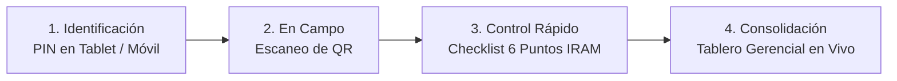

# Milicic FireControl 365 — Resumen Ejecutivo para la Dirección

**Informe de Síntesis para Dirección General, Gerencia de Operaciones y Responsables de Higiene y Seguridad**  
**Organización:** Milicic S.A. | **Emisión:** Octubre 2026 | **Versión:** 1.0.0 | **Commit:** `951738c`

---

> [!CAUTION]
> **Aviso Importante:** Este documento es un resumen de gestión y arquitectura. No constituye certificación legal ni reemplaza las inspecciones oculares físicas ni la firma pericial del profesional matriculado en Higiene y Seguridad según la normativa vigente en la República Argentina.

---

## 1. Qué es Milicic FireControl 365 y qué Problema Resuelve

**Milicic FireControl 365** es una plataforma digital de gestión y control de activos de seguridad contra incendios diseñada a medida para las operaciones de Milicic S.A. Transforma radicalmente la fiscalización del parque de extintores (130 equipos en Base Central Rosario), reemplazando las tarjetas manuales de cartón y planillas en papel por un circuito digital ágil, inviolable y accesible desde cualquier teléfono celular o tablet industrial.

### El Desafío Previo

- **Pérdida de Información y Desactualización:** Tarjetas de inspección dañadas por grasa o intemperie y carpetas físicas con semanas de retraso.
- **Incertidumbre Operativa:** Desconocimiento en tiempo real sobre cilindros despresurizados, vencidos o retirados sin equipo de reemplazo.
- **Riesgo en Auditorías:** Dificultad para demostrar fehacientemente ante la ART, bomberos o clientes que los controles mensuales se realizaron en fecha y forma en el puesto balizado.

### El Logro del Sistema Actual

- **Inspección en Campo en Menos de 15 Segundos:** El inspector escanea el código QR adherido al puesto y tilda un checklist visual de 6 puntos según norma IRAM 3517-2.
- **Continuidad Operativa Sin Internet (Offline-First):** En subsuelos, depósitos y obradores sin señal celular, la app sigue funcionando con total fluidez, almacenando los datos de forma segura en el teléfono y sincronizando al volver la conexión.
- **Respuesta Inmediata ante Anomalías:** Si un extintor pierde presión o le falta el precinto, la app exige una fotografía y abre automáticamente un Caso de Mantenimiento de alta prioridad.
- **Gobernanza y Privacidad:** Autenticación institucional con Microsoft Entra ID (M365), cambio rápido de usuario por PIN para dispositivos compartidos y protección de la privacidad de los operarios (sin rankings punitivos individuales).

---

## 2. Un Día de Ronda Operativa en 4 Pasos



1. **Ingreso Ágil al Turno:** El inspector toma la tablet del pañol y selecciona su nombre con su PIN de 4 dígitos. El sistema le muestra exclusivamente los puestos de su sector asignado.
2. **Escaneo del Puesto:** Al colocarse frente al extintor, escanea el código QR con la cámara del celular. En pantalla aparece la ficha técnica completa del equipo (agente, capacidad, fecha de recarga y vencimientos).
3. **Chequeo y Registro de Falla:** Verifica acceso despejado, manómetro en verde, precinto sano, estado del cilindro, cartel baliza y marbete oficial. Si detecta una anomalía, saca una foto que viaja comprimida para no saturar la memoria del teléfono.
4. **Cierre y Reportes Automáticos:** El supervisor visualiza el avance del mes en vivo. Al completar la ronda, el sistema emite el informe mensual en PDF con código único de verificación y exportación a Excel.

---

## 3. Garantías Técnicas y Límites del Sistema

Para una toma de decisiones responsable, la Dirección debe conocer con precisión qué asegura la tecnología y qué responsabilidades continúan en el terreno humano y legal:

### Qué Garantiza la Plataforma

- **Inmutabilidad de la Evidencia:** El servidor bloquea formalmente cualquier intento de modificar o borrar una inspección pasada (código HTTP `405 Method Not Allowed`). Lo inspeccionado queda asentado con fecha, hora e identificación del operario.
- **Detección de Inspecciones Sospechosas:** El motor antifraude detecta y marca cualquier chequeo completado en menos de 5 segundos, alertando al supervisor sobre controles apresurados.
- **Copias de Seguridad Consistentes en Caliente:** Respaldos automáticos diarios de la base de datos sin detener la app (`VACUUM INTO`), con validación de sanidad inmediata y tiempo de recuperación de solo 15 minutos ante fallas mayores.

### Qué NO Garantiza (Límites Claros)

- **No reemplaza el ensayo físico de taller:** El software no puede certificar la composición química interna del polvo ni la resistencia del acero; eso depende exclusivamente de la recarga anual y la prueba hidráulica quinquenal en taller habilitado IRAM.
- **No reemplaza la firma profesional:** El sistema provee la evidencia técnica y de gestión; la responsabilidad civil y laboral sigue requiriendo la fiscalización del profesional matriculado en Higiene y Seguridad.

---

## 4. El Tablero de Gerencia (KPIs Ejecutivos)

Diseñado para directores y gerentes de operaciones, el tablero de control `/gerencia` ofrece una visión panorámica instantánea con enfoque preventivo:

```text
======================= MILICIC FIRECONTROL 365 BI =======================
Cobertura de Ronda: 98.5% [OK]        | Vigencia Técnica: 96.2% [OK]
Índice de Salud ISPCI: 92 / 100 [VERDE]| Casos Abiertos: 3 (MTTR: 4.2 Días)
Vencimientos < 30 Días: 5 Unidades     | Inversión en Taller: $ 485.000
==========================================================================
```

- **Índice de Salud de Protección Contra Incendios (ISPCI - Escala 0 a 100):** Calificación única y ponderada que evalúa cobertura, extintores vigentes, ausencia de desvíos y tiempos de respuesta de talleres externos.
- **Mapa de Calor por Sector (Heatmap):** Identifica visualmente qué pisos o dependencias concentran mayor cantidad de anomalías o equipos atrasados.
- **Proyección de Vencimientos a 12 Meses:** Anticipa cuántos equipos vencerán mes a mes, permitiendo presupuestar y negociar con talleres antes de que se produzca el vencimiento normativo.
- **Conector Directo para Power BI:** Datos disponibles para el área de Control de Gestión sin necesidad de pedir reportes por correo ni transferir planillas manuales.

---

## 5. Estado Actual de Capacidades

| Capacidad del Sistema                                  |      Estado      | Situación Actual                                          |
| :----------------------------------------------------- | :--------------: | :-------------------------------------------------------- |
| **Escaneo QR y Checklist 6 Puntos IRAM**               | `[Implementado]` | 100% operativo en teléfonos y tablets.                    |
| **Modo Sin Conexión (IndexedDB) y Compresión**         | `[Implementado]` | Operativo; las fotos se achican a menos de 300 KB.        |
| **Apertura Automática de Casos por Falla**             | `[Implementado]` | Dispara caso de alta prioridad ante cualquier tilde rojo. |
| **Acceso M365 (Entra ID) y PIN Rápido con Bloqueo**    | `[Implementado]` | Login corporativo + PIN con bloqueo a 5 intentos.         |
| **Inmutabilidad y Auditoría Append-Only**              | `[Implementado]` | Inspecciones no modificables por API; bitácora completa.  |
| **Backups Automáticos Consistentes (RTO 15 min)**      | `[Implementado]` | Copias atómicas con comprobación automática.              |
| **Tablero de Gerencia y Métricas BI**                  | `[Implementado]` | 12 KPIs calculados en backend y snapshots mensuales.      |
| **Alertas Automáticas por Correo / Teams**             |   `[Parcial]`    | Webhooks activos; resta configurar servidor SMTP directo. |
| **Planos Interactivos de Planta en Pantalla**          |  `[Propuesta]`   | En hoja de ruta para el mes 3.                            |
| **Firma Digital con Token Criptográfico (Ley 25.506)** |  `[Propuesta]`   | En hoja de ruta para el mes 3.                            |

---

## 6. Las 5 Mejoras Principales y Próximos Pasos

1. **Alertas Inmediatas por Correo y Microsoft Teams:** Notificar automáticamente a la guardia cuando un extintor se reporte sin presión o fuera de puesto. _(Horizonte Inmediato - 2 semanas)_.
2. **Plano Digital Interactivo de Planta (CAD/SVG):** Visualizar sobre el plano de Base Central la ubicación exacta y estado semafórico de cada equipo. _(Horizonte 3 meses)_.
3. **Módulo de Firma Digital Avanzada:** Incorporar token criptográfico para dotar a los reportes mensuales de plena eficacia jurídica pericial según Ley 25.506. _(Horizonte 3 meses)_.
4. **Extensión a Hidrantes y Luces de Emergencia:** Unificar todos los activos de protección pasiva y activa en la misma plataforma. _(Horizonte 6 meses)_.
5. **Replicación en Tiempo Real en Azure (Cloud Offsite):** Copia continua de cada transacción en la nube para resguardo ante catástrofes físicas del servidor local. _(Horizonte 6 meses)_.

### Próximos Pasos Recomendados (Plan Piloto de 4 Semanas)

- **Semana 1:** Validación física de los 130 equipos registrados en Base Rosario.
- **Semana 2:** Pegado de etiquetas QR en chapas baliza con vinilo protector UV.
- **Semana 3:** Taller práctico de 20 minutos con inspectores de HyS.
- **Semana 4:** Primera ronda oficial digital y presentación de resultados a la Dirección.
